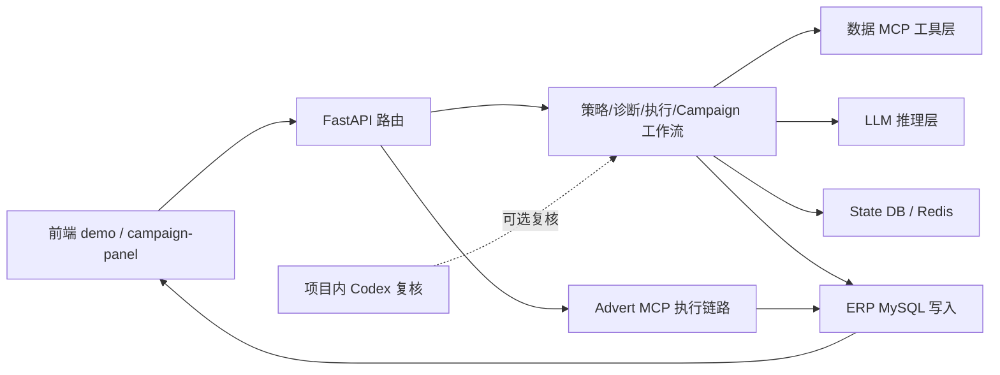
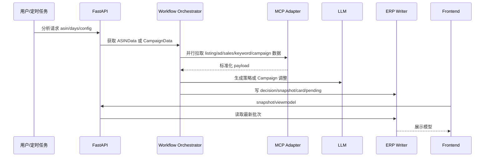

# 项目知识图谱总览

## 目的

本篇提供 AD-Agent 项目自身的全局地图，帮助开发者和开发 Agent 在改动前判断“应该读哪里、影响哪里、验证哪里”。

## 当前代码真源

- 后端应用：`ad-direction-agent/app`
- API 路由：`ad-direction-agent/app/api`
- 工作流：`ad-direction-agent/app/workflow/steps`
- MCP 数据层：`ad-direction-agent/app/data`
- ERP 写入：`ad-direction-agent/app/persistence/erp_writer`
- Agent 自有状态：`ad-direction-agent/app/persistence`
- 前端：`ad-direction-agent/demo`
- 项目内 Codex 复核：同工作区 `AD_Agent_codexV2`

## 子系统地图

## 主要边界

AD-Agent 项目有三条核心链路：

1. 前置策略推荐链路：消费 `ASINData`，生成战略、策略、诊断、执行层推荐。
2. Campaign 分析链路：消费 Campaign 粒度数据，生成活动级调整建议、预算组合、新建活动、复评建议。
3. 广告执行链路：把已确认的建议映射成 Advert MCP 调用，并回写执行状态。

还有四个支撑面：

- MCP 数据层：负责父 ASIN 上下文解析、广告报表、自然排名、竞品、组合等外部数据。
- 持久化层：ERP 库负责业务展示和执行单据，State 库负责 Agent 自有长期状态。
- 缓存层：Redis/LRU 主要缓存 `ASINData`，降低重复 MCP 拉取。
- 前端层：单页 HTML 加模块化 Campaign panel，直接消费后端 viewmodel。

## 数据流总览

## 命名约定

- `ASINData`：父 ASIN 粒度的综合产品、销售、广告、关键词和竞品数据。
- `CampaignData`：Campaign/子 ASIN/关键词/placement 粒度的广告活动数据。
- `decision_id`：一次推荐批次在 ERP 侧的主键。
- `campaign_key`：Campaign 分析中使用的活动唯一键，语义是 `”活动名 × 子ASIN#match_type#keyword_id”`（v3.19 已从活动级改为关键词级）。落库后以 card/pending ID 为准。
- `meta_filter`：轻量加载所需数据域的选择器，用于减少 MCP 工具调用和缓存切分。
- `operating_mode`：经营模式（6 值），通过 `runtime_contract.yaml` §mode_policies 定义权威行为，运行时经 `ad_permission` / ACOS 容忍系数 / Ontology Card 三层注入 Campaign 引擎。

## 按任务阅读路线

| 要改什么 | 先读 | 再读 | 验证 |
| --- | --- | --- | --- |
| MCP 工具、ASINData、数据缺失 | `03`、`04`、`06` | `01`、`05` | `14` 的 MCP 与数据层 |
| 前置策略推荐 | `07` | `01`、`06`、`09` | `14` 的前置策略工作流 |
| Campaign 分析、护栏、预算、新建活动 | `08` | `01`、`02`、`03`、`07`、`09` | `14` 的 Campaign 工作流 |
| ERP 落库/viewmodel | `02`、`08` | `11`、`12` | `14` 的 ERP 与持久化 |
| 前端 Campaign panel | `11` | `08`、`12` | `14` 的前端与 UX |
| 配置保存/回读（一键保存 save-all/latest） | `07`、`11` | `02`（`t_advert_agent_config`）、`01` | `14` 的前置策略工作流/前端与 UX |
| Advert MCP 执行 | `12` | `02`、`03`、`05` | `14` 的广告执行 |
| 定时分析 | `10` | `08`、`02`、`05` | 状态文件 + API/ERP 验证 |
| 项目内 Codex 复核 | `13` | `08`、`09` | CodexV2 脚本/对照结果 |

开发 Agent 使用本目录时，应从任务对应专题进入，而不是从旧交接文档或全局搜索直接跳到实现。

## 常见误区

- 不要把本目录和 `docs/knowledge_base` 混淆。后者是业务规则知识库，本目录是项目结构知识。
- 不要把 `AD_Agent_codexV2` 理解成外部开发 Agent。它是项目内的复核组件。
- 不要把 Campaign 链路当成前置策略链路的简单延伸。两者共享部分上下文，但数据粒度、输出模型和落库目标不同。
- 不要把旧交接文档中的“曾经方案”直接当成当前真相。需要回到代码真源核对。

## 更新检查清单

- API 新增或改名时，同步更新本篇和对应专题文档。
- MCP 工具新增、废弃或参数变化时，同步更新 `03` 和 `04`。
- ERP/State 表变化时，同步更新 `02`。
- Campaign panel 或 viewmodel 改动时，同步更新 `11`。
- Codex 复核由同步改异步时，同步更新 `13`。
- 新增经营模式或修改 `OperatingMode` 枚举时，同步更新本篇命名约定和 `08` 经营模式注入点。
- 知识库文件/章节编号变化时，同步更新 `09` 的 preset 表和 `08` 的 KB 引用。
