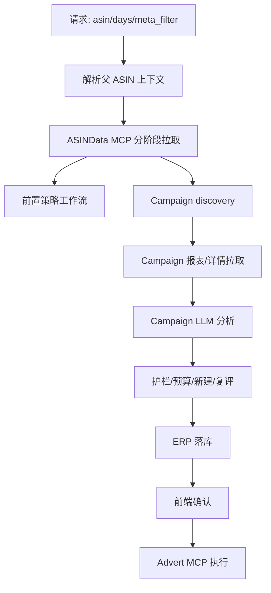

# 广告Agent-MCP实际调用链路说明

## 目的

本篇说明 AD-Agent 当前实际怎样调用 MCP 工具。它继承既有 `docs/MCP工具调用链路文档.md` 的主体思路，但以当前代码为准修正工具名和边界。

## 当前代码真源

- `ad-direction-agent/app/data/mcp_mapping.py`
- `ad-direction-agent/app/data/mcp_adapter.py`
- `ad-direction-agent/app/data/mcp_fetch_run.py`
- `ad-direction-agent/app/data/campaign_fetcher.py`
- `ad-direction-agent/app/workflow/steps/campaign.py`
- `ad-direction-agent/app/workflow/steps/campaign_new.py`
- `ad-direction-agent/app/workflow/steps/campaign_restart.py`
- `ad-direction-agent/app/workflow/steps/advert_execution.py`
- `ad-direction-agent/app/data/advert_mcp_client.py`
- `ad-direction-agent/app/data/core_keyword_fetcher.py`
- `ad-direction-agent/app/workflow/steps/core_keyword.py`

## 代码锚点地图

| 阶段 | 入口/代码位置 | 关键函数 |
| --- | --- | --- |
| 父 ASIN 上下文 | `app/data/mcp_db_context.py`、`app/data/mcp_adapter.py:195` | `resolve_mcp_context_from_mcp()`、`listing_basic_info_v2` |
| meta 工具规划 | `app/data/mcp_mapping.py:94`、`:110` | `META_TO_MCP_TOOLS`、`bootstrap_tools_for_meta()` |
| 分阶段执行 | `app/data/mcp_fetch_run.py:16` | `run_planned_mcp_tools()` |
| ASINData 装配 | `app/data/mcp_adapter.py:299` 起 | `normalize_*`、`finalize_mcp_asin_data()` |
| Phase 2 排名 | `mcp_adapter.py:246` 到 `:274` | 从 campaign exact 词逐词调 `keyword_child_asins` |
| Campaign discovery | `app/data/campaign_fetcher.py:45`、`:270`、`:316` | `fetch_campaigns()`、`_discover_context_from_mcp()`、`_fetch_campaign_list()` |
| Campaign 报表 | `campaign_fetcher.py:352`、`:454`、`:501`、`:557` | basic/product/placement/search term |
| 新增词源 | `campaign_fetcher.py:602`、`:665`、`:759` | flow/own/competitor/suggested bids |
| 核心词判定 | `app/data/core_keyword_fetcher.py` | CoreKeywordFetcher：6 步 MCP，跨 StarRocks + Azlisting |
| Advert 执行 | `workflow/steps/advert_execution.py:255`、`advert_exec_mapper.py:82` | `load_confirmed_pending()`、`build_exec_plan()` |

## 总链路

## 阶段 0：父 ASIN 上下文和 ASINData

入口通常来自 `WorkflowOrchestrator.ensure_data()` 或 Campaign API 中的分析准备。

关键调用：

1. `parent_listing_detail`：父 ASIN 到站点、店铺、父 SKU、产品名。
2. `listing_basic_info_v2`：listing 基础信息。
3. `parent_listing_stock_summary`：库存汇总。
4. 按 meta_filter 决定是否调用广告、销售、关键词、竞品工具。
5. `keyword_child_asins`：对提取出的 EXACT 词逐词并行查询，不走普通 meta 列表。

日期窗口由 `make_date_window(days, site_code)` 构造，并按站点时区排除未完整的当前日。

阶段 0 的关键边界：

- `parent_listing_detail` 是当前父 ASIN 上下文真源，不应再描述为本地 DB 查找兜底。
- `listing_basic_info_v2` 在上下文解析后补充 listing 字段；如果缺失，ASINData 可降级但会带数据质量提示。
- `ad_campaign_product_keyword_list` 是否作为 bootstrap 取决于 meta_filter：关键词/Campaign 相关场景需要，纯轻量 dashboard 可不取。

## 阶段 1：普通报表与 meta_filter

`META_TO_MCP_TOOLS` 决定不同业务元数据需要哪些 MCP 工具。

常见活跃工具包括：

- `direct_competitors`
- `flow_keywords`
- `ad_product_report`
- `ad_placement_report`
- `ad_search_term_report`
- `product_sales`

bootstrap 工具包括：

- `listing_basic_info_v2`
- `parent_listing_stock_summary`
- `ad_campaign_product_keyword_list`，仅在关键词相关 meta 或 Campaign 场景中加入。

如果是轻量 meta_filter，系统会减少不必要工具，并通过带 hash 后缀的缓存 key 区分数据完整度。

meta_filter 到 MCP 的关系：

| meta_filter 场景 | 典型工具 | 主要消费者 |
| --- | --- | --- |
| `dashboard_light` | listing、库存、轻量销售/广告摘要 | Strategy options、首页/仪表盘 |
| `tactics` | 广告摘要、关键词、自然排名、流量词 | purpose-agent 推荐 |
| `diagnosis` | 广告摘要、趋势、库存、关键词信号 | 诊断只读面板 |
| `execution` | ACOS/CVR、趋势、利润、关键词 | 方向评分和 LLM 执行推荐 |
| `p3` | ACOS/spend/CPC、利润、库存、趋势 | target ACOS、预算、bid |
| `campaign` | ASIN 级策略背景 + Campaign 独立工具 | Campaign 分析 |

## 阶段 2：Campaign discovery

Campaign 分析需要先发现活动集合和活动-商品-关键词关系。

主要工具：

- `parent_listing_detail`
- `ad_campaign_list`
- `ad_campaign_product_keyword_list`
- `ad_campaign_basic_info_v2`

`ad_campaign_basic_info_v2` 按 `campaign_id_list` 批量调用，替代按活动名的 v1。

discovery 字段合并：

- `ad_campaign_list` 给出活动名和 campaign_id 的快速集合。
- `ad_campaign_product_keyword_list` 给出活动、商品、关键词、match type 的关系。
- 两者合并后才能稳定区分 exact/broad/new campaign 已覆盖词；单靠活动列表无法判断关键词粒度。

## 阶段 3：Campaign 报表拉取

活动集合确定后，Campaign 链路拉取效果数据：

- `ad_campaign_product_report`
- `ad_campaign_placement_report`
- `ad_campaign_search_term_report`

placement 和 search term 数据通常更重，会在精细分析或 LLM 前置上下文需要时加载。

报表拉取的消费边界：

- product report 是 CampaignUnit 的核心绩效事实，直接进入 LLM 和护栏。
- placement report 主要服务 exact 流和 P10 TOS 加价阻断。
- search term report 主要服务 broad/phrase/auto 流的否定词机会，不作为 exact 主判断依据。

## 阶段 4：自然排名和新增活动候选

新建 Campaign 候选的词源包括：

- `flow_keywords`
- `own_keyword_flow`
- `keyword_child_asins`
- 可选竞品词源

候选经过桶配额、相关性、去重、已有活动排除、预算约束和 LLM 判断后进入 `NewCampaignItem`。

是否启用竞品词源、最大竞品数量、每竞品词数和超时由 Campaign new 相关配置控制。

## 阶段 5：淘汰复评

复评链路围绕低价池/淘汰池条目：

1. 从 pool entry 读取候选。
2. 按配置限制候选数量和入池天数。
3. 拉取必要的近期 Campaign 商品报表。
4. 判断是否恢复、保持淘汰或调整预算/bid。

复评依赖 `campaign_restart_*` 配置，并与 `t_advert_agent_pool_entry` 写回逻辑关联。

## 阶段 6：LLM 分析

LLM 本身不是 MCP 工具。

MCP 的作用是为 LLM 准备结构化事实：

- ASIN 级策略上下文。
- Campaign 活动效果。
- placement/search term 明细。
- 新增活动候选证据。
- 预算和 portfolio 信息。

LLM 输出后还会经过护栏、预算约束、冲突消解和格式校验。

## 阶段 7：ERP 写入

ERP 写入不是 MCP 调用。

Campaign 结果会写入：

- decision
- summary
- card
- campaign pending
- keyword pending
- placement pending
- reason group
- special display

前端读 snapshot/viewmodel 展示，用户确认后才进入执行链路。

## 阶段 8：Advert MCP 执行

确认后的 pending 项由 `advert_exec_mapper.py` 映射成执行计划：

- 修改已有活动：`agent_async_batch_update_advert`
- 新建活动：`agent_create_portfolio_campaign`
- 否定词：`agent_create_negative_keywords`
- 执行前组合匹配：`agent_query_portfolio_list`
- 建议竞价查询：`agent_query_keyword_suggest_bid`

执行链路受 `advert_mcp_enabled` 和 `advert_exec_dry_run` 双开关保护。

执行阶段返回处理：

- `parse_result_envelope()` 判断工具 envelope 是否成功。
- `extract_task_ids()` 提取异步 task id。
- 常规执行只读取 `CONFIRMED + execute_status=PENDING` 的 pending，执行后回写状态，保证幂等。

## 阶段 9：核心词离线判定

核心词判定使用 6 个 MCP 工具，跨两个 MCP 服务：

| 步骤 | 工具 | MCP 服务 | 用途 |
|------|------|---------|------|
| 1 | `parent_listing_detail` | StarRocks | 获取 shop_account、site_code |
| 2 | `erp_listing_product_info` | Azlisting | 标题/五点/变体/类目 |
| 3 | `ad_campaign_product_keyword_list` | StarRocks | 关键词发现 + 多词活动过滤 |
| 4 | `ad_campaign_product_report` × N | StarRocks | 14 天 cost/orders/acos |
| 5 | `keyword_child_asins` × N | StarRocks | 自然排名 + 近次排名 |
| 6 | `flow_keywords` | StarRocks | 搜索量 |

Azlisting 工具由 `CoreKeywordFetcher` 内部持独立 `StreamableHttpMcpInvoker` 调用（endpoint: `azlisting_mcp_url`），不走 `McpAdapter` 全局路由。其余 5 个 StarRocks 工具走 `McpAdapter`。

## 常见误区

- Campaign discovery 不是只靠 `ad_campaign_list`，还依赖 `ad_campaign_product_keyword_list` 补足活动-商品-关键词关系。
- 旧文档中出现的工具名如果不在 `mcp_mapping.py` 或 `advert_mcp_client.py` 中，应先查代码再引用。
- ERP 写入和 Advert MCP 执行是两个阶段；写 pending 不代表已经动真实广告。
- LLM 超时或护栏失败时，部分链路会 fail-open 或规则兜底，不应直接视为 MCP 失败。
- Azlisting `erp_listing_product_info` 是核心词判定专用工具，参数为 camelCase（`shopAccount`/`parentAsin`/`parentSellerSku`），与 StarRocks 的 snake_case 不同。

## 更新检查清单

- 修改 Campaign discovery 逻辑时，同步更新阶段 2。
- 修改 meta_filter、bootstrap 或 Phase 2 关键词逻辑时，同步更新阶段 0-1。
- 修改新增活动或复评逻辑时，同步更新阶段 4-5。
- 修改广告执行工具时，同步更新阶段 8 和 `12-广告执行链路与安全开关.md`。
