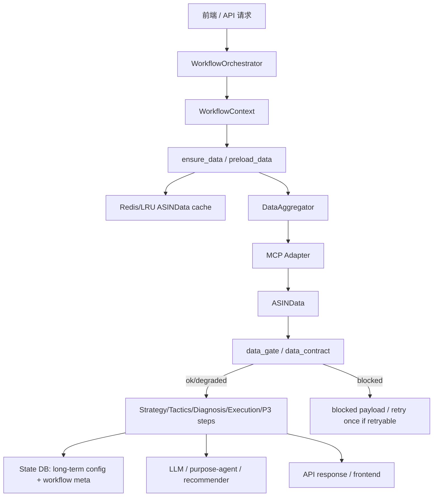
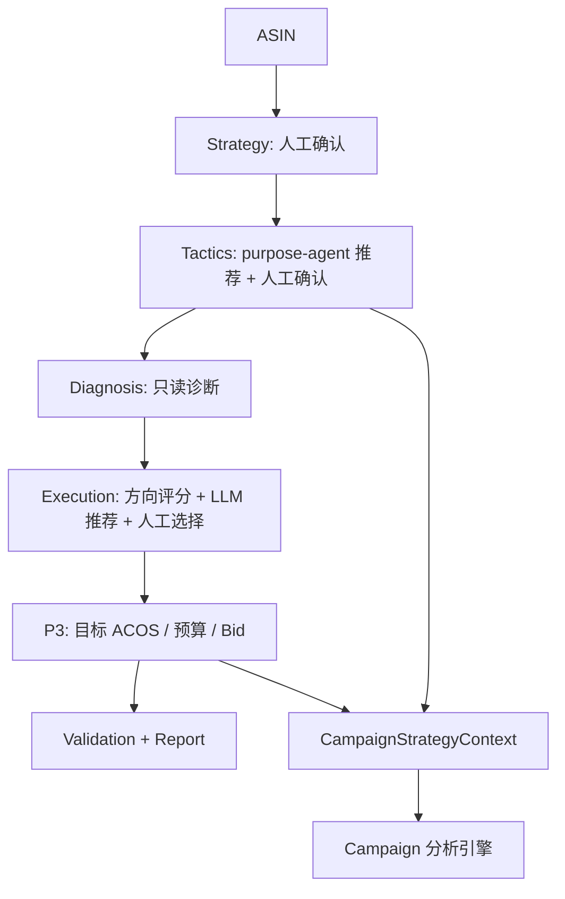

# 广告策略推荐工作流引擎架构

## 目的

本篇说明 Campaign 分析之前的广告策略推荐工作流。它是 AD-Agent 的主干工作流，负责把父 ASIN 的 MCP 数据、长期配置、业务知识库和 LLM/规则推荐结合起来，产出“战略 → 策略 → 诊断 → 执行 → P3/报告”的递进式决策上下文。

本文提炼自原项目交接文档，但只保留稳定架构、当前链路和代码真源。若本文与代码冲突，以代码为准。

## 当前代码真源

- 编排器：`ad-direction-agent/app/core/workflow_orchestrator.py`
- 工作流上下文：`ad-direction-agent/app/workflow/context.py`
- 数据闸门：`ad-direction-agent/app/workflow/data_gate.py`
- 数据契约：`ad-direction-agent/app/workflow/data_contract.py`
- meta_filter：`ad-direction-agent/app/workflow/meta_filters.py`
- 数据聚合：`ad-direction-agent/app/core/data_aggregator.py`
- MCP 数据层：`ad-direction-agent/app/data/mcp_adapter.py`
- ASIN 模型：`ad-direction-agent/app/models/asin_data.py`
- 四层模型：`ad-direction-agent/app/models/layers.py`
- Strategy：`ad-direction-agent/app/workflow/steps/strategy.py`
- Tactics：`ad-direction-agent/app/workflow/steps/tactics.py`
- Diagnosis：`ad-direction-agent/app/workflow/steps/diagnosis.py`
- Execution：`ad-direction-agent/app/workflow/steps/execution.py`
- P3：`ad-direction-agent/app/workflow/steps/p3.py`
- 校验与报告：`ad-direction-agent/app/workflow/steps/validation_report.py`
- 状态后端：`ad-direction-agent/app/persistence/state_factory.py`、`mysql_state_manager.py`、`state_manager.py`
- Redis 缓存：`ad-direction-agent/app/persistence/redis_cache.py`
- LLM：`ad-direction-agent/app/llm/reasoner.py`、`purpose_adapter.py`、`client.py`
- API：`ad-direction-agent/app/api/strategy.py`、`tactics.py`、`diagnosis.py`、`execution.py`、`wizard.py`、`long_term_config.py`、`core_keyword.py`

## 系统定位

广告策略推荐工作流回答的是“这个父 ASIN 当前该采取什么广告方向”。它不直接输出某个 Campaign 的 bid、budget、placement 调整命令，而是生成后续 Campaign 引擎需要的策略背景。

核心问题包括：

- 产品当前属于什么层级、阶段、季节状态。
- 当前广告目的是什么。
- 目标关键词策略是什么。
- 当前经营和广告问题在哪里。
- 推荐执行方向是什么。
- 目标 ACOS、预算和 Bid 应如何设定。
- 当前数据是否足够支持 LLM 判断。

Campaign 引擎会消费这里形成的长期配置和 P3 目标，但 Campaign 引擎有独立的活动级数据模型、LLM 分流和落库链路。

## 总链路



## 编排器边界

`WorkflowOrchestrator` 当前是薄编排器，不承载大量业务规则。它的职责是：

- 持有 `DataAggregator`、`StateManager`、`LLMReasoner`、`Recommender`。
- 构造 `WorkflowContext`，把依赖交给 step 函数。
- 封装 `_ensure_data()`、`_preload_data()` 和缓存策略。
- 在 `USE_LANGGRAPH=true` 时把调用转给 LangGraph bridge；默认直接调用 `workflow.steps`。
- 暴露 API 层需要的高层方法：`get_strategy_options()`、`confirm_strategy()`、`get_tactics_options()`、`get_tactics_recommendations()`、`get_diagnosis()`、`get_execution_options()`、`confirm_execution()`、P3 系列方法和 wizard 方法。

业务逻辑应下沉到 `app/workflow/steps/`。新功能不要把厚逻辑塞回 `WorkflowOrchestrator`。

## 代码锚点地图

本节的行号是当前代码快照的导航锚点。后续维护时应优先用函数名 `rg` 复核，避免代码移动后误读。

| 层/职责 | 入口函数 | 关键下游 | 说明 |
| --- | --- | --- | --- |
| Orchestrator 依赖装配 | `app/core/workflow_orchestrator.py:46` `WorkflowOrchestrator.__init__()` | `DataAggregator` / `StateManager` / `LLMReasoner` / `Recommender` | 构造共享依赖，不承载厚业务 |
| Orchestrator 数据缓存 | `workflow_orchestrator.py:80` `_preload_data()`；`:111` `_ensure_data()` | `DataAggregator.aggregate()` | 负责 ASINData 拉取、Redis 缓存、meta_filter key |
| Strategy options | `workflow_orchestrator.py:187` `get_strategy_options()`；`workflow/steps/strategy.py:51` `run_get_strategy_options()` | `ctx.preload_data(...DASHBOARD_LIGHT_META_FILTER)` | 配置栏秒开，同时后台预热轻量数据 |
| Strategy confirm | `workflow_orchestrator.py:192` `confirm_strategy()`；`strategy.py:88` `run_confirm_strategy()` | `StateManager.set_long_term_config()` / `advance_layer()` | 保存产品层级、阶段、季节并推进到 tactics |
| Tactics options | `workflow_orchestrator.py:203` `get_tactics_options()`；`workflow/steps/tactics.py:349` `run_get_tactics_options()` | state config/cache | 只读已有配置和缓存，不主动重跑推荐 |
| Tactics recommend | `workflow_orchestrator.py:208` `get_tactics_recommendations()`；`tactics.py:412` `run_get_tactics_recommendations()` | `ensure_data_for_llm()` / purpose-agent bridge | 拉取 tactics 数据并生成广告目的、关键词策略 |
| Tactics confirm | `workflow/steps/tactics.py:535` `run_confirm_tactics()` | `set_long_term_config()` / `advance_layer("diagnosis")` | 用户确认后写长期策略配置 |
| Diagnosis | `workflow_orchestrator.py:222` `get_diagnosis()`；`workflow/steps/diagnosis.py:55` `run_get_diagnosis()` | `QueryRouter.resolve()` / `ScenarioAnalyzer` | 只读诊断，不写用户选择 |
| Execution options | `workflow_orchestrator.py:233` `get_execution_options()`；`workflow/steps/execution.py:54` `run_get_execution_options()` | `Recommender.recommend()` / `reasoner.recommend_execution()` | 方向评分 + LLM 推荐 + 降级兜底 |
| Execution confirm | `workflow_orchestrator.py:240` `confirm_execution()`；`execution.py:179` `run_confirm_execution()` | state workflow selection | 保存执行方向并推进 validation |
| P3 target/budget/unified | `workflow/steps/p3.py:54`、`:83`、`:117` | `reasoner.recommend_p3()` / algorithm fallback | 目标 ACOS、预算、Bid 和统一推荐 |
| CoreKeyword 离线判定 | `workflow/steps/core_keyword.py` `run_core_keyword_analysis()` | `CoreKeywordFetcher` / `reasoner.recommend_semantic_core()` / ERP task+label | 离线核心词判定，7 天一次；产出 `is_core` 标签供 Campaign 护栏消费 |

## 数据输入：ASINData

前置工作流的核心数据对象是 `ASINData`。

它来自纯 MCP 数据源：

- 父 ASIN 上下文：`parent_listing_detail`
- listing 基础信息：`listing_basic_info_v2`
- 库存：`parent_listing_stock_summary`
- 销售趋势：`product_sales`
- 广告效果：`ad_product_report`、`ad_placement_report`、`ad_search_term_report`
- 关键词发现：`ad_campaign_product_keyword_list`
- 关键词排名：Phase 2 逐词调用 `keyword_child_asins`
- 流量词：`flow_keywords`
- 竞品：`direct_competitors`

当前项目是纯 MCP 数据源，不再依赖本地数仓直连或外部 DB 兜底。MCP 失败时通过 `missing_fields`、`partial_failures`、`data_missing`、`data_freshness` 等字段进入数据闸门和前端提示。

## 缓存和 meta_filter

`WorkflowOrchestrator._ensure_data()` 按 `(asin, days, meta_filter)` 分 key 缓存。

关键设计：

- 完整缓存 key：`asin_data:{asin}:{days}`
- 轻量缓存 key：`asin_data:{asin}:{days}:f{hash}`
- `meta_filter` 会排序去重后参与 hash，避免不同数据域互相污染。
- 有 filter 的请求优先读同 filter 缓存；完整缓存是 filter 的超集时可复用。
- refresh 会删除对应缓存并重新拉取。
- Strategy options 会后台 preload dashboard_light 数据，不阻塞配置栏秒开。

常见 filter：

- `dashboard_light`：配置栏和轻量仪表盘。
- `tactics`：策略推荐需要的数据域。
- `diagnosis`：诊断面板需要的数据域。
- `execution`：执行方向推荐需要的数据域。
- `p3`：目标 ACOS、预算和 Bid 推荐需要的数据域。

## 数据闸门

LLM 调用前通过 `ensure_data_for_llm()` 做数据完整性判断。

数据契约按模块分层：

| 模块 | required | important | 说明 |
| --- | --- | --- | --- |
| `tactics` | `ad_data.acos`, `ad_data.cpc` | trend, CTR, 自然单占比, keywords | 缺 required 会阻断 purpose-agent |
| `execution` | `ad_data.acos`, `ad_data.cvr` | margin, trend, TACOS, 自然单占比, keywords | 支持 degraded 继续带提示 |
| `p3` | `ad_data.acos`, `ad_data.spend`, `ad_data.cpc` | margin, trend, keywords, TACOS | 目标 ACOS/预算推荐要求广告成本基础 |
| `report` | `ad_data.acos` | margin, trend, CVR, keywords | 报告可降级 |
| `campaign` | 无 required | margin, 自然单占比, 库存, 日均销量 | Campaign 有独立 CampaignData，ASINData 只提供策略背景 |

如果缺 required 且可重试，系统会自动 refresh 一次。仍 blocked 时返回 blocked payload，不应强行让 LLM 产出结论。

关键词在当前契约中是 important，不是 required。原因是 `ad_keyword_report` 已下线，关键词级广告效果暂缺，但关键词发现和排名已通过 `ad_campaign_product_keyword_list + keyword_child_asins` 恢复基础链路。

## 四层工作流



### Strategy

入口：

- `POST /strategy/options`
- `POST /strategy/confirm`

核心文件：

- `workflow/steps/strategy.py`
- `models/layers.py`

职责：

- 返回产品层级、产品阶段、季节阶段的可选项。
- `run_get_strategy_options()` 会触发 dashboard_light preload，但不等待完整 MCP 拉取。
- `run_confirm_strategy()` 保存长期配置，并推进 workflow layer 到 tactics。
- 确认时会尝试读取 ASINData 用于辅助默认值和上下文，但战略层本质仍是人工选择。

长期配置字段：

- `product_level`
- `product_stage`
- `season_stage`

数据来源、产物和消费：

| 问题 | 当前实现 |
| --- | --- |
| 数据从哪来 | options 不等待完整 MCP，只在 `strategy.py:56` 触发 `dashboard_light` preload；confirm 阶段在 `strategy.py:108` 尝试 `ctx.ensure_data()` 读取完整 ASINData 辅助上下文 |
| 是否多来源 | 用户提交值是最终真源；ASINData 只用于辅助默认值/提示，不覆盖用户选择 |
| 是否调用 LLM | Strategy 当前不调用 LLM；它是人工确认层 |
| 写入哪里 | `strategy.py:129` 调 `set_long_term_config()` 写 state 长期配置；`strategy.py:130` 推进 layer 到 `tactics` |
| 下游消费 | Tactics、Diagnosis、Execution、P3 和 CampaignStrategyContext 都会读取 long_term_config 中的 strategy 字段 |

### Tactics

入口：

- `POST /tactics/options`
- `POST /tactics/recommend`
- `POST /tactics/confirm`

核心文件：

- `workflow/steps/tactics.py`
- `llm/purpose_adapter.py`
- `ad-purpose-agent`

职责：

- 推荐广告目的 `ad_purposes`。
- 推荐目标关键词策略 `target_keyword_strategy`。
- 读取或生成 `keyword_analysis`、`target_scores`。
- 已保存 tactics 时，options 只读长期配置和已有缓存，不主动重跑 LLM。
- 用户点击重新推荐时走 `run_get_tactics_recommendations()`，通过 purpose-agent 重新生成。

当前策略层 LLM 统一走 purpose-agent。direction-agent 内部旧 `TACTICS_SYSTEM_PROMPT` / `recommend_tactics()` 不应作为当前架构描述。

确认后写入：

- `tactics_config` 或 long_term_config 对应字段。
- workflow layer 推进到 diagnosis。

数据来源、Prompt 和产物：

| 问题 | 当前实现 |
| --- | --- |
| 数据从哪来 | 推荐入口 `tactics.py:412` 调 `ensure_data_for_llm(module="tactics")`；内部通过 orchestrator 的 `ctx.ensure_data()` 拉取 ASINData，meta_filter 为 tactics 数据域 |
| MCP 字段来源 | ASINData 聚合层透传广告 ACOS/CPC、趋势、CTR、自然单占比、关键词发现和排名等；具体 MCP 工具见 MCP 调用链路说明文档 |
| 是否多来源 | options 路径只读 state/cache；recommend 路径会重跑 purpose-agent；confirm 后用户选择成为长期配置真源 |
| Prompt 如何组装 | 当前推荐统一走 `app/llm/purpose_adapter.py` 桥接 `ad-purpose-agent`；旧 direction-agent 内部 tactics prompt 只作历史兼容，不作为当前主链路 |
| 产出什么 | `ad_purposes`、`target_keyword_strategy`、`keyword_analysis`、`target_scores` 以及推荐解释 |
| 写入/缓存 | 推荐结果写 workflow state/cache；confirm 在 `tactics.py:540` 写长期配置，在 `tactics.py:541` 推进到 diagnosis |
| 下游消费 | Diagnosis/Execution/P3 作为策略背景；Campaign 引擎通过 `build_campaign_strategy_context()` 消费广告目的和关键词策略 |

### Diagnosis

入口：

- `POST /diagnosis`

核心文件：

- `workflow/steps/diagnosis.py`
- `core/scenario_analyzer.py`
- `core/query_router.py`

职责：

- 基于战略和策略上下文生成只读诊断。
- 展示北极星指标、告警信号、关键词监控等。
- 读取 `strategy_config` / `tactics_config` 作为上下文。
- 使用 diagnosis meta_filter 获取必要数据。

诊断层不保存用户选择，也不应该直接生成 Campaign 级调价命令。

数据来源和边界：

| 问题 | 当前实现 |
| --- | --- |
| 数据从哪来 | `diagnosis.py:63` 读取长期配置；`diagnosis.py:64` 使用 diagnosis meta_filter 拉取 ASINData |
| 是否多来源 | 长期配置来自用户确认；实时指标来自 MCP 聚合 ASINData；manual target ACOS 在 `diagnosis.py:146` 附加为诊断上下文 |
| Prompt/规则 | 诊断主要由 `ScenarioAnalyzer`、`QueryRouter` 和本地规则组织；`diagnosis.py:91`/`:92` 做 query route 解析和描述 |
| 产出什么 | 诊断摘要、指标解读、告警信号、关键词监控等只读结构 |
| 下游消费 | 用户/前端阅读；Execution 仍会重新根据 ASINData 和长期配置计算方向，不把 diagnosis 当命令源 |

### Execution

入口：

- `POST /execution/options`
- `POST /execution/select`

核心文件：

- `workflow/steps/execution.py`
- `core/recommender.py`
- `llm/reasoner.py`

职责：

- 基于 ASINData、战略/策略上下文、目标 ACOS 手动覆盖值，计算四个方向评分。
- 调用 LLM 推荐执行方向。
- LLM 失败时按规则评分降级。
- 通过 `QueryRouter.resolve()` 根据场景和推荐方向推导后续 meta。
- 用户选择后保存 execution selection。

常见执行方向包括：

- 推自然位
- 新增扩词
- 优化 ACOS
- 平衡维持

数据来源、Prompt 和产物：

| 问题 | 当前实现 |
| --- | --- |
| 数据从哪来 | `execution.py:56` 调 `ensure_data_for_llm(module="execution")`；`execution.py:59` 读取 long_term_config；`execution.py:85` 读取 manual target ACOS |
| 是否多来源 | 方向评分来自 `core/recommender.py`；LLM 推荐来自 `reasoner.recommend_execution()`；LLM 失败时回落到规则评分，不丢失基础方向 |
| Prompt 如何组装 | `llm/reasoner.py:158` `_build_execution_system_prompt()` 构造系统提示；`reasoner.py:1176` `recommend_execution()` 组装 ASINData 摘要、方向评分、策略上下文和 manual ACOS |
| 产出什么 | 四方向评分、推荐方向、推荐理由、query route、LLM 状态或降级原因 |
| 写入哪里 | `execution.py:179` `run_confirm_execution()` 保存用户选择；`execution.py:182` 推进 workflow layer 到 validation |
| 下游消费 | P3 读取 execution selection 作为目标 ACOS/预算/Bid 推荐背景；CampaignStrategyContext 也会透传执行方向 |

### P3：目标 ACOS / 预算 / Bid

入口：

- `POST /execution/target-acos`
- `POST /execution/budget-bid`
- `POST /execution/recommend`
- `POST /execution/target-acos/override`
- `DELETE /execution/target-acos/override`
- `POST /execution/budget-bid/override`
- `DELETE /execution/budget-bid/override`

核心文件：

- `workflow/steps/p3.py`
- `core/recommender.py`
- `llm/reasoner.py`

职责：

- 给出目标 ACOS 推荐。
- 给出预算/Bid 推荐。
- 给出 unified recommendation。
- 手动 override 优先于 LLM 和算法。
- LLM 失败时降级到 `TargetAcosRecommender` / `BudgetBidRecommender`。
- 推荐结果可缓存到 state，refresh 可强制重算。

优先级：

1. 手动 override
2. 未过期的 P3 cache
3. LLM unified recommendation
4. 算法降级

数据来源、Prompt 和产物：

| 问题 | 当前实现 |
| --- | --- |
| 数据从哪来 | target ACOS 在 `p3.py:63` 拉取 P3 meta_filter；budget/bid 在 `p3.py:92` 拉取 P3 meta_filter；unified 在 `p3.py:157` 通过 `ensure_data_for_llm(module="p3")` 做闸门 |
| 是否多来源 | manual override 最高优先级；其次读 P3 cache；再走 LLM unified；LLM 失败或数据不足时走 `TargetAcosRecommender` / `BudgetBidRecommender` |
| Prompt 如何组装 | `llm/reasoner.py:231` `_build_p3_system_prompt()`；`reasoner.py:1311` `recommend_p3()` 组装战略、策略、执行方向、广告效果、利润/库存等上下文 |
| 产出什么 | target ACOS、daily budget、bid 建议、解释、风险提示、LLM 状态/算法降级状态 |
| 写入哪里 | override 写 long_term_config；unified 推荐可写 `p3_recommendation` cache；清除 override 会把对应长期字段置空 |
| 下游消费 | Campaign 引擎通过 CampaignStrategyContext 获取 target ACOS、预算倾向和执行方向；前端执行页直接展示 P3 推荐 |

## 状态存储

前置工作流的长期状态主要在 State 库：

| 表/对象 | 责任 |
| --- | --- |
| `strategy_config` | 战略层长期配置 |
| `tactics_config` | 策略层长期配置 |
| `workflow_meta` | 当前层级、已完成层级、execution selection |
| `keyword_analysis` | 关键词分析缓存 |
| `target_scores` | 广告目的评分缓存 |
| `p3_recommendation` | P3 推荐缓存 |
| `acos_override` | 目标 ACOS 手动覆盖 |
| `budget_override` / long_term_config | 预算手动覆盖 |
| `analysis_session` | 分析会话状态 |
| `feedback` | 用户反馈 |

ERP 库不是前置工作流的主状态库。ERP 用于销售端展示、决策批次、Campaign 快照和执行 pending；State 库用于 Agent 自有长期配置和工作流状态。

## 与 Campaign 引擎的接口

Campaign API 会构造 `CampaignStrategyContext`，把前置配置转成 Campaign 可消费上下文。

典型字段：

- 产品层级
- 产品阶段
- 季节阶段
- 广告目的
- 目标关键词策略
- 目标 ACOS
- 当前预算
- 毛利率
- 库存和自然单占比等 ASIN 信号

Campaign 引擎只消费这些上下文，不应反向覆盖前置长期配置。Campaign 分析产生的是活动级建议和 ERP pending。

## 核心词离线判定

核心词判定是独立于主干工作流的离线批处理，7 天运行一次。它判定现有投放关键词中哪些是"核心词"，产出 `is_core` 标签供 Campaign 引擎的 P0/P3/P5 确定性护栏消费。

### 当前代码真源

- 离线编排：`ad-direction-agent/app/workflow/steps/core_keyword.py`
- MCP 拉数：`ad-direction-agent/app/data/core_keyword_fetcher.py`
- API 入口：`ad-direction-agent/app/api/core_keyword.py`（`POST /core-keyword/analyze`）
- LLM Prompt：`ad-direction-agent/app/llm/reasoner.py`（`_SEMANTIC_CORE_PROMPT` + `recommend_semantic_core()`）
- KB 注入：`ad-direction-agent/app/llm/kb_loader.py`（`semantic_core` preset → KB29 §1-3 + KB28 §2）
- ERP 落库：`ad-direction-agent/app/persistence/erp_writer/repository.py`（`write_core_keyword_task` + `fetch_core_keyword_set`）
- Campaign 消费：`ad-direction-agent/app/workflow/steps/campaign.py`（`_analyze_one_stream()` + `_backfill_campaign_adjustment_context()`）
- 护栏消费：`ad-direction-agent/app/workflow/steps/campaign_guardrails.py`（P0/P3/P5）
- ERP 表：`t_advert_agent_core_keyword_task`、`t_advert_agent_core_keyword_label`
- DDL 迁移：`ad-direction-agent/scripts/erp_db/migrate_core_keyword.sql`
- 批跑脚本：`ad-direction-agent/batch_core_keyword.py` + `batch_core_keyword.sh`
- 配置：`ad-direction-agent/app/config/settings.py`（`core_keyword_enabled`、`core_keyword_analyze_enabled`、`core_keyword_llm_timeout`、`core_keyword_mcp_timeout`、`azlisting_mcp_*`）

### 判定模型

核心词判定公式：

```
is_core = semantic_conflict == "pass" AND (semantic_core OR data_core)
```

三个维度各自独立：语义冲突是负向门槛，语义核心（LLM）和数据核心（代码）任一命中即通过。

```
LLM 一次调用批量判断                     代码纯计算
  → semantic_conflict: pass/fail          → data_core: 4 个数值条件
  → semantic_core: true/false
           ↘                ↙
              merge → is_core
```

### MCP 数据来源

一词一活动前提下，共 6 个 MCP 工具，跨两个 MCP 服务：

| 步骤 | 工具 | MCP 服务 | 返回关键字段 | 用途 |
|------|------|---------|------------|------|
| 1 | `parent_listing_detail` | StarRocks | shop_account, site_code | 下游构参来源；身份校验（返回 sku/shop_id 与请求三元组不一致 → FAILED） |
| 2 | `erp_listing_product_info` | Azlisting | productName, fiveBulletPoint1-5, variationThemeName, productColor, productSize, lastCategory | 标题/五点/变体/类目 → semantic_core LLM 输入 |
| 3 | `ad_campaign_product_keyword_list` | StarRocks | campaign_id, campaign_name, keyword_text, match_type, child_asin | 关键词发现，按 `campaign_id` 分组 → 否定词豁免 → set 去重 → 仅保留 COUNT=1 的 1:1 活动 |
| 4 | `ad_campaign_product_report × N` | StarRocks | cost, orders, acos（14 天窗口，站点时区） | data_core：高广告花费 + 广告效果已验证 |
| 5 | `keyword_child_asins × N` | StarRocks | craw_nature_rank, near_craw_nature_rank | data_core：自然排名价值 |
| 6 | `flow_keywords` | StarRocks | keyword, searches | data_core：高搜索量 |

Step1 串行，Step2-3 并行。Step3 之后的数据流：**Step4 → 合并跨 campaign 同词 → Step5 → Step6（串行，因为合并依赖 Step4 的成本数据）**。Azlisting 工具由 `CoreKeywordFetcher` 内部持独立 `StreamableHttpMcpInvoker` 调用，不走 `McpAdapter` 全局路由。

MCP 并发控制：每个 `CoreKeywordFetcher` 持一个 `asyncio.Semaphore(5)`，所有 6 个 Step 的 MCP 调用共享此信号量。批跑脚本并发 5 个 worker，总计 MCP 峰值 5×5=25。

### data_core：纯代码计算

四个数值条件相互独立，任一命中即 `data_core = True`：

| 条件 | 计算逻辑 | 边界 |
|------|---------|------|
| 高广告花费 | 同产品内所有 1:1 关键词按 cost 降序，排名前 30% | 合格关键词 < 3 时跳过 |
| 高搜索量 | flow_keywords 词池内 searches 排名前 30% | 词池为空或关键词不在词池中 → 跳过 |
| 广告效果已验证 | orders ≥ 3 且 acos ≤ 容忍上限 | 容忍上限来自 CampaignStrategyContext，无值时默认 40% |
| 自然排名价值 | rank ≤ 50 且排名不恶化 | near_rank 为 None 时仅检查 rank ≤ 50 |

四个条件只计算 1:1 活动。多关键词活动在 Step3 发现阶段即被剔除（与 `campaign_prefilter.py` 口径一致：按 `campaign_id` 分组、否定词豁免、set 去重），不会进入 data_core 计算。

### 跨 campaign 同词合并

Step4 拉完各 campaign 的效果数据后，通过 `_dedupe_keyword_items` 对跨 campaign 的同关键词做合并：`cost_14d` 求和、`orders_14d` 求和、`acos_14d` 按 cost 加权平均。合并后的词在 data_core 排名中反映其整体投放分量。Step5 排名字段只取首次出现的值。

### semantic_core：LLM 批量判断

一次 LLM 调用最多批 20 个关键词，>20 时自动分批并发调用。

输入：产品标题、五点、变体（颜色/尺寸）、类目 + 关键词列表
输出：{semantic_conflict: pass/fail, conflict_reason, semantic_core: true/false, semantic_evidence}

语义冲突四种情况（任一命中则 language 出局）：
1. 品类不一致
2. 属性不符（款式/结构/功能/人群/场景）
3. 变体不属于当前子 ASIN
4. 非产品意图词（纯价格/促销/平台活动词）

LLM 使用 `temperature=0.3`、JSON 模式、不需要 thinking，注入 KB29 §1-3 + KB28 §2（R1-R4 定义）。

### ERP 落库

每批次一条 `t_advert_agent_core_keyword_task`（`is_core_task_id`），每条关键词一条 `t_advert_agent_core_keyword_label`。产品标识使用 `(parent_asin, parent_seller_sku, shop_id)` 三元组。

批次由独立 `task_id`（`ckt_{date}_{hash}`）管理，不混用 campaign 分析链路的 `decision_id`。label 表冗余 `parent_seller_sku`/`shop_id`，支持主流程不 JOIN 直接按三元组查询。

### 主流程消费

Campaign 引擎在 `_analyze_campaigns_impl()` 中调用 `fetch_core_keyword_set(parent_asin, parent_seller_sku, shop_id)`，读取最近一次 DONE 批次中所有 `is_core=1` 的关键词文本集合。

注入路径：`core_keyword_set` 向下透传到两个点位——`_analyze_one_stream()` 的 `is_core` 字段（注入 LLM prompt 提示）和 `_backfill_campaign_adjustment_context()` 的 `item.is_core`（供护栏和 ERP 消费）。

五个下游消费点：

| 位置 | 消费方式 |
|------|---------|
| P0 核心词禁淘汰 | `campaign_guardrails.py:119` — `item.is_core=True` 且 action=淘汰 → 强制改 keep |
| P3 硬淘汰跳过 | `campaign_guardrails.py:191` — `item.is_core=True` → 跳过强制淘汰 |
| P5 保护反修正 | `campaign_guardrails.py:263` — `item.is_core=True` 且被误判淘汰 → 兜底拉回 keep |
| LLM prompt 保护提示 | `reasoner.py:1610` — `is_core=True` 时注入"核心词保护"提示 |
| ERP card + 前端 | `mappers.py:465` 写入 `is_core` 列 → `campaign_viewmodel.py:204` 前端展示 |

时序：`_backfill_campaign_adjustment_context()` 在护栏执行之前调用，保证 `item.is_core` 在 P0/P3/P5 消费前已设置。R3/R4 重判产生的新 item 会被二次 backfill 覆盖，`is_core` 不丢失。

消费侧 `core_keyword_enabled=False` 时返回空 set（fail-soft），不阻断主分析。生成侧 `core_keyword_analyze_enabled=False` 时离线 endpoint 拒绝执行，两个开关独立。

### 配置

| 配置 | 默认值 | 说明 |
|------|--------|------|
| `core_keyword_enabled` | `True` | 主流程是否读取核心词标签（fail-soft） |
| `core_keyword_analyze_enabled` | `True` | 离线 endpoint 是否允许执行核心词分析 |
| `core_keyword_llm_timeout` | `120s` | semantic_core 单批 LLM 超时 |
| `core_keyword_mcp_timeout` | `180s` | MCP 拉数总超时 |
| `azlisting_mcp_url` | `""` | Azlisting MCP 服务地址 |
| `azlisting_mcp_token` | `""` | Azlisting MCP 认证 token |
| `azlisting_mcp_header_name` | `"Authorization"` | Azlisting MCP 认证 header 名 |
| `azlisting_mcp_timeout` | `60s` | Azlisting 单工具超时 |

### 运行方式

离线独立 endpoint `POST /core-keyword/analyze`，不串入 `/campaign/viewmodel` 主链路。运行在独立 8015 端口，`app/start_core_keyword_server.py` 作为 FastAPI 入口（与 `app/main.py` 同级），`ad-core-keyword.service`（systemd）管控进程，workers=5。批跑 `batch_core_keyword.sh` 从 `t_advert_agent_decision_config` 取三元组列表，每周日 7:00 cron 调度。主 campaign 流程只读已完成标签，不现场补算。

### 常见误区

- 不要把核心词判定的 `is_core` 和 `keyword_class`（大词/长尾/竞品/品牌/自定义）混淆。后者来自 purpose-agent 的关键词分类，前者是 KB29 定义的语义+数据双维判定。
- 不要把 `t_advert_agent_core_keyword_label` 和 `t_advert_agent_core_keyword_tracking` 混淆。前者是核心词持久标签（供护栏消费），后者是 Tab1 历史展示快照（per decision_id）。
- 不要在核心词离线链路里现场跑 campaign 分析。离线 endpoint 只有 MCP 拉数 + 判定 + 落库，不调 CampaignFetcher、不做活动调整。
- 多关键词活动在 Step3 发现阶段即剔除，不要试图在下游打补丁过滤（如 `_multi_kw` 标记方式）——会浪费额外的 MCP 请求和 LLM token。

## API 速查

| 层 | API | 读写 | 说明 |
| --- | --- | --- | --- |
| Strategy | `POST /strategy/options` | 读 | 返回战略层选项，触发轻量 preload |
| Strategy | `POST /strategy/confirm` | 写 | 保存产品层级/阶段/季节 |
| Tactics | `POST /tactics/options` | 读 | 返回配置和已有推荐 |
| Tactics | `POST /tactics/recommend` | 读+写缓存 | 重跑 purpose-agent 推荐 |
| Tactics | `POST /tactics/confirm` | 写 | 保存广告目的和关键词策略 |
| Diagnosis | `POST /diagnosis` | 读 | 只读诊断 |
| Execution | `POST /execution/options` | 读 | 方向评分和 LLM 推荐 |
| Execution | `POST /execution/select` | 写 | 保存用户选择 |
| P3 | `POST /execution/recommend` | 读+写缓存 | 统一推荐 |
| P3 | override APIs | 写 | 保存/清除人工覆盖 |
| Wizard | `GET /wizard/state/{asin}` | 读 | 工作流状态 |
| Wizard | `POST /wizard/reset/{asin}` | 写 | 重置 ASIN 状态 |
| Config | `GET/PUT /long-term-config/{asin}` | 读写 | 长期配置直读直写 |
| CoreKeyword | `POST /core-keyword/analyze` | 写 | 离线核心词判定，产出 task+label |

## 关键设计约束

- 前置工作流以 `ASINData` 为核心，不直接处理 Campaign 明细。
- LLM 前必须经过 data_gate；blocked 不能伪装成正常推荐。
- meta_filter 缓存必须按 filter 分 key，轻量缓存不能污染完整缓存。
- Strategy 是人工确认层，不应自动覆盖用户长期配置。
- Tactics 推荐由 purpose-agent 负责，direction-agent 只做桥接、缓存和确认。
- Diagnosis 是只读层。
- Execution 方向推荐可以降级，但必须标明 LLM 状态或降级原因。
- P3 手动 override 优先级最高。
- State 库保存工作流状态；ERP 库保存业务展示批次。

## 常见误区

- 不要把 Campaign 的活动级建议写进 `ASINData` 或前置 workflow_meta。
- 不要把 tactics options 当成重新推荐；重新推荐入口是 `/tactics/recommend`。
- 不要把关键词缺失当成必然 blocked；当前契约里 keywords 是 important。
- 不要把 `daily_budget_override` 和 Campaign 活动预算 pending 混淆。
- 不要在文档里继续写旧的数据源兜底链路；当前数据主链路是纯 MCP。

## 更新检查清单

- 修改 `WorkflowOrchestrator._ensure_data()` 后，同步检查缓存和 meta_filter 说明。
- 修改 `data_contract.py` 后，同步更新数据闸门表格。
- 修改 `tactics.py` 或 purpose-agent 桥接后，同步更新 Tactics 段。
- 修改 P3 override 或缓存后，同步更新 P3 优先级。
- 修改 State 表或 manager 后，同步更新数据库文档。
- 修改 CampaignStrategyContext 构造后，同步更新本篇和 Campaign 架构文档。
- 修改核心词判定逻辑或落库表后，同步更新本篇"核心词离线判定"段和 08 护栏段 `is_core` 来源说明。
