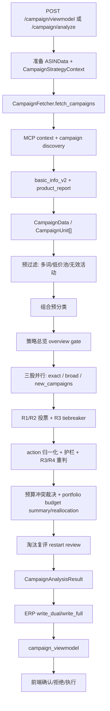

# Campaign分析引擎架构说明

## 目的

本篇说明 Campaign 广告活动分析引擎的真实架构。它以原 `docs/Campaign分析引擎交接文档.md` 为母本，保留数据流、核心设计、模块边界、API、配置和风险点，并对照当前代码修正已过时表述。

本文不是业务知识库，不记录短期过程信息。若本文与代码冲突，以代码为准。

## 当前代码真源

- API：`ad-direction-agent/app/api/campaign.py`
- ViewModel：`ad-direction-agent/app/api/campaign_viewmodel.py`
- 主编排：`ad-direction-agent/app/workflow/steps/campaign.py`
- 数据获取：`ad-direction-agent/app/data/campaign_fetcher.py`
- 预过滤：`ad-direction-agent/app/data/campaign_prefilter.py`
- 数据模型：`ad-direction-agent/app/models/campaign.py`
- LLM Prompt/解析：`ad-direction-agent/app/llm/reasoner.py`
- KB 切片：`ad-direction-agent/app/llm/kb_loader.py`
- 组合分类：`ad-direction-agent/app/workflow/steps/campaign_portfolio.py`
- 预算汇总：`ad-direction-agent/app/workflow/steps/campaign_budget_summary.py`
- 预算回算：`ad-direction-agent/app/workflow/steps/campaign_budget_reallocation.py`
- 新建活动：`ad-direction-agent/app/workflow/steps/campaign_new.py`
- 淘汰复评：`ad-direction-agent/app/workflow/steps/campaign_restart.py`
- 确定性护栏：`ad-direction-agent/app/workflow/steps/campaign_guardrails.py`
- ERP 写入：`ad-direction-agent/app/persistence/erp_writer/repository.py`
- 执行链路：`ad-direction-agent/app/workflow/steps/advert_execution.py`
- 配置：`ad-direction-agent/app/config/settings.py`
- 前端：`ad-direction-agent/demo/ad-asisitant-agent.html`、`demo/campaign-panel/`

## 模块定位

Campaign 引擎回答的是“现有广告活动和新增广告活动应该如何调整”。它独立于前置 `ASINData` 四层工作流，但会消费前置策略上下文。

核心能力：

- 发现父 ASIN 下的 Campaign、子 ASIN、关键词、match type、预算、bid、placement。
- 按精准流和广泛/词组/自动流分流分析。
- 对每个活动产出淘汰、调价、调预算、调广告位、保持等建议。
- 发现新增活动候选词并生成新建建议。
- 做组合预算汇总和预算回算。
- 对低价池/淘汰池活动做复评。
- 通过确定性护栏约束 LLM 输出。
- 写入 ERP 决策批次、card、pending 和 reason group。
- 为前端提供 viewmodel。
- 在用户确认后进入 Advert MCP 执行链路。

## 代码锚点地图

本节行号是当前代码快照的导航锚点。后续代码移动时，以函数名和 `rg` 复核为准。

| 职责 | 代码位置 | 说明 |
| --- | --- | --- |
| API 分析入口 | `app/api/campaign.py:113` `/campaign/analyze`；`:139` `/campaign/viewmodel`；`:265` `_do_analyze()` | 接收前端/API 请求，运行分析，按需写 ERP 并读回 viewmodel |
| ERP 写入门禁 | `app/api/campaign.py:40` `_maybe_push_erp()` | 判断是否写 ERP，写入后 finalize 最新批次 |
| 快照读取 | `app/api/campaign.py:235` `/campaign/snapshot` | 读取最新或指定 decision 快照 |
| 确认/执行 | `campaign.py:426` `/campaign/confirm`；`:511` `/campaign/execute`；`:534` `/campaign/execute-portfolio-budget` | 前端确认、拒绝和真实执行入口 |
| ViewModel 组装 | `app/api/campaign_viewmodel.py:113` `from_db_snapshot()` | ERP 21 表快照转前端结构 |
| Campaign 主流程 | `workflow/steps/campaign.py:253` `analyze_campaigns()`；`:310` `_analyze_campaigns_impl()` | 主分析编排 |
| 策略上下文 | `campaign.py:1085` `build_campaign_strategy_context()` | 把前置工作流 long_term/P3 转成 Campaign 背景 |
| 策略总览 | `campaign.py:1188` `_build_overview_facts()`；`:1239` `_run_overview()` | 生成 shared overview gate |
| 分流分析 | `campaign.py:1269` `_analyze_one_stream()`；`:1416` `_run_round()` | exact/broad 分批、双轮、R3/R4 |
| 护栏注入 | `campaign.py:2175` `_build_guardrail_alerts()`；`:2193` `_inject_alerts_to_summaries()`；`:2265` `_apply_campaign_guardrails()` | LLM 后的确定性修正和重判提示 |
| CampaignData 拉取 | `app/data/campaign_fetcher.py:45` `fetch_campaigns()`；`:964` `_assemble()` | MCP 结果归一成 CampaignUnit |
| 新建活动线 | `workflow/steps/campaign_new.py:263` `analyze_new_campaigns()`；`:484` `_run_round()` | 候选词、双轮 LLM、确定性补齐执行字段 |
| Prompt 构造 | `app/llm/reasoner.py:366`、`:437`、`:488`、`:523`、`:578` | exact/broad/new/synthesis/overview/budget prompt |
| ERP 映射/落库 | `persistence/erp_writer/mappers.py:357`；`repository.py:801` | CampaignAnalysisResult 转 card/pending/reason group |
| Advert 执行 | `workflow/steps/advert_execution.py:255`；`persistence/erp_writer/advert_exec_mapper.py:82` | CONFIRMED pending 转 MCP 执行计划 |

## 总数据流

## 输入对象

Campaign 主入口需要：

- `parent_asin`
- `days`
- `ASINData`
- `CampaignStrategyContext`
- 可选 `erp_override`
- 可选已预取 `CampaignData`
- 可选 `keyword_analysis`
- `run_id`

`ASINData` 提供父 ASIN 背景，例如毛利率、自然单占比、产品阶段、标题、库存、目标 ACOS 等。

`CampaignData` 提供活动级事实，例如活动名、campaign_id、子 ASIN、关键词、match type、当前 bid、当前 budget、广告效果、placement、search term 等。

两者不要混淆：`ASINData` 是父 ASIN 粒度，`CampaignData` 是 Campaign/子 ASIN/关键词粒度。

## CampaignData 构造

当前数据源是纯 MCP StarRocks 网关，不应再描述旧的数据源兜底链路。

主要工具和步骤：

1. `parent_listing_detail`：解析站点、店铺、父 SKU、产品名等上下文。
2. `ad_campaign_list` / `ad_campaign_product_keyword_list`：发现活动和活动-商品-关键词关系。
3. `ad_campaign_basic_info_v2`：按 campaign_id 批量查询活动基础信息。
4. `ad_campaign_product_report`：获取活动商品效果。
5. `ad_campaign_placement_report`：精准流需要时预取 placement。
6. `ad_campaign_search_term_report`：广泛流需要时预取 search term。
7. `ad_portfolio_list`：拉取 portfolio 真实预算，用于预算汇总和回算。
8. `keyword_child_asins` / `own_keyword_flow` / `flow_keywords`：用于自然排名、候选词和新建活动线。

`CampaignFetcher` 负责把这些 MCP 返回组装为 `CampaignUnit[]`。

数据来源细化：

| 数据/字段 | MCP/上游来源 | 代码锚点 | 下游用途 |
| --- | --- | --- | --- |
| 站点、店铺、父 SKU、产品名 | `parent_listing_detail` / MCP 上下文解析 | `campaign_fetcher.py:45` `fetch_campaigns()`；`:72` `resolve_mcp_context_from_mcp()` | 后续所有 Campaign MCP 调用的 shop/site/seller_sku 上下文 |
| 活动发现 | `ad_campaign_list` 与 `ad_campaign_product_keyword_list` | `campaign_fetcher.py:94` 并行发现；`:316` `_fetch_campaign_list()`；`:270` `_discover_context_from_mcp()` | 形成 campaign_id/name、商品、关键词关系 |
| 活动基础信息 | `ad_campaign_basic_info_v2` | `campaign_fetcher.py:177`；`:352` `_fetch_basic_batch_v2()` | current bid、budget、match type、state 等基础字段 |
| 活动商品表现 | `ad_campaign_product_report` | `campaign_fetcher.py:186`；`:454` `_fetch_perf_one()` | ACOS、spend、sales、orders、clicks、CVR 等事实 |
| placement | `ad_campaign_placement_report` | `campaign.py:1873` `_prefetch_placement()`；`campaign_fetcher.py:501` `fetch_placement_for()` | exact 流广告位建议和 P10 placement 护栏 |
| search term | `ad_campaign_search_term_report` | `campaign.py:1935` `_prefetch_search_terms()`；`campaign_fetcher.py:557` `fetch_search_terms_for()` | broad/phrase/auto 流否定词、搜索词证据 |
| portfolio 预算 | `ad_portfolio_list` | `campaign.py:366`；`campaign_fetcher.py:813` `fetch_portfolio_list()` | 组合预算汇总和预算回算 |
| 自然排名 | `keyword_child_asins` / `own_keyword_flow` | `campaign_fetcher.py:920` 附近批量拉取 | exact/new campaign 的关键词自然位证据 |
| 新建活动候选词 | `flow_keywords` / `own_keyword_flow` / 可选竞品反查 | `campaign_fetcher.py:602`；`:665`；`campaign_new.py:263` | 新建 exact/broad 活动候选池 |
| 建议竞价 | `suggested_bid` 或竞品反查自带 bid | `campaign_fetcher.py:759`；`:746` | 新建活动 bid 补齐 |

同一字段的多来源和兜底：

- campaign_id 优先来自 `ad_campaign_list`，活动-关键词关系来自 `ad_campaign_product_keyword_list`；两路在 `fetch_campaigns()` 中并行合并，避免单一路径缺字段导致活动不可识别。
- portfolio 预算优先使用 `ad_portfolio_list` 真实预算；失败时预算模块按既定比例做业务兜底，但该兜底只影响预算汇总，不伪造 MCP 明细事实。
- 新建活动候选词来自 `flow_keywords` 和 `own_keyword_flow`，竞品词源是可选增强；竞品不可用时不阻断主线。
- 当前链路是 MCP 真源，不再描述本地数仓直连兜底。

## 运行互斥和缓存

`campaign.py` 使用跨 worker 锁防止同一父 ASIN 重复分析：

- lock key：`campaign:running:{asin}`
- TTL：`campaign_total_timeout + 60`
- Redis 可用时使用 Redis lock；不可用时由基础设施降级。

CampaignData 另有 Redis 缓存：

- key：`campaign:data:{asin}:{days}`
- TTL：30 分钟
- refresh 时跳过缓存
- `total_campaigns == 0` 或 `errors` 非空时不入缓存，避免上游临时失败毒化缓存。

## 预过滤

预过滤分为两类：

1. `campaign_prefilter.py` 的数据层过滤：多词活动、无效活动、维度补齐等。
2. `campaign.py` 的分析前过滤：严格低价池活动，即 bid <= 0.20 且 budget <= 1.00。

严格低价池活动不送 LLM 重复分析，而是：

- 标记为 `__prefiltered`
- 归入低价捡漏组
- 可进入淘汰复评候选
- 前端以灰卡展示

如果全部活动都被预过滤，系统仍会同步 pool entry，然后返回无 LLM 分析结果。

## 分流策略

Campaign 引擎按 match type 分流：

- 精准流：`EXACT`
- 广泛流：非 `EXACT`，包括 `BROAD`、`PHRASE`、`AUTO`
- 新建活动线：独立并行，不直接等同于 existing campaign 调整

精准流和广泛流使用不同 prompt 和证据：

| 流 | 主要证据 | 主要动作 |
| --- | --- | --- |
| exact | product report、placement、关键词自然排名、策略上下文 | bid、budget、placement、淘汰、保持 |
| broad/phrase/auto | product report、search term、否定词机会、策略上下文 | bid、budget、negative keywords、淘汰、保持 |
| new_campaigns | flow keywords、own keyword flow、排名、搜索量、标题相关性、竞品可选源 | 新建 exact/broad 活动 |

## 策略总览 overview gate

主分析会先启动策略总览任务，但不阻塞 prefetch。

设计：

- `campaign_overview_enabled` 控制是否启用。
- overview 输出 `posture_brief`。
- `posture_brief` 注入共享 `ctx_dict["_strategic_overview_text"]`。
- exact、broad、new_campaigns 在进入 LLM 轮次前等待 overview gate。
- overview 失败 fail-open，只产生 warning，不阻断三股主流。

它的作用是让三股分析共享“今日总纲”，避免各流判断风格漂移。

策略总览细节：

| 问题 | 当前实现 |
| --- | --- |
| 数据从哪来 | 主流程已拿到的 `CampaignData` / `CampaignUnit[]`、portfolio summary、前置 `CampaignStrategyContext`；`campaign.py:491` 调 `_build_overview_facts()`，实现位于 `campaign.py:1188` |
| 是否额外调用 MCP | overview 自身不另开一套 MCP 拉取；它消费已组装的 CampaignData 和策略上下文 |
| Prompt 如何组装 | `campaign.py:1248` 调 `reasoner.recommend_campaign_overview()`；系统提示在 `reasoner.py:523` `_build_campaign_overview_prompt()`；知识库切片由 `kb_loader.py:72` 的 `campaign_overview` 注入 |
| 产出什么 | `CampaignStrategicOverview`，核心是 `posture_brief`、风险/机会摘要和全局策略姿态 |
| 谁消费 | `_ov_holder` 保存 overview；`ctx_dict["_strategic_overview_text"]` 注入 exact/broad/new 三股分析；`campaign_new.py:525` 等待 overview gate 后进入新建活动 LLM 轮次 |
| 前端看到什么 | `CampaignAnalysisResult.strategic_overview` 写 ERP 后由 viewmodel 透出，前端作为本批次总览展示 |
| 失败会怎样 | fail-open：记录 warning，不阻断 exact/broad/new 主流 |

Prompt 组装细节：

| 分支 | Prompt 入口 | KB 切片 | 输入事实 | 结构化输出 |
| --- | --- | --- | --- | --- |
| exact 调整 | `reasoner.py:366` `_build_campaign_system_prompt("exact")`；`:1589` `recommend_campaign_batch()` | `kb_loader.py:64` `campaign_adjustment_exact` | CampaignUnit、placement、自然排名、策略上下文、overview text | `CampaignAdjustmentItem[]` |
| broad/phrase/auto 调整 | `reasoner.py:366` `_build_campaign_system_prompt("broad")`；`:1589` `recommend_campaign_batch()` | `kb_loader.py:67` `campaign_adjustment_broad` | CampaignUnit、search terms、否定词证据、策略上下文、overview text | `CampaignAdjustmentItem[]` |
| new campaign | `reasoner.py:437` `_build_new_campaign_prompt()`；`:1813` `recommend_new_campaigns()` | `kb_loader.py:82` `new_campaign` | 候选词、自然排名、流量词、建议竞价、策略上下文、overview text | 新建活动候选决策，代码再补齐执行字段 |
| synthesis | `reasoner.py:488` `_build_campaign_synthesis_prompt()`；`:2011` `recommend_campaign_synthesis()` | Campaign synthesis 相关切片 | 已有活动调整、新建活动、预算摘要、策略总览 | reason groups / specials |
| budget reallocation | `reasoner.py:578` `_build_budget_realloc_prompt()`；`:2101` `recommend_budget_reallocation()` | `kb_loader.py:85` `budget_reallocation` | portfolio 预算、组别预算、调整建议、父级净增约束 | 组合预算重分配建议 |

## LLM 分批与投票

现有 Campaign 调整采用分批 + 双轮投票：

- batch size 默认来自 `campaign_batch_size`，当前默认 6。
- per-stream 并发来自 `campaign_llm_concurrency`。
- 单批 LLM timeout 在 `campaign.py` 中定义为 60 秒。
- R1/R2 使用不同随机种子排序。
- R1/R2 输出按 `campaign_key` 合并。
- action 和关键方向一致则 high。
- 单轮缺失或两轮分歧进入 R3。
- R3 直接采信并标 medium。
- 两轮都漏且 R3 仍漏的活动删除占位，交 skipped 兜底，不伪造成 keep。

投票只比较核心决策方向。否定词是叠加型建议，不作为投票分歧判据；两轮并集保留，并用 vote 标注可信度。

## action 归一化

LLM 输出的 action 不是最终真源。`_normalize_action()` 会根据 proposed/current 差异重新推导动作：

- budget 变化 → `adjust_budget`
- bid 变化 → `adjust_bid`
- placement 变化 → `adjust_placement`
- 低价池淘汰 → `eliminate_to_low_bid_pool`
- 无变化 → `keep`

多维同时变化时，由单 action 字段限制按业务优先级归一。后续预算冲突裁决后还会二次归一，避免 pending 与展示动作不一致。

## 确定性护栏

`campaign_guardrails.py` 是不依赖 LLM 的硬规则层。

它负责：

- 核心活动保护。
- 新活动样本不足保护。
- 复活动作保护。
- 无单且 bid/budget 已触底时强制淘汰。
- 预算上限、低花费、样本量、bid 下限等约束。
- 新建活动 bid 保护。
- 输出 `retry_instruction` 和 `campaign_key`，供 R3/R4 重判注入。

护栏不只是过滤器。当前主链路会把护栏告警转成 per-campaign alert 注入 LLM 重判，最多进入 R3/R4 编排；最终仍不合规则走护栏兜底。

生效节点和优先级：

| 节点 | 代码锚点 | 作用 |
| --- | --- | --- |
| LLM 轮次后第一次护栏 | `campaign.py:671` 附近 | 对 R1/R2/R3 产出的建议做确定性修正，产生 rule result |
| 护栏告警构造 | `campaign.py:680` / `campaign.py:2175` `_build_guardrail_alerts()` | 把违规点转成 LLM 可读的 retry instruction |
| 重判注入 | `campaign.py:722` / `campaign.py:2193` `_inject_alerts_to_summaries()` | 将 per-campaign alert 注入后续 R3/R4 prompt |
| 第二次护栏 | `campaign.py:785` 附近 | 重判后仍执行确定性兜底，保证最终输出不越界 |
| 规则执行顺序 | `campaign_guardrails.py:83` `apply_all()` | 先 P0-P2 保护类，再 P3-P11 裁决/数值类 |

低价池口径：

- 严格预过滤/已在池判定是 AND：`bid <= 0.20` 且 `budget <= 1.00`，见 `campaign_guardrails.py:37` `is_strictly_in_low_bid_pool()`。
- 归组/强制淘汰触发是 OR：`bid <= 0.10` 或 `budget <= 1.00`，见 `campaign_guardrails.py:48` `_is_in_elimination_pool()` 和 `campaign_guardrails.py:492` `_p3_should_force_eliminate()`。
- 这两个口径不要混用：AND 更适合“已经低价池/预过滤”，OR 更适合“应该进入低价池/强制淘汰”。

护栏规则全表：

| 优先级 | 规则 | 触发条件 | 修正动作 | 边界和后续 |
| --- | --- | --- | --- | --- |
| P0 | `P0_CORE_PROTECT` `campaign_guardrails.py:117` | `is_core=True` 且 action 为淘汰 | 强制 keep，清理淘汰相关 proposed 字段 | 最高保护之一；后续 P3 不应再把它淘汰 |
| P1 | `P1_SAMPLE_INSUFFICIENT` `campaign_guardrails.py:134` | 样本不足且 action 为淘汰；样本不足包括投放天数 <=3、7 天花费 < $5、点击 <10 | 强制 keep | P3 硬淘汰优先级高于 P1；触底场景交给 P3/P4 |
| P2 | `P2_REACTIVATION_PROTECT` `campaign_guardrails.py:159` | `days_since_reactivation` 在 0..3 且 action 为淘汰 | 强制 keep | 与 P0 同属高优保护，防止刚恢复活动抖动 |
| P3 | `P3_FORCE_ELIMINATE` `campaign_guardrails.py:177` | 无订单、非核心、非复活保护，且 bid <=0.10 或 budget <=1.00 | 强制 `eliminate_to_low_bid_pool`，budget=1，bid 收敛到 0.10..0.20，清 placement/否定词 | P0/P2 高于 P3；P1 不阻断触底淘汰 |
| P4 | `P4_ELIMINATION_FILL` `campaign_guardrails.py:223` | action 已为淘汰但淘汰字段不完整或越界 | 补 budget=1，bid=max(0.10,min(current,proposed,0.20))，清 placement/否定词 | 保证 ERP pending 和执行层拿到完整淘汰值 |
| P5 | `P5_PROTECTION_REVERSAL` `campaign_guardrails.py:255` | 后续链路把核心/复活保护项重新变成淘汰 | 再次强制 keep | 保护类兜底，防止规则链或 LLM 重判反向覆盖 |
| P6 | `P6_BUDGET_CAP` `campaign_guardrails.py:279` | proposed_budget > 200 | cap 到 200 | 硬上限，避免 LLM 给出异常预算 |
| P7 | `P7_BUDGET_LOW_SPEND` `campaign_guardrails.py:294` | 非淘汰、预算上调，但近 7 天花费 / 当前预算容量 < 50% | proposed_budget 回到 current_budget | 花不完预算时禁止继续加预算 |
| P8 | `P8_BID_AMPLITUDE` `campaign_guardrails.py:327` | 非淘汰、bid 变化超过 50%，且 clicks <10 | 将变化收敛到 30%，并保留最低 0.20 | 小样本下限制剧烈 bid 调整 |
| P9 | `P9_BID_CAP` `campaign_guardrails.py:358` | proposed_bid > 3 | cap 到 3 | bid 硬上限 |
| P10 | `P10_PLACEMENT_BLOCK` `campaign_guardrails.py:374` | TOS 加价，且库存天数 <15、退货率 >=30% 或评分 <3.8 | placement action 改为维持，proposed_pct=current_pct | 只阻断 TOS 增加，不等同于禁止所有活动调整 |
| P11 | `P11_NEW_CAMPAIGN_BID` `campaign_guardrails.py:425` | 新活动创建后天数 <=3 且 bid 降幅过大 | 降幅收窄到不超过 current_bid 的 10% 或 $0.05 | P4 已处理淘汰值时跳过；P1 只改 action 不改 proposed 值，所以仍需检查降 bid |

通过/不通过后的后续：

- 通过护栏：建议继续进入预算冲突裁决、synthesis、ERP 映射和 viewmodel。
- 被护栏修正：修正后的 item 成为新的事实输出，同时 rule result 进入 warnings/round detail，供前端和开发排查。
- 需要 LLM 重判：护栏生成 `retry_instruction` 和 `campaign_key`，注入 R3/R4；重判后仍再次执行护栏。
- 最终仍违规：以确定性护栏修正为准，不允许 LLM 原始输出直接写入 pending。

## 组合分类和预算

Campaign 引擎维护四类组合语义：

- 精准主力组
- 精准测试组
- 自动广泛组
- 低价捡漏组

代码真源是 `campaign_portfolio.py` 的常量和映射。ERP 侧使用 code，前端展示中文 label。

预算相关模块：

- `campaign_budget_summary.py`：生成预算汇总，优先使用 `ad_portfolio_list` 真实 portfolio 预算；失败则按 60/20/20 兜底。
- `campaign_budget_reallocation.py`：按 KB23 做组合预算回算，起点是 current_group_budget，并受增量约束。
- `campaign_parent_allowed_net_increase`：父级允许净增，当前默认 0，意味着预算增长要非常谨慎。

低价捡漏组不参与主推/测试/广泛三组预算约束，通常按每活动 1 美元思路处理。

## 新建活动线

`campaign_new.py` 是独立并行管道。

候选来源：

- `flow_keywords`
- `own_keyword_flow`
- 自然排名信号
- 可选竞品词源

核心步骤：

1. ASIN 级阻断判断，例如某些产品状态不适合新建。
2. 候选词发现和去噪。
3. 合并同词多来源信号。
4. 桶配额选择。
5. 建议竞价查询。
6. 双轮 LLM 选词。
7. 两轮都判“建”的词取交集。
8. 代码层补齐 match_type、bid、budget、campaign_name、目标子 ASIN、portfolio class。

重要边界：

- 相关性、词类型、建不建属于主观语义判断，交给 LLM。
- bid、budget、campaign_name、match_type、placement 等执行字段由代码确定性补齐。
- 双轮一轮失败时退化为单轮并标记人工复核；双轮都失败则无新增建议。

## 淘汰复评

`campaign_restart.py` 负责低价池/淘汰池复评。

流程：

1. discovery 阶段同步 `t_advert_agent_pool_entry`。
2. 读取入池日期和淘汰前花费等信息。
3. 只评估入池天数达到 `campaign_restart_review_days` 的候选。
4. 候选数量受 `campaign_restart_max_candidates` 限制。
5. 拉取在池窗口订单。
6. 必要时拉取精准 30 天均 CPC。
7. 生成恢复预算、恢复 bid 或继续保留低价池的建议。

复评输出复用 `CampaignAdjustmentItem`，因此后续可走同一套落库、pending、前端展示和执行链路。

## CampaignAnalysisResult

最终结果包括：

- `adjustments`：已有活动调整。
- `new_campaigns`：新建活动建议。
- `strategic_overview`：策略总览。
- `budget_summary` / budget reallocation 相关字段。
- `skipped_campaigns`：预过滤、未分析、数据不足等。
- `warnings`：非致命问题。
- `rounds_detail`：R1/R2/R3 等细节。
- `data_unavailable`：上游数据不可用标记。

`data_unavailable=true` 必须和“业务判断无需调整”区分。前端、定时任务和 ERP 写入门禁都不应把它当作正常 no-op。

## ERP 落库

Campaign viewmodel 主入口通常走“分析 → 落库 → 读回快照 → viewmodel”的路径。

主要 ERP 结构：

- `t_advert_agent_decision`
- `t_advert_agent_modify_suggest_summary`
- `t_advert_agent_modify_suggest_card`
- `t_advert_agent_modify_campaign_pending`
- `t_advert_agent_modify_keyword_pending`
- `t_advert_agent_modify_placement_pending`
- `t_advert_agent_modify_suggest_reason_group`
- `t_advert_agent_modify_suggest_reason_group_member`
- `t_advert_agent_modify_suggest_special`
- `t_advert_agent_pool_entry`

落库原则：

- `decision_id` 是一次分析批次主键。
- card 是前端展示主项。
- pending 是确认和执行的事实来源。
- reason group 和 special display 服务前端叙事。
- 执行记录类表由 ERP 系统自身维护，Python 链路不应随意直写。

结果到前端/执行的链路：

1. `workflow/steps/campaign.py:995` 附近组装 `CampaignAnalysisResult`，包含 `adjustments`、`new_campaigns`、`strategic_overview`、预算摘要、skipped 和 warnings。
2. `api/campaign.py:40` `_maybe_push_erp()` 判断是否写入 ERP；写入前会保留 `CampaignAnalysisResult` 的结构化字段。
3. `persistence/erp_writer/mappers.py:357` 起把 adjustments 映射为 card、campaign pending、keyword pending、placement pending；`:477` 起映射 new campaign；`:523` 起映射灰卡 skipped。
4. `persistence/erp_writer/repository.py:801` `_upsert_modern_cards_and_pending()` 写 card/pending；`:1024` 写 synthesis reason group/member/special。
5. `repository.py:563` `finalize_batch()` 维护同 ASIN 唯一 `is_latest=1` 批次。
6. `api/campaign.py:184` 读回 snapshot 后调用 `from_db_snapshot(mode="interactive")`；`/campaign/snapshot` 在 `campaign.py:253` 走同一个 mapper。
7. `campaign_viewmodel.py:123` 到 `:125` 按 card 索引三类 pending；`:183` 将前端 `campaign_key` 收敛为 card_id；`:249` 到 `:276` 组装 reason groups/specials；`:297` 输出 `is_latest`。
8. 前端只消费 viewmodel，不直接消费原始 `CampaignAnalysisResult`。
9. 用户确认时 `/campaign/confirm` 把前端 card_id 形式的 `campaign_key` 写回 card 和三类 pending 的 confirm_status。
10. 执行时 `advert_execution.py:255` 只读取 CONFIRMED 且 `execute_status=PENDING` 的 pending；`advert_exec_mapper.py:82` 编译为 Advert MCP 调用计划。

## ViewModel 和前端

`campaign_viewmodel.py` 把 ERP 快照转换为前端可消费结构。

职责：

- 合并 card、campaign pending、keyword pending、placement pending。
- 生成 action class。
- 翻译 review level。
- 兼容旧枚举。
- 输出可确认、可拒绝、可执行状态。
- 标识 `is_latest`。

前端 Campaign panel 位于 `demo/campaign-panel/`：

- `panel.js`：挂载和请求。
- `state.js`：选择、确认、执行、toast。
- `events.js`：事件委托。
- `viewmodel.js`：normalize 和兼容。
- `render.js`：DOM 输出。
- `panel.css`：样式。

前端不应直接依赖原始 `CampaignAnalysisResult`，而应消费 viewmodel。

## API 端点

| 方法 | 路径 | 责任 |
| --- | --- | --- |
| POST | `/campaign/analyze` | 返回老格式 `CampaignAnalysisResult`，用于调试和兼容 |
| POST | `/campaign/viewmodel` | 主入口：分析/落库/读回 viewmodel |
| GET | `/campaign/snapshot` | 读取已有 ERP 快照 |
| POST | `/campaign/confirm` | 确认/拒绝建议，更新 card 和 pending confirm_status |
| POST | `/campaign/execute` | 执行已确认广告调整，进入 Advert MCP 链路 |
| POST | `/campaign/execute-portfolio-budget` | 执行组合预算调整 |

## 关键配置

| 配置 | 说明 |
| --- | --- |
| `campaign_batch_size` | 每批送 LLM 的活动数 |
| `campaign_llm_concurrency` | Campaign 每流 LLM 并发 |
| `campaign_llm_temperature` | LLM 温度 |
| `campaign_total_timeout` | Campaign 总分析超时 |
| `campaign_sem_acquire_timeout` | 等待 Campaign semaphore 的上限 |
| `campaign_discovery_timeout` | discovery 超时 |
| `campaign_mcp_tool_timeout` | Campaign MCP 工具超时 |
| `campaign_prefilter_enabled` | 是否启用预过滤 |
| `campaign_overview_enabled` | 是否启用策略总览 |
| `campaign_portfolio_enabled` | 是否启用组合分类 |
| `campaign_portfolio_fetch_enabled` | 是否拉取真实 portfolio 预算 |
| `campaign_budget_agent_enabled` | 是否启用预算 agent；失败走规则兜底 |
| `campaign_parent_allowed_net_increase` | 父级预算允许净增 |
| `campaign_new_enabled` | 是否启用新建活动线 |
| `campaign_new_max_count` | 新建候选最大数量 |
| `campaign_new_max_creates` | 新建输出最大数量 |
| `campaign_restart_enabled` | 是否启用淘汰复评 |
| `campaign_restart_review_days` | 入池后多少天可复评 |
| `campaign_restart_fetch_concurrency` | 复评拉数并发 |

## 执行链路边界

Campaign 分析本身不直接动真实广告。

执行需要：

1. 分析结果落 ERP。
2. 前端或 API 确认建议。
3. `/campaign/execute` 读取 confirmed pending。
4. `advert_exec_mapper.py` 构造执行计划。
5. `advert_execution.py` 检查 `advert_mcp_enabled` 和 `advert_exec_dry_run`。
6. 调用 Advert MCP。
7. 回写 execute_status。

写 pending 不等于真实执行。默认 `advert_exec_dry_run=true` 时只生成计划和状态，不动 Amazon 广告。

## 常见误区

- 不要把旧文档里的本地数仓上下文查询或外部 DB 兜底当成当前架构。
- 不要把 `campaign_key` 当数据库主键；它是业务匹配键，落库后仍以 decision/card/pending ID 为准。
- 不要让 LLM 输出绕过 `_normalize_action()` 和 guardrails。
- 不要把低价池预过滤理解为丢弃数据；它会进入灰卡和复评链路。
- 不要把新建活动线当成 exact/broad 流的副产物；它是第三条并行管道。
- 不要把 `adjustments` 为空当成无结果，还要检查 `new_campaigns`、`budget_summary`、`skipped_campaigns` 和 `data_unavailable`。
- 不要让前端直接拼 pending 逻辑；应优先通过 viewmodel。

## 更新检查清单

- 修改 `campaign.py` 主流程后，同步更新总数据流、投票、护栏和预算段。
- 修改 `campaign_fetcher.py` 或 `mcp_mapping.py` 后，同步更新 CampaignData 构造和 MCP 文档。
- 修改 `campaign_guardrails.py` 后，同步更新护栏段和测试地图。
- 修改 `campaign_new.py` 后，同步更新新建活动线。
- 修改 `campaign_restart.py` 或 pool entry 逻辑后，同步更新淘汰复评。
- 修改 ERP repository/mappers 后，同步更新落库段和数据库文档。
- 修改 `campaign_viewmodel.py` 或前端 panel 后，同步更新 ViewModel 和前端文档。
