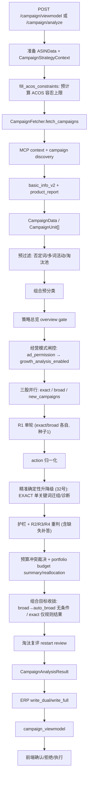

# Campaign分析引擎架构说明

## 目的

本篇说明 Campaign 广告活动分析引擎的真实架构。它以原 `docs/Campaign分析引擎交接文档.md` 为母本，保留数据流、核心设计、模块边界、API、配置和风险点，并对照当前代码修正已过时表述。

本文不是业务知识库，不记录短期过程信息。若本文与代码冲突，以代码为准。

## 当前代码真源

- API：`ad-direction-agent/app/api/campaign.py`
- ViewModel：`ad-direction-agent/app/api/campaign_viewmodel.py`
- 主编排：`ad-direction-agent/app/workflow/steps/campaign.py`
- 数据获取：`ad-direction-agent/app/data/campaign_fetcher.py`
- 活动级样本判定：`ad-direction-agent/app/core/campaign_sample.py`
- 预过滤：`ad-direction-agent/app/data/campaign_prefilter.py`
- 数据模型：`ad-direction-agent/app/models/campaign.py`
- LLM Prompt/解析：`ad-direction-agent/app/llm/reasoner.py`
- KB 切片：`ad-direction-agent/app/llm/kb_loader.py`
- Ontology 契约：`ad-direction-agent/docs/knowledge_base/ontology/runtime_contract.yaml`
- 组合分类：`ad-direction-agent/app/workflow/steps/campaign_portfolio.py`
- 预算汇总：`ad-direction-agent/app/workflow/steps/campaign_budget_summary.py`
- 预算回算：`ad-direction-agent/app/workflow/steps/campaign_budget_reallocation.py`
- 新建活动：`ad-direction-agent/app/workflow/steps/campaign_new.py`
- 搜索词提精准：`ad-direction-agent/app/workflow/steps/campaign_search_term_promotion.py`
- 淘汰复评：`ad-direction-agent/app/workflow/steps/campaign_restart.py`
- 确定性护栏：`ad-direction-agent/app/workflow/steps/campaign_guardrails.py`
- ACOS 约束：`ad-direction-agent/app/core/acos_constraints.py`
- 精准升降级：`ad-direction-agent/app/workflow/steps/campaign_exact_transition.py`
- ERP 写入：`ad-direction-agent/app/persistence/erp_writer/repository.py`
- 执行链路：`ad-direction-agent/app/workflow/steps/advert_execution.py`
- 配置：`ad-direction-agent/app/config/settings.py`
- 前端：`ad-direction-agent/demo/ad-asisitant-agent.html`、`demo/campaign-panel/`

## 模块定位

Campaign 引擎回答的是“现有广告活动和新增广告活动应该如何调整”。它独立于前置 `ASINData` 四层工作流，但会消费前置策略上下文。

核心能力：

- 发现父 ASIN 下的 Campaign、子 ASIN、关键词、match type、预算、bid、placement。
- 按精准流和广泛/词组/自动流分流分析。
- 对每个活动产出淘汰、调价、调预算、调广告位、保持等建议。
- 发现新增活动候选词并生成新建建议。
- 做组合预算汇总和预算回算。
- 对低价池/淘汰池活动做复评。
- 通过确定性护栏约束 LLM 输出。
- 写入 ERP 决策批次、card、pending 和 reason group。
- 为前端提供 viewmodel。
- 在用户确认后进入 Advert MCP 执行链路。

## 代码锚点地图

本节行号是当前代码快照的导航锚点。后续代码移动时，以函数名和 `rg` 复核为准。

| 职责 | 代码位置 | 说明 |
| --- | --- | --- |
| API 分析入口 | `app/api/campaign.py:113` `/campaign/analyze`；`:139` `/campaign/viewmodel`；`:265` `_do_analyze()` | 接收前端/API 请求，运行分析，按需写 ERP 并读回 viewmodel |
| ERP 写入门禁 | `app/api/campaign.py:40` `_maybe_push_erp()` | 判断是否写 ERP，写入后 finalize 最新批次 |
| 快照读取 | `app/api/campaign.py:235` `/campaign/snapshot` | 读取最新或指定 decision 快照 |
| 确认/执行 | `campaign.py` `/campaign/confirm`（approve 内调统一提交/轮询服务）；`:534` `/campaign/execute-portfolio-budget`；`decision.py` `/decision/immediate-exit`、`/decision/execution-status` | 前端确认、拒绝和真实执行入口（2026-08-03 起 `/campaign/execute` 已删除） |
| ViewModel 组装 | `app/api/campaign_viewmodel.py:113` `from_db_snapshot()` | ERP 21 表快照转前端结构 |
| Campaign 主流程 | `workflow/steps/campaign.py:253` `analyze_campaigns()`；`:310` `_analyze_campaigns_impl()` | 主分析编排 |
| 策略上下文 | `campaign.py:1085` `build_campaign_strategy_context()` | 把前置工作流 long_term/P3 转成 Campaign 背景 |
| 策略总览 | `campaign.py:1188` `_build_overview_facts()`；`:1239` `_run_overview()` | 生成 shared overview gate |
| 分流分析 | `campaign.py` `_analyze_one_stream()` / `_run_round()` | exact/broad 分批、R1 单轮、护栏 R2/R3/R4 重判；广泛流同时承载搜索词提精准候选 |
| 护栏注入 | `campaign.py:2175` `_build_guardrail_alerts()`；`:2193` `_inject_alerts_to_summaries()`；`:2265` `_apply_campaign_guardrails()` | LLM 后的确定性修正和重判提示 |
| CampaignData 拉取 | `app/data/campaign_fetcher.py:45` `fetch_campaigns()`；`:964` `_assemble()` | MCP 结果归一成 CampaignUnit |
| 新建活动线 | `workflow/steps/campaign_new.py` `analyze_new_campaigns()` / `finalize_new_campaign_decisions()` | 流量来源候选与广泛流搜索词来源合流、按词去重、统一补齐执行字段和最终截断 |
| Prompt 构造 | `app/llm/reasoner.py:366`、`:437`、`:488`、`:523`、`:578` | exact/broad/new/synthesis/overview/budget prompt |
| ERP 映射/落库 | `persistence/erp_writer/mappers.py:357`；`repository.py:801` | CampaignAnalysisResult 转 card/pending/reason group |
| Advert 执行 | `workflow/steps/advert_execution.py:255`；`persistence/erp_writer/advert_exec_mapper.py:82` | CONFIRMED pending 转 MCP 执行计划 |
| 经营模式权限闸 | `campaign.py:414` `ad_permission`；`:417` `growth_analysis_enabled` | 经营模式 → AdPermission，控制增长流（复评/新建）开关 |
| ACOS 容忍上限 | `campaign.py:1246` `fill_acos_constraints()` → `acos_constraints.py:55` `compute_acos_tolerance()` | 预计算 effective_acos_tolerance / target_cpa，注入策略上下文 |
| 精准升降级 | `campaign.py:1153` `_apply_exact_transition_rules()` → `campaign_exact_transition.py:172` `evaluate_exact_transition()` | 32号规则引擎：EXACT 单关键词活动的迁组/诊断，LLM 合并后护栏前执行 |
| 组合目标收拢 | `campaign.py:2101` `_reconcile_portfolio_targets()` | 落库前唯一可信挪组 target：广泛→auto_broad，精准仅 EXACT_TRANSITION 结果可写 |
| Ontology Card | `kb_loader.py:232` `build_ontology_card()` | 从 runtime_contract.yaml 拼装精简 Ontology Card 注入 prompt |

## 总数据流



## 输入对象

Campaign 主入口需要：

- `parent_asin`
- `days`
- `ASINData`
- `CampaignStrategyContext`
- 可选 `erp_override`
- 可选已预取 `CampaignData`
- 可选 `keyword_analysis`
- `run_id`

`ASINData` 提供父 ASIN 背景，例如毛利率、自然单占比、产品阶段、标题、库存、目标 ACOS 等。

`CampaignData` 提供活动级事实，例如活动名、campaign_id、子 ASIN、关键词、match type、当前 bid、当前 budget、广告效果、placement、search term 等。

两者不要混淆：`ASINData` 是父 ASIN 粒度，`CampaignData` 是 Campaign/子 ASIN/关键词粒度。

## CampaignData 构造

当前数据源是纯 MCP StarRocks 网关，不应再描述旧的数据源兜底链路。

主要工具和步骤：

1. `parent_listing_detail`：解析站点、店铺、父 SKU、产品名等上下文。
2. `ad_campaign_list` / `ad_campaign_product_keyword_list`：发现活动和活动-商品-关键词关系。
3. `ad_campaign_basic_info_v2`：按 campaign_id 批量查询活动基础信息。
4. `ad_campaign_product_report`：获取活动商品效果。
5. `ad_campaign_placement_report`：精准流需要时预取 placement。
6. `ad_campaign_search_term_report`：广泛流需要时预取 search term。
7. `ad_portfolio_list`：固定 1/3/7 天三窗口并行（`qryFixedPortfolio=true, qryReport=true`），拉取 portfolio 原始预算、日均花费、窗口总花费、ACOS。预算+日均花费供 LLM 回算；花费+ACOS 落库供前端看板。
8. `keyword_child_asins` / `own_keyword_flow` / `flow_keywords`：用于自然排名、候选词和新建活动线。

`CampaignFetcher` 负责把这些 MCP 返回组装为 `CampaignUnit[]`。

数据来源细化：

| 数据/字段 | MCP/上游来源 | 代码锚点 | 下游用途 |
| --- | --- | --- | --- |
| 站点、店铺、父 SKU、产品名 | `parent_listing_detail` / MCP 上下文解析 | `campaign_fetcher.py:45` `fetch_campaigns()`；`:72` `resolve_mcp_context_from_mcp()` | 后续所有 Campaign MCP 调用的 shop/site/seller_sku 上下文 |
| 活动发现 | `ad_campaign_list` 与 `ad_campaign_product_keyword_list` | `campaign_fetcher.py:94` 并行发现；`:316` `_fetch_campaign_list()`；`:270` `_discover_context_from_mcp()` | 形成 campaign_id/name、商品、关键词关系 |
| 活动基础信息 | `ad_campaign_basic_info_v2` | `campaign_fetcher.py:177`；`:352` `_fetch_basic_batch_v2()` | current bid、budget、match type、state 等基础字段 |
| 活动商品表现 | `ad_campaign_product_report` | `campaign_fetcher.py:186`；`:454` `_fetch_perf_one()` | ACOS、spend、sales、orders、clicks、CVR 等事实 |
| placement | `ad_campaign_placement_report` | `campaign.py:1873` `_prefetch_placement()`；`campaign_fetcher.py:501` `fetch_placement_for()` | exact 流广告位建议和 P10 placement 护栏 |
| search term | `ad_campaign_search_term_report` | `campaign.py` `_prefetch_search_terms()`；`campaign_fetcher.py` `fetch_search_terms_for()` / `build_search_term_bundle()` | 活动级样本门禁后并行取 7d+14d；7d 生成候选、低信号过滤、按订单/花费/点击排序并截取 20 条；仅 7d 样本不足词按同词键补 14d |
| portfolio 预算+花费+ACOS | `ad_portfolio_list` (固定 1/3/7d 三窗口并行) | `campaign.py:546`；`campaign_fetcher.py:817` `fetch_portfolio_list()` | 原始预算→回算；日均花费→LLM prompt；1/3/7d 花费+ACOS→DB→前端看板 |
| 自然排名 | `keyword_child_asins` / `own_keyword_flow` | `campaign_fetcher.py:920` 附近批量拉取 | exact/new campaign 的关键词自然位证据 |
| 新建活动候选词 | 流量来源：`flow_keywords` / `own_keyword_flow` / 可选竞品反查；搜索词来源：广泛/词组/自动流搜索词候选 | `campaign_fetcher.py:602`；`:665`；`campaign_search_term_promotion.py`；`campaign_new.py` | 合流后的新建 exact/broad 活动候选池 |
| 建议竞价 | `suggested_bid` 或竞品反查自带 bid | `campaign_fetcher.py:759`；`:746` | 新建活动 bid 补齐 |

同一字段的多来源和兜底：

- campaign_id 优先来自 `ad_campaign_list`，活动-关键词关系来自 `ad_campaign_product_keyword_list`；两路在 `fetch_campaigns()` 中并行合并，避免单一路径缺字段导致活动不可识别。
- portfolio 预算+花费+ACOS 优先使用 `ad_portfolio_list` 真实值（固定 1/3/7d 三窗口并行，7d 失败→整体回退 60/20/20；1d/3d 失败仅对应窗口 NULL）。预算兜底只影响 LLM 回算，不伪造花费/ACOS 事实。花费/ACOS 不进入 `aggregate()` 或 LLM prompt，仅走 DB→快照→前端看板。
- 新建活动的流量来源为 `flow_keywords` 和 `own_keyword_flow`，竞品词源是可选增强；搜索词来源为广泛/词组/自动流搜索词提精准。竞品不可用时不阻断主线，搜索词来源也不另开 MCP 管道。
- 当前链路是 MCP 真源，不再描述本地数仓直连兜底。

### 搜索词活动门禁与 bundle 预处理

`_prefetch_search_terms()` 先消费 `assess_campaign_sample()` 的活动级判定，再决定是否调用搜索词 MCP：

- 活动上线不足 3 天，或 7d 花费低于 `max($5, target_cpa×0.5)`，或 7d 点击少于 10：标记 `SKIPPED_CAMPAIGN_SAMPLE_INSUFFICIENT`，不调用搜索词 MCP，也不向 LLM 透传逐词数据。
- 活动样本充足：同一活动串行完成活动基础数据后，再同时请求 7d 和 14d 搜索词报告；不发起 30d 请求。
- `build_search_term_bundle()` 以 7d 为唯一候选集，先按标准化词键聚合并删除完全无行为信号的词（订单、点击、花费均为 0 且曝光为 0/缺失）。
- 候选按 7d `orders desc → cost desc → clicks desc → impressions desc → keyword asc` 排序，单活动技术上限为 `search_term_llm_max_terms_per_campaign=20`；旧的 Top10/花费排序不再适用。
- 只对入选且 `term_sample_insufficient=true` 的 7d 词，按标准化词键补充 14d；14d 独有词、被过滤词和被截断词不进入 LLM。

每个 bundle 记录原始行数、低信号删除数、容量截断数、最终词数、7d 样本不足数和 14d 同键命中数。LLM renderer 为每个词标注 `window=7d/14d` 与 `term_sample_insufficient`，7d 是动作基线，14d 只能辅助观察。

## 运行互斥和缓存

`campaign.py` 使用跨 worker 锁防止同一父 ASIN 重复分析：

- lock key：`campaign:running:{asin}`
- TTL：`campaign_total_timeout + 60`
- Redis 可用时使用 Redis lock；不可用时由基础设施降级。

CampaignData 另有 Redis 缓存：

- key：`campaign:data:{asin}:{days}`
- TTL：30 分钟
- refresh 时跳过缓存
- `total_campaigns == 0` 或 `errors` 非空时不入缓存，避免上游临时失败毒化缓存。

## 预过滤

预过滤分为两层，在 Campaign 数据拉取完成后、LLM 分析前顺序执行。第一层处理原始行 dict（MCP 未组装），第二层处理 `CampaignUnit`（MCP basic_info 组装后）。

### 第一层：数据层硬过滤（`campaign_prefilter.py`）

`filter_campaigns(raw: list[dict]) -> (surviving, excluded)` 是纯函数，无 I/O。在 `CampaignFetcher.fetch_campaigns()` 内部调用（MCP `ad_campaign_product_keyword_list` 返回 → `_normalize_mcp_campaign_keywords()` → `filter_campaigns()`）。

两条活跃规则：

| 规则 | 判定 | 处理 |
|------|------|------|
| 否定词 | `match_type` 含 `"negative"`（大小写不敏感） | 静默丢弃，不计入 `excluded` |
| 多关键词活动 | 同一 `campaign_id` 下去重 `keyword_text` > 1 | 折叠为 1 条 `excluded`，`reason="多关键词活动，请到ERP手动修改"`，标记 `__prefiltered=True` |

关键实现细节：

- 多词判定用 `campaign_id`（数字主键，跨工具稳定）而非 `campaign_name`。
- 否定词不计入多词关键词计数（广泛活动常有同词根否词，算进去会误判）。
- `excluded` 条目中 `child_asin` 取该活动下关联行数最多的子 ASIN；`keyword_text` 硬编码为 `"多关键词活动"`。

Surviving 继续进入下一阶段；excluded 最终合并进 `CampaignAnalysisResult.skipped_campaigns`，前端以预过滤灰卡展示。

### 第二层：淘汰池预过滤（`campaign_prefilter.py` + `campaign.py`）

`filter_eliminated_pool(units: list[CampaignUnit]) -> (surviving, skipped, pool_units)` 在 `analyze_campaigns()` 中调用，处理已组装的 `CampaignUnit` 列表。依赖 MCP `ad_campaign_basic_info_v2` 返回的 `current_bid` 和 `current_budget`，因此必须在第一层之后、`CampaignFetcher._assemble()` 之后执行。

判定函数：`is_strictly_in_low_bid_pool(bid, budget)`，定义在 `campaign_guardrails.py`（阈值常量的归一化唯一来源）。

```
LOW_BID_MAX   = $0.20
LOW_BUDGET_MAX = $1.00
判定逻辑: bid ≤ $0.20 AND budget ≤ $1.00 (AND 口径，KB 21 §6)
```

满足条件的活动：

- **不进 LLM 分析**：已在淘汰池，无需重复分析。
- **三个输出**：
  - `surviving`：未入池，送入 LLM 分流分析。
  - `skipped`：dict 列表，含 `campaign_key/name/child_asin/match_type/keyword_text/reason/__prefiltered=True`，供前端灰卡渲染。
  - `pool_units`：`CampaignUnit` 列表，保留完整对象供淘汰复评（KB 21 §7）使用——复评需要 `campaign_id`、`current_bid`、`current_budget` 等字段。

不满足 AND 条件的活动（仅 bid≤$0.20 或仅 budget≤$1.00，或两者都不满足）归入 `surviving`，交 LLM 按 KB 规则判断。若 LLM 判淘汰，`P3_FORCE_ELIMINATE` 护栏在 OR 口径（`bid≤$0.10` 或 `budget≤$1.00` 且无出单）下执行强制淘汰。

### `__prefiltered` 标记

两层的 excluded/skipped 条目均含 `__prefiltered=True`。前端 `viewmodel.js` 据此区分"预过滤灰卡"（不可操作）和"LLM 丢失项"（可人工补救）。正常路径中 LLM 批次失败的 skipped 项不带此标记。

### 淘汰池表同步

`_sync_pool_entries_if_needed()` 在 `filter_eliminated_pool()` 之后、复评之前执行，调 `repository.sync_pool_entries()` 双向同步 `t_advert_agent_pool_entry`：

- **入池方向（discovery）**：`live` 中 `is_strictly_in_low_bid_pool=True` 且池表无记录 → INSERT `entry_date=NOW()`。
- **离池方向**：池表有记录但 `live` 中该 `campaign_id` 不存在或已不在池 → UPDATE `exit_date=NOW()`。

此函数在两处被调用：正常路径（LLM 分析后、复评前）和全预过滤路径（early return 前）。两处调用同一函数定义，防止逻辑漂移。

### 淘汰复评辅助函数

`_maybe_restart_review()` 是 `analyze_campaigns()` 内的嵌套函数，封装了三个步骤：

1. `_sync_pool_entries_if_needed()` — 同步池表。
2. `repo.get_active_entries()` — 读取当前在池记录。
3. `_run_restart_review(pool_units, entry_dates, ...)` — 调用 `campaign_restart.py` 的纯规则引擎判定。

返回 `(reactivate_items, reactivated_keys)`。正常路径和全预过滤路径共用此函数。

### 全预过滤路径

`llm_campaigns == 0`（所有活动被两层预过滤筛掉）时不裸返回空结果，而是执行：

1. `_maybe_restart_review()` — 淘汰复评：若有符合天数和花费条件的在池活动，产出 `reactivate_*` 调整。
2. `analyze_new_campaigns()` — 新增活动分析：即使旧活动全在淘汰池，仍可能有新词可建。

返回的 `CampaignAnalysisResult` 包含 `adjustments`（可能非空，含复评产物）、`new_campaigns`（可能非空）、`skipped_campaigns`（含所有被筛掉的条目）。`total_campaigns=0` 仅表示无可分析旧活动，不代表无任何产出。

ERP 落库门禁 `should_push_to_erp()` 检查 `adjustments` 非空或 `new_campaigns` 非空即放行；`adjustments` 非空时还校验 `campaign_id`。全预过滤路径下的复评产物或新增活动建议均可通过门禁正常落库。

## 分流策略

Campaign 引擎按 match type 分流：

- 精准流：`EXACT`
- 广泛流：非 `EXACT`，包括 `BROAD`、`PHRASE`、`AUTO`
- 新建活动最终化：流量来源（`campaign_new.py` 的流量/自有/排名/竞品候选）与搜索词来源（广泛流中的搜索词提精准候选）合流；两者按归一化词去重后统一补齐执行字段并截断。

精准流和广泛流使用不同 prompt 和证据：

| 流 | 主要证据 | 主要动作 |
| --- | --- | --- |
| exact | product report、placement、关键词自然排名、策略上下文 | bid、budget、placement、淘汰、保持 |
| broad/phrase/auto | product report、search term、否定词机会、策略上下文 | bid、budget、negative keywords、淘汰、保持；同时可产出搜索词提精准候选 |
| new_campaigns | 流量来源的 flow/own/rank/competitor 候选 + 搜索词来源的 broad/phrase/auto 搜索词候选 | 合流后新建 exact/broad 活动 |

### 广泛流搜索词到精准扩词的接线

广泛、词组、自动活动统一进入非 `EXACT` 流。LLM 在同一份逐词搜索词证据中额外输出 `exact_promotion_candidates`；解析器只接受本批次实际注入的 `campaign_id + search_term`，并由代码回填订单、销售额、花费、ACOS 等权威指标，避免 LLM 编造事实。

`campaign_search_term_promotion.py` 对候选执行确定性处理：

- 直接词根/词条通道按单词证据做订单、销售额、ACOS 准入；
- 词根通道按归一化 `keyword_root` 合并多个广泛/词组/自动活动的同根信号，再做订单或 ACOS 准入；
- 已存在 EXACT 活动的词按归一化词排除；同一批多个来源的同词只保留一条；
- 输出标准化 `NewCampaignDecision`，与流量来源进入 `campaign_new.py` 的同一合流、去重、补齐和 `campaign_new_max_creates` 截断链路。

## 经营模式注入点

Campaign 引擎在运行时消费经营模式（`OperatingMode`），但不将其持久化到 Campaign 侧的调整结果中。经营模式通过三层机制约束分析行为，权威定义在 `runtime_contract.yaml` §mode_policies。

### 第一层：广告权限闸控

`campaign.py:414` 将经营模式转为 `AdPermission`（`operating_mode_to_permission()` 纯函数）：

| 经营模式 | AdPermission | 效果 |
|----------|-------------|------|
| `IMMEDIATE_EXIT`（立即退出） | `STOP` | 不进入 Campaign LLM 分析，由 `advert_execution.py` 走确定性执行：BROAD/PHRASE/AUTO → stop_campaign，EXACT → move_to_low_bid_retention_group |
| `CONTROLLED_CLEARANCE`（控制清货） | `CLEARANCE_ONLY` | `growth_analysis_enabled=False`：禁用新增活动分析和淘汰复评；仅允许下调类动作（降 bid/降预算/加否词/stop/PP 广告位） |
| 其余 4 种模式 | `NORMAL` | 全部分析流正常启用 |

`IMMEDIATE_EXIT` 的确定性执行在 `advert_execution.py:660-663` 触发，跳过常规 Campaign LLM 全流程。其余模式走正常 Campaign 分析管道，但 `CLEARANCE_ONLY` 在 `campaign.py:418-421` 通过 `growth_analysis_enabled` 关闭新增活动和复评。

### 第二层：ACOS 容忍系数

`acos_constraints.py:35-42` 定义了 `_MODE_COEFFICIENT`，经营模式作为乘数作用于 15号§4.2 的阶段 ACOS 加值：

| 经营模式 | 系数 | 含义 |
|----------|------|------|
| 立即退出 / 控制清货 / 获取利润 / 限时修复 | 0.0 | 阶段正加值归零，ACOS 容忍不因产品阶段放大 |
| 稳定经营 / 积极推进 | 1.0 | 阶段加值全额生效 |

`控制清货` 有特殊逻辑（`acos_constraints.py:97-98`）：当 `product_stage == "清货期"` 时系数取 1.0（与清货方向一致），其余阶段取 0.0。

### 第三层：知识库注入

`runtime_contract.yaml` 的 `mode_policies` 在 `kb_loader.build_ontology_card()` 中随 Ontology Card 注入 LLM prompt，让 LLM 感知当前模式的允许/禁止动作边界。但代码层的闸控（第一、二层）是硬约束，不依赖 LLM 遵守。

### 关键边界

- 经营模式不参与 `_reconcile_portfolio_targets()` 的迁组授权（`campaign.py:2110` 注释：「经营模式只能影响前序分析与护栏，不参与此处迁组授权」）。
- `fill_acos_constraints()` 在 LLM 分析前预计算 `effective_acos_tolerance`，存入 `CampaignStrategyContext`，后续精准升降级和护栏均消费此值。
- 未知经营模式按 `mode_fallback.unknown_value` 处理：强制人工复核（`force_manual_review`），禁止静默降级为 NORMAL。

## 策略总览 overview gate

主分析会先启动策略总览任务，但不阻塞 prefetch。

设计：

- `campaign_overview_enabled` 控制是否启用。
- overview 输出 `posture_brief`。
- `posture_brief` 注入共享 `ctx_dict["_strategic_overview_text"]`。
- exact、broad、new_campaigns 在进入 LLM 轮次前等待 overview gate。
- overview 失败 fail-open，只产生 warning，不阻断三股主流。

它的作用是让三股分析共享“今日总纲”，避免各流判断风格漂移。

策略总览细节：

| 问题 | 当前实现 |
| --- | --- |
| 数据从哪来 | 主流程已拿到的 `CampaignData` / `CampaignUnit[]`、portfolio summary、前置 `CampaignStrategyContext`；`campaign.py:491` 调 `_build_overview_facts()`，实现位于 `campaign.py:1188` |
| 是否额外调用 MCP | overview 自身不另开一套 MCP 拉取；它消费已组装的 CampaignData 和策略上下文 |
| Prompt 如何组装 | `campaign.py:1248` 调 `reasoner.recommend_campaign_overview()`；系统提示在 `reasoner.py:523` `_build_campaign_overview_prompt()`；知识库切片由 `kb_loader.py:72` 的 `campaign_overview` 注入 |
| 产出什么 | `CampaignStrategicOverview`，核心是 `posture_brief`、风险/机会摘要和全局策略姿态 |
| 谁消费 | `_ov_holder` 保存 overview；`ctx_dict["_strategic_overview_text"]` 注入 exact/broad/new 三股分析；`campaign_new.py:525` 等待 overview gate 后进入新建活动 LLM 轮次 |
| 前端看到什么 | `CampaignAnalysisResult.strategic_overview` 写 ERP 后由 viewmodel 透出，前端作为本批次总览展示 |
| 失败会怎样 | fail-open：记录 warning，不阻断 exact/broad/new 主流 |

Prompt 组装细节：

| 分支 | Prompt 入口 | KB 切片 | 输入事实 | 结构化输出 |
| --- | --- | --- | --- | --- |
| exact 调整 | `reasoner.py:366` `_build_campaign_system_prompt("exact")`；`:1589` `recommend_campaign_batch()` | `kb_loader.py:64` `campaign_adjustment_exact` | CampaignUnit、placement、自然排名、策略上下文、overview text | `CampaignAdjustmentItem[]` |
| broad/phrase/auto 调整 | `reasoner.py:366` `_build_campaign_system_prompt("broad")`；`:1589` `recommend_campaign_batch()` | `kb_loader.py:67` `campaign_adjustment_broad` | CampaignUnit、search terms、否定词证据、策略上下文、overview text | `CampaignAdjustmentItem[]` + `exact_promotion_candidates[]` |
| new campaign | `reasoner.py:437` `_build_new_campaign_prompt()`；`:1813` `recommend_new_campaigns()` | `kb_loader.py:82` `new_campaign` | 流量来源候选词、自然排名、流量词、建议竞价、策略上下文、overview text | 流量来源候选决策；再与搜索词来源合流并由代码补齐执行字段 |
| synthesis | `reasoner.py:488` `_build_campaign_synthesis_prompt()`；`:2011` `recommend_campaign_synthesis()` | Campaign synthesis 相关切片 | 已有活动调整、新建活动、预算摘要、策略总览 | reason groups / specials |
| budget reallocation | `reasoner.py:578` `_build_budget_realloc_prompt()`；`:2101` `recommend_budget_reallocation()` | `kb_loader.py:85` `budget_reallocation` | portfolio 预算、组别预算、调整建议、父级净增约束 | 组合预算重分配建议 |

## LLM 分批与单轮分析

现有 Campaign 调整采用分批 + R1 单轮 + 护栏 R2/R3/R4 重判：

- batch size 默认来自 `campaign_batch_size`，当前默认 10。
- per-stream 并发来自 `campaign_llm_concurrency`。
- 单批 LLM timeout 在 `campaign.py` 中定义为 60 秒。
- 每条流（exact/broad）统一执行一次 R1（种子 1），不做双轮投票。
- R1 输出按 `campaign_key` 合并，`confidence` 统一 `medium`。
- 护栏失败项 + R1 缺失补答项合并进 `retry_keys`，进入 R2/R3/R4 重判。
- 每轮护栏告警跨轮累积（`retry_instruction` 逐条去重），注入下一轮 prompt。
- 送进去没吐出来的 key 一律带入下一轮；R4 后仍缺失的留在 `skipped_campaigns`。

护栏重判不再依赖双轮投票的置信度；`high`/`low` 置信度不再产生。

## action 归一化

LLM 输出的 action 不是最终真源。`_normalize_action()` 会根据 proposed/current 差异重新推导动作：

- budget 变化 → `adjust_budget`
- bid 变化 → `adjust_bid`
- placement 变化 → `adjust_placement`
- 低价池淘汰 → `eliminate_to_low_bid_pool`
- 无变化 → `keep`

多维同时变化时，由单 action 字段限制按业务优先级归一。后续预算冲突裁决后还会二次归一，避免 pending 与展示动作不一致。

## 确定性护栏

`campaign_guardrails.py` 是不依赖 LLM 的确定性规则引擎，所有硬规则归一化到这一个文件。

`is_core` 标签由离线核心词判定系统（见 `07-广告策略推荐工作流引擎架构.md` § 核心词离线判定）生成，存入 ERP `t_advert_agent_core_keyword_label` 表，Campaign 主流程通过 `fetch_core_keyword_set()` 读取后注入 `CampaignAdjustmentItem.is_core` 字段。

### 在分析链路中的位置

```
MCP拉数 → 预过滤 → R1_exact+R1_broad(并行)
    ↓
R1 合并 → backfill(context) → backfill(复评保护)
    ↓
┌─ 护栏编排 (campaign.py) ──────────────────────────────────┐
│                                                             │
│  护栏执行(_apply_campaign_guardrails)                        │
│    ↓                                                        │
│  ├─ corrections==0 且无缺失 → 通过 → 进入终态组合分类、sanity │
│  │                                                          │
│  └─ 否则: retry_keys = 护栏失败 ∪ 待补答(R1缺失/上轮未返回)   │
│       │ 告警跨轮累积注入 → R2 重判(精准/广泛分开)             │
│       ↓                                                     │
│     护栏再次执行                                              │
│       ├─ corrections==0 且无缺失 → 通过                       │
│       └─ 否则 → R3 重判 → 护栏 → R4 重判 → 护栏兜底(强制修正) │
│                                                             │
└─────────────────────────────────────────────────────────────┘
    ↓
终态组合分类(§7b) → sanity_check → synthesis → budget_reallocation → ERP落库
```

护栏使用 `for retry_rounds((2,"R2"),(3,"R3"),(4,"R4")): ... else: _apply_campaign_guardrails()` 结构。R4 后不再有 R5，护栏强制修正作为最终输出。R1 缺失的活动在重判轮补答成功后 append 回 `adjustments`、回填上下文并从 `skipped_campaigns` 移除；R4 后仍未返回的留在 `skipped_campaigns`。

### 数据消费

护栏消费每个 `CampaignAdjustmentItem` 上的以下字段：

| 字段 | 来源 | 用途 |
|------|------|------|
| `action` | LLM 产出 或 前序护栏修正 | 核心判定（是否淘汰、调整等） |
| `current_bid` / `current_budget` | MCP `ad_campaign_basic_info_v2`，backfill 填入 | 硬淘汰触发、预算上限、bid 振幅判定 |
| `proposed_bid` / `proposed_budget` | LLM 产出 | 修正目标值 |
| `perf_7d` (cost/clicks/orders) | MCP `ad_campaign_product_report`，backfill 填入 | P1 样本不足判定、P3 出单检查、P7 花费检查、P8 点击检查 |
| `days_online` | MCP `ad_campaign_basic_info_v2` | 新活动判定门槛 |
| `days_since_reactivation` | 池表 `t_advert_agent_pool_entry`，backfill 填入 | 复评抖动保护 |
| `is_core` | 关键词分析 `keyword_class_map` | 核心词保护 |
| `placement_adjustments` | LLM 产出 + backfill | P10 广告位阻断 |
| `product_stage` | `CampaignStrategyContext` 透传 | 测试期保护判定 |
| `inventory_days` / `refund_rate` / `rating` | `CampaignStrategyContext` 透传 | P10 阻断条件 |

### 规则优先级和执行顺序

执行两轮：第一轮保护类（P0-P2），第二轮裁决/数值类（P3-P11）。同一轮内按优先级顺序执行。后执行的规则看到前序规则修正后的值。

```
第一轮（保护类，禁止淘汰）：
  P0_CORE_PROTECT
  P1_SAMPLE_INSUFFICIENT
  P2_REACTIVATION_PROTECT

第二轮（裁决/数值类）：
  P3_FORCE_ELIMINATE       ← P0/P2 高于 P3；P1 不阻断 P3
  P5_PROTECTION_REVERSAL    ← P3 和 P4 之间，保护类兜底
  P4_ELIMINATION_FILL       ← P5 之后才补淘汰值
  P6_BUDGET_CAP
  P7_BUDGET_LOW_SPEND
  P8_BID_AMPLITUDE
  P9_BID_CAP
  P10_PLACEMENT_BLOCK
  P11_NEW_CAMPAIGN_BID
```

### 每个规则的完整说明

**P0 — 核心词禁淘汰** (`_p0_core_protect`)

- 触发：`is_core=True` 且 `action == eliminate_to_low_bid_pool`
- 动作：`_force_keep(item)` —— action 改 keep，proposed_bid/budget 回退到 current，清空 direction/placement_adjustments；保留 negative_keywords（否词是叠加建议，keep 时不丢失）
- 优先级：最高。P3 显式检查 `is_core` → return，确保不被硬淘汰覆盖
- KB 依据：KB21 §2 Custom 核心词保护
- R2/R3/R4 回灌文案：
  > `[campaign_name] 核心词不得淘汰。若当前表现偏弱，可结合活动事实评估小幅降 bid、`
  > `降预算、调整广告位或维持观察。`

**P1 — 样本不足保护** (`_p1_new_campaign_protect`)

- 触发：`action == eliminate_to_low_bid_pool` 且样本不足。
- 活动级样本判定统一调用 `app/core/campaign_sample.py:assess_campaign_sample()`：上线不足 3 天，或 7d 花费低于 `max($5, target_cpa×0.5)`，或 7d 点击少于 10，即判定不足；缺失事实不按 0 处理。测试期的其他保护由独立规则负责，不混入此 helper。
- 词级 `term_sample_insufficient_7d` 是搜索词 bundle 的传输事实，不替代活动级 P1 判定；14d 仅作为词级样本不足的辅助观察窗口。
- P3 硬淘汰优先级高于 P1：在执行 `_force_keep` 之前先查 `_p3_should_force_eliminate(item)`——若 P3 会强制淘汰，P1 跳过（不写矛盾告警），交给 P3 处理
- 动作：`_force_keep(item)`。仅禁淘汰，不拦调整——LLM 判 `adjust_bid` 等非淘汰 action 时不触发
- KB 依据：KB21 §2 / KB17 §1.2 SAMPLE_INSUFFICIENT
- R2/R3/R4 回灌文案：
  > `[campaign_name] 样本不足({reasons})时不得直接淘汰；若同时命中无订单且 bid/预算触底，`
  > `按硬淘汰判断。其他情况下，可结合事实评估小幅 bid、预算、广告位调整或维持。`

**P2 — 复评抖动保护** (`_p2_reactivation_protect`)

- 触发：`days_since_reactivation ∈ [0,3]` 且 `action == eliminate_to_low_bid_pool`
- 动作：`_force_keep(item)`
- 优先级：与 P0 同级，高于 P3。P3 显式检查 `days_since_reactivation` → return
- 说明：防止淘汰 → 复评捞回 → 又被淘汰的死循环
- R2/R3/R4 回灌文案：
  > `[campaign_name] 复评后仅 {days} 天，短期内不得再次淘汰。若表现仍弱，`
  > `可结合事实评估轻量收敛 bid、预算或维持观察，避免进出池抖动。`

**P3 — 硬淘汰触发** (`_p3_force_eliminate`)

- 触发条件（全部同时满足）：
  1. `action != eliminate_to_low_bid_pool`（不是已经是淘汰）
  2. `perf_7d.orders == 0`（7 天无出单）
  3. `is_core == False`（P0 保护优先）
  4. `days_since_reactivation` 不在 [0,3]（P2 保护优先）
  5. `_p3_should_force_eliminate()` 返回 True：`current_bid ≤ LOW_BID_MIN($0.10)` 或 `current_budget ≤ LOW_BUDGET_MAX($1.00)`
- 动作：action 改 `eliminate_to_low_bid_pool`，budget=$1.00，bid 收敛到 [LOW_BID_MIN, LOW_BID_MAX] 区间，清 placement_adjustments/negative_keywords
- 说明：P1 样本不足不阻断 P3——即使样本不足，无出单且已触底的活动仍应强制淘汰
- 口径：OR（归组/强制修正用），严于预过滤 AND
- R2/R3/R4 回灌文案：
  > `[campaign_name] 无订单且 bid=${current_bid}/budget=${current_budget} 已触及淘汰阈值，`
  > `应进入低价捡漏/淘汰判断，不要仅因样本不足改回 keep。`

**P4 — 淘汰值填充** (`_p4_elimination_fill`)

- 触发：`action == eliminate_to_low_bid_pool`
- 动作：budget 补齐到 $1.00；bid 取 `max($0.10, min(current_bid, proposed_bid, $0.20))`；清空 placement_adjustments/negative_keywords
- 说明：保证 ERP pending 和执行层拿到完整淘汰值。LLM 原始输出或 P3 强制淘汰后都会经过此规则
- R2/R3/R4 回灌文案：
  > `[campaign_name] 若判断为淘汰，预算应为 $1.00，bid 应落在低价捡漏区间，`
  > `且不应附带广告位加价或否词调整。`

**P5 — 淘汰保护反修正** (`_p5_protection_reversal`)

- 触发：`action == eliminate_to_low_bid_pool` 且（`is_core == True` 或 `days_since_reactivation ∈ [0,3]`）
- 动作：`_force_keep(item)`
- 说明：防御性兜底。正常情况下 P3 的 early return 已阻止保护项被强制淘汰。若将来规则链变更导致漏网，P5 在 P3 后、P4 前兜底拉回
- R2/R3/R4 回灌文案：
  > `[campaign_name] 受{'核心词' if core else '复评'}保护，不得淘汰。`
  > `可结合事实重新评估轻量调整或维持。`

**P6 — 日预算硬上限** (`_p6_budget_cap`)

- 触发：`proposed_budget > BUDGET_CAP($200)`
- 动作：截断到 $200
- KB 依据：KB15 §1.4 / KB19 §10
- R2/R3/R4 回灌文案：
  > `[campaign_name] 日预算不得超过 $200。如仍需加预算，`
  > `请在上限内给出合规值；也可按事实选择维持或下调。`

**P7 — 预算花不完禁加** (`_p7_budget_low_spend`)

- 触发：非淘汰、`proposed_budget > current_budget`、且 `budget_utilization_pct = spend / (current_budget × 7) × 100 < 50%`（近 7 天日均花费不到日预算一半）
- 动作：`proposed_budget` 封顶回 `current_budget`
- 说明：当前预算都花不完，加预算无意义。应先提 Bid 或扩词
- R2/R3/R4 回灌文案：
  > `[campaign_name] 近 7 天总花费 ${spend}，当前日预算 ${current_budget}，`
  > `预算利用率 {pct}% 低于 50%，不应上调预算。可结合事实评估维持预算、下调预算、调整 bid 或广告位。`

**P8 — Bid 振幅收敛** (`_p8_bid_amplitude`)

- 触发：非淘汰、`abs(proposed_bid - current_bid)/current_bid > 0.5` 且 `perf_7d.clicks < 10`
- 动作：收敛到 30% 变动，不低于 $0.20
- 说明：小样本下 LLM 不宜做剧烈 bid 调整
- R2/R3/R4 回灌文案：
  > `[campaign_name] clicks={clicks} 的样本下 bid 变动 {change_pct}% 偏大。`
  > `可保留原调整方向，但幅度应更收敛；若事实支持，也可维持。`

**P9 — Bid 硬上限** (`_p9_bid_cap`)

- 触发：`proposed_bid > BID_HARD_CAP($3.00)`
- 动作：截断到 $3.00
- KB 依据：KB15 §1.4
- R2/R3/R4 回灌文案：
  > `[campaign_name] bid 不得超过 $3.00。如仍需加 bid，`
  > `请在上限内重新给值；否则按事实选择维持或其他调整。`

**P10 — 广告位 TOS 阻断** (`_p10_placement_block`)

- 触发：placement_adjustments 中有 TOS/头部加价（action 非”维持”），且 ASIN 级满足：`inventory_days < 15` 或 `refund_rate >= 30%` 或 `rating < 3.8`
- 动作：action 改为”维持”，`proposed_pct` 同步回到 `current_pct`
- 说明：只阻断 TOS 加价，不阻断其他广告位、不影响整体 action。数据来自 `CampaignStrategyContext`，非 activity 级
- KB 依据：KB15 §3.2
- R2/R3/R4 回灌文案：
  > `[campaign_name] 因 {'; '.join(blocks)}，不得上调头部 TOS 加价。`
  > `这不代表商品位、其他位、bid 或预算必须维持；请按各自数据继续判断。`

**P11 — 新活动禁大降 Bid** (`_p11_new_campaign_bid_protect`)

- 触发：`days_online ∈ [0,3]`、非淘汰、`current_bid - proposed_bid > max_drop`，其中 `max_drop = min(current_bid × 10%, $0.05)`
- 动作：降幅收窄到 `current_bid - max_drop`
- 说明：新活动允许小降（≤ $0.05 或 ≤ 10%），阻止大幅降价。淘汰活动由 P4 处理，此规则跳过
- KB 依据：KB15 §1.3 / KB19 §3
- R2/R3/R4 回灌文案：
  > `[campaign_name] 上线仅 {days} 天，bid 不应大幅下调。若确需降 bid，`
  > `可收敛到不超过 ${max_drop} 的降幅；也可按事实选择维持或其他轻量调整。`

### 输出结构

每个护栏修正都产生 `GuardrailResult`，包含四个字段：

| 字段 | 消费方 | 内容 |
|------|--------|------|
| `message` | 运营前端 `warnings_list` | 人可读的拦截说明，如”核心词受保护，已强制修正为 keep” |
| `retry_instruction` | LLM R2/R3/R4 prompt | 内部复判指令，不包含规则编号/护栏口气，是正向指引而非纯否定 |
| `campaign_key` | 告警精确注入 | 标识被修正的活动，防止告警混入其他活动 |
| `rule_id` | 日志/审计 | 如 `P0_CORE_PROTECT` |

`retry_instruction` 和 `message` 分离是为了防止 LLM 看到”已强制修正为 keep”后陷入保守化。`retry_instruction` 是正向指引（如”核心词不得淘汰。若表现偏弱，可评估小幅降 bid、降预算或维持”），不包含规则编号和护栏执行口气。

全局注入 LLM 的指令（`_GUARDRAIL_RETRY_INSTRUCTION`）明确写：”护栏不是要求一律 keep。请只修正被指出的违规部分，仍需根据活动事实做该做的调整：该淘汰就淘汰，该小调就小调。”

### 告警注入机制

1. `_build_guardrail_alerts(guardrail_pass)` 按 `campaign_key` 分组，取每条 Result 的 `retry_instruction` 拼接
2. **告警跨轮累积**：`guardrail_alert_history` 按 `campaign_key + retry_instruction` 逐条去重累积（同一指令不重复追加），每轮生成 `cumulative` 快照注入
3. `_inject_alerts_to_summaries(retry_summaries, cumulative)` 将累计告警文本写入每个 summary 的 `_guardrail_alert` 字段
4. `reasoner.py` prompt 构建时检查 `_guardrail_alert`，如有则在活动标题后插入 `⚠️ 护栏告警:` 行
5. 精准和广泛分流：被拦 item 按 `match_type` 分桶，`EXACT` 走 `task_type=”exact”`，其余走 `task_type=”broad”`

跨轮累积效果：R2 触发 P7 → R3 prompt 带 P7；R3 新触发 P8 → R4 prompt 同时带 P7 + P8。纯缺失补答项（从未触发护栏）不注入告警。

### 低价池阈值（归一化唯一来源）

三个常量定义在 `campaign_guardrails.py`：

| 常量 | 值 | 用途 |
|------|---|------|
| `LOW_BID_MIN` | $0.10 | OR 口径归组/强制淘汰 bid 下限 |
| `LOW_BID_MAX` | $0.20 | AND 口径严格在池判定 bid 上限 |
| `LOW_BUDGET_MAX` | $1.00 | 两口径共用 budget 上限 |

- `is_strictly_in_low_bid_pool()`：AND —— `bid ≤ LOW_BID_MAX 且 budget ≤ LOW_BUDGET_MAX`。供预过滤剔除 + 复评判”确实已入池执行”。
- `_is_in_elimination_pool()`：OR —— `bid ≤ LOW_BID_MIN 或 budget ≤ LOW_BUDGET_MAX`。供归组分类 + P3 强制淘汰触发。
- `_p3_should_force_eliminate()`：OR —— 同上逻辑，但不检查 orders。供 P1 判断”P3 是否会接管”。

`_p3_should_force_eliminate` 只判阈值不判 orders——因为 orders 检查在 P3 主函数内。P1 用它决定是否跳过时，P3 会用 orders 做终判。

### 通过/不通过后的后续

- 通过护栏（corrections=0）：进入终态组合分类(§7b)、sanity check、synthesis、预算回算、ERP 落库
- 被护栏修正（corrections>0）：修正项进入 `warnings_list`（运营可见），同时 `retry_instruction` 注入 R2/R3/R4。R4 后仍违规则以护栏强制修正版为准落库，不再重试

## 精准组合确定性升降级

`campaign_exact_transition.py` 是基于 32号（精准组合升降级规则）的纯函数引擎，无 I/O、无副作用。在 pipeline 中位于 step 6d：LLM 结果合并后、护栏执行前（`campaign.py:756`），由 `exact_transition_enabled` 闸控（`settings.py:177`，默认 True）。

### 适用范围

仅处理同时满足以下条件的活动：
- `match_type == "EXACT"`
- `keyword_id` 非空（单关键词活动）
- 当前归组为 `exact_core_group` 或 `exact_testing_group`

不满足条件的活动（非 EXACT、多关键词、已淘汰、广泛组）直接跳过，由 LLM 和护栏处理。

### 判定逻辑

`evaluate_exact_transition()` 纯函数（`campaign_exact_transition.py:172`），按当前归组分流：

**精准测试组 → 优先查升级，再查淘汰：**
- `promote_to_core`：T-3/T-4/T-5 各日花费 > $5，3 日合计 ACOS < target_acos，且自然排名改善（最新 7 日 < 前 7 日）→ AUTO 升级到 exact_core_group
- `eliminate_to_low_bid`：观察窗口满足（demoted ≥ 7 天或 native ≥ 14 天），7 日零订单，且点击 ≥ 10 或花费 ≥ $15 → AUTO 淘汰到 low_bid_retention_group（核心词除外）

**精准核心组 → 查衰退：**
- `stay_with_adjustment`（mild）：3 日 ACOS 在 (target_acos, effective_acos_tolerance] 区间且 7 日有出单 → AUTO，保持核心组
- `demote_to_testing`（moderate）：连续两个 3 日周期 ACOS 均 > effective_acos_tolerance，且（7 日零单+点击≥10 或 订单下降 > 20%）→ MANUAL_REVIEW，降级到 exact_testing_group

### 前置数据依赖

`_apply_exact_transition_rules()` 在执行前需要：
1. `fill_acos_constraints()` 已计算 `effective_acos_tolerance`（存入 `strat_ctx`）
2. `repo.list_campaign_metric_daily()` 拉取近 21 天日维度指标（spend/sales/orders/clicks/natural_rank）
3. `repo.get_exact_lifecycle()` 读取生命周期（testing_origin / demoted_at / campaign_created_at）
4. `core_keyword_set` 用于核心词保护判定

### 输出覆写

触发 transition 时直接覆写 `CampaignAdjustmentItem` 的以下字段：
- `action` ← transition_type 映射（promote_to_core → `promote_to_exact_core` 等）
- `target_campaign_group_type` ← 目标组 ERP code
- `proposed_budget` / `proposed_bid` / `placement_adjustments` ← 确定性值
- `triggered_rule` ← `"EXACT_TRANSITION:{transition_type}"`（供 `_reconcile_portfolio_targets` 识别）
- `review_level` ← AUTO / MANUAL_REVIEW

升降级结果在后续护栏阶段仍受 P0-P11 保护（如核心词禁淘汰在 32号内部和护栏 P0 双重防护）。

## 组合分类和预算

Campaign 引擎维护四类组合语义：

- 精准主力组
- 精准测试组
- 自动广泛组
- 低价捡漏组

代码真源是 `campaign_portfolio.py` 的常量和映射。ERP 侧使用 code，前端展示中文 label。

预算相关模块：

- `campaign_budget_summary.py`：生成预算汇总，优先使用 `ad_portfolio_list` 真实 portfolio 预算+花费+ACOS；失败则按 60/20/20 兜底。输出 `portfolio_current_budget`（原始预算，仅 MCP 成功时）、`portfolio_spend_1d/3d/7d`、`portfolio_acos_1d/3d/7d`。早期返回分支同样输出看板字段。
- `campaign_budget_reallocation.py`：按 KB23 做组合预算回算。`to_budget_summary()` 输出 `portfolio_current_budget`（仅 `constraint_basis=portfolio`）+ 看板 spend/acos map。看板字段不进入 `aggregate()` 或 LLM prompt。
- `campaign_parent_allowed_net_increase`：父级允许净增，当前默认 0，意味着预算增长要非常谨慎。

低价捡漏组不参与主推/测试/广泛三组预算约束，通常按每活动 1 美元思路处理。

### 组合目标收拢（`_reconcile_portfolio_targets`）

`campaign.py:2101` 的 `_reconcile_portfolio_targets()` 是落库前唯一可信的挪组 target 生成点，在护栏后、ERP 落库前执行（step 7b）。其原则是「挪组授权不依赖 LLM」：

**广泛/词组/自动 → 无条件收拢到自动广泛组：**
- 不依赖 LLM 输出：只要当前真实组合确认不属于 `auto_broad_group`，就写入 `target_campaign_group_type`
- 未被 LLM 返回的广泛活动（含多关键词预过滤活动）补一条纯挪组项：只改 portfolio，不改 bid/budget
- 权威路由：`runtime_contract.yaml` ROUTE-001：`match_type in [BROAD, PHRASE, AUTO] → auto_broad_group`

**精准 EXACT → 仅确定性规则结果可授权挪组：**
- 只有 `triggered_rule` 以 `"EXACT_TRANSITION:"` 开头的项才写 `target_campaign_group_type`
- 旧的 $5 预算分界（`campaign_portfolio.py:classify()`）仅作展示标签（`ai_portfolio_class`），不授权实际的 portfolio 迁移
- 权威路由：ROUTE-003/004 由 exact_main_validation 决定 core/testing 归属

**关键边界：**
- 经营模式不参与此处迁组授权（代码注释：「经营模式只能影响前序分析与护栏」）
- `target_campaign_group_type` 为空字符串时执行侧不发起挪组 MCP 调用
- `match_unique_portfolio()` 要求子串匹配唯一命中；多命中或零命中均不写 target

## 新建活动线

`campaign_new.py` 负责新增活动候选的共同最终化。流量来源仍由该模块独立发现；搜索词来源则由广泛/词组/自动流在同一轮搜索词分析中产出，再接入此处，不另起一条搜索词管道。

流量来源候选：

- `flow_keywords`
- `own_keyword_flow`
- 自然排名信号
- 可选竞品词源

搜索词来源候选：

- `campaign.py` 非 `EXACT` 流的 `exact_promotion_candidates`
- `campaign_search_term_promotion.py` 对直接词和跨活动词根的确定性准入结果

核心步骤：

1. ASIN 级阻断判断，例如某些产品状态不适合新建。
2. 候选词发现和去噪。
3. 合并同词多来源信号（流量来源/搜索词来源按归一化词去重）。
4. 桶配额选择。
5. 建议竞价查询。
6. 流量来源执行双轮 LLM 选词。
7. 流量来源两轮都判“建”的词取交集；搜索词来源已在广泛流 LLM 输出后经过搜索词提精准的确定性准入，不再重复走流量来源的新词双轮。
8. 代码层补齐 match_type、bid、budget、campaign_name、目标子 ASIN、portfolio class；搜索词来源的精准扩词也复用同一套名称、子 ASIN 指派和落库接线。

合流后的统一约束：已有 EXACT 活动的词先排除；流量来源/搜索词来源同词只保留一条；最后按 `campaign_new_max_creates` 做新建输出上限截断。搜索词来源不绕过 `campaign_new.py` 的公共最终化，也不改变流量来源的业务规则。

重要边界：

- 相关性、词类型、建不建属于主观语义判断，交给 LLM。
- bid、budget、campaign_name、match_type、placement 等执行字段由代码确定性补齐。
- 双轮一轮失败时退化为单轮并标记人工复核；双轮都失败则无新增建议。

## 淘汰复评

`campaign_restart.py` 负责低价池/淘汰池复评。

流程：

1. discovery 阶段同步 `t_advert_agent_pool_entry`。
2. 读取入池日期和淘汰前花费等信息。
3. 只评估入池天数达到 `campaign_restart_review_days` 的候选。
4. 候选数量受 `campaign_restart_max_candidates` 限制。
5. 拉取在池窗口订单。
6. 必要时拉取精准 30 天均 CPC。
7. 生成恢复预算、恢复 bid 或继续保留低价池的建议。

复评输出复用 `CampaignAdjustmentItem`，因此后续可走同一套落库、pending、前端展示和执行链路。

## CampaignAnalysisResult

最终结果包括：

- `adjustments`：已有活动调整。
- `new_campaigns`：新建活动建议。
- `strategic_overview`：策略总览。
- `budget_summary` / budget reallocation 相关字段。
- `skipped_campaigns`：预过滤、未分析、数据不足等。
- `warnings`：非致命问题。
- `rounds_detail`：R1 + 护栏重判轮次等细节。
- `data_unavailable`：上游数据不可用标记。

`data_unavailable=true` 必须和“业务判断无需调整”区分。前端、定时任务和 ERP 写入门禁都不应把它当作正常 no-op。

## ERP 落库

Campaign viewmodel 主入口通常走“分析 → 落库 → 读回快照 → viewmodel”的路径。

主要 ERP 结构：

- `t_advert_agent_decision`
- `t_advert_agent_modify_suggest_summary`
- `t_advert_agent_modify_suggest_card`
- `t_advert_agent_modify_campaign_pending`
- `t_advert_agent_modify_keyword_pending`
- `t_advert_agent_modify_placement_pending`
- `t_advert_agent_modify_suggest_reason_group`
- `t_advert_agent_modify_suggest_reason_group_member`
- `t_advert_agent_modify_suggest_special`
- `t_advert_agent_pool_entry`

落库原则：

- `decision_id` 是一次分析批次主键。
- card 是前端展示主项。
- pending 是确认和执行的事实来源。
- reason group 和 special display 服务前端叙事。
- 执行记录类表由 ERP 系统自身维护，Python 链路不应随意直写。

结果到前端/执行的链路：

1. `workflow/steps/campaign.py:995` 附近组装 `CampaignAnalysisResult`，包含 `adjustments`、`new_campaigns`、`strategic_overview`、预算摘要、skipped 和 warnings。
2. `api/campaign.py:40` `_maybe_push_erp()` 判断是否写入 ERP；写入前会保留 `CampaignAnalysisResult` 的结构化字段。
3. `persistence/erp_writer/mappers.py:357` 起把 adjustments 映射为 card、campaign pending、keyword pending、placement pending；`:477` 起映射 new campaign；`:523` 起映射灰卡 skipped。
4. `persistence/erp_writer/repository.py:801` `_upsert_modern_cards_and_pending()` 写 card/pending；`:1024` 写 synthesis reason group/member/special。
5. `repository.py:563` `finalize_batch()` 维护同 ASIN 唯一 `is_latest=1` 批次。
6. `api/campaign.py:184` 读回 snapshot 后调用 `from_db_snapshot(mode="interactive")`；`/campaign/snapshot` 在 `campaign.py:253` 走同一个 mapper。
7. `campaign_viewmodel.py:123` 到 `:125` 按 card 索引三类 pending；`:183` 将前端 `campaign_key` 收敛为 card_id；`:249` 到 `:276` 组装 reason groups/specials；`:297` 输出 `is_latest`。
8. 前端只消费 viewmodel，不直接消费原始 `CampaignAnalysisResult`。
9. 用户确认时 `/campaign/confirm` 把前端 card_id 形式的 `campaign_key` 写回 card 和三类 pending 的 confirm_status。
10. 执行时 `advert_execution.py:255` 只读取 CONFIRMED 且 `execute_status=PENDING` 的 pending；`advert_exec_mapper.py:82` 编译为 Advert MCP 调用计划。

## ViewModel 和前端

`campaign_viewmodel.py` 把 ERP 快照转换为前端可消费结构。

职责：

- 合并 card、campaign pending、keyword pending、placement pending。
- 生成 action class。
- 翻译 review level。
- 兼容旧枚举。
- 输出可确认、可拒绝、可执行状态。
- 标识 `is_latest`。

前端 Campaign panel 位于 `demo/campaign-panel/`：

- `panel.js`：挂载和请求。
- `state.js`：选择、确认、执行、toast。
- `events.js`：事件委托。
- `viewmodel.js`：normalize 和兼容。
- `render.js`：DOM 输出。
- `panel.css`：样式。

前端不应直接依赖原始 `CampaignAnalysisResult`，而应消费 viewmodel。

## API 端点

| 方法 | 路径 | 责任 |
| --- | --- | --- |
| POST | `/campaign/analyze` | 返回老格式 `CampaignAnalysisResult`，用于调试和兼容 |
| POST | `/campaign/viewmodel` | 主入口：分析/落库/读回 viewmodel |
| GET | `/campaign/snapshot` | 读取已有 ERP 快照 |
| POST | `/campaign/confirm` | 确认/拒绝建议；approve 分支先确认再调统一提交/轮询服务 |
| GET | `/decision/execution-status` | 只读查询 pending 执行状态（task_id/execute_status） |
| POST | `/campaign/execute-portfolio-budget` | 执行组合预算调整 |

> `POST /campaign/execute` 已于 2026-08-03 删除（生产 0 次访问，spec §6.2）；执行统一入口为 `/campaign/confirm`(approve) 与 `/decision/immediate-exit`。

## 关键配置

| 配置 | 说明 |
| --- | --- |
| `campaign_batch_size` | 每批送 LLM 的活动数 |
| `campaign_llm_concurrency` | Campaign 每流 LLM 并发 |
| `campaign_llm_temperature` | LLM 温度 |
| `campaign_total_timeout` | Campaign 总分析超时 |
| `campaign_sem_acquire_timeout` | 等待 Campaign semaphore 的上限 |
| `campaign_discovery_timeout` | discovery 超时 |
| `campaign_mcp_tool_timeout` | Campaign MCP 工具超时 |
| `campaign_prefilter_enabled` | 是否启用预过滤 |
| `campaign_overview_enabled` | 是否启用策略总览 |
| `campaign_portfolio_enabled` | 是否启用组合分类 |
| `campaign_portfolio_fetch_enabled` | 是否拉取真实 portfolio 预算 |
| `campaign_budget_agent_enabled` | 是否启用预算 agent；失败走规则兜底 |
| `campaign_parent_allowed_net_increase` | 父级预算允许净增 |
| `campaign_new_enabled` | 是否启用新建活动线 |
| `campaign_new_max_count` | 新建候选最大数量 |
| `campaign_new_max_creates` | 新建输出最大数量 |
| `search_term_llm_max_terms_per_campaign` | 单活动搜索词进入 LLM 的技术容量上限；当前为 20，按 7d 订单数、花费、点击数、曝光数、归一化词排序，不恢复旧 Top10/花费截断 |
| `campaign_restart_enabled` | 是否启用淘汰复评 |
| `campaign_restart_review_days` | 入池后多少天可复评 |
| `campaign_restart_fetch_concurrency` | 复评拉数并发 |

## 执行链路边界

Campaign 分析本身不直接动真实广告。

执行需要：

1. 分析结果落 ERP。
2. 前端或 API 确认建议（`/campaign/confirm` approve 先确认、重载 CONFIRMED pending，再提交；`/decision/immediate-exit` 系统自动确认）。
3. `advert_execution.py` 统一服务读取 confirmed pending → 原子抢占 → 调异步 MCP 拿 taskId → taskId 落库 → 后台轮询器按 3/6/12/24 分钟轮询终态。
4. `advert_exec_mapper.py` 构造执行计划。
5. `advert_execution.py` 检查 `advert_mcp_enabled` 和 `advert_exec_dry_run`。
6. 调用 Advert MCP。
7. 回写 execute_status。

写 pending 不等于真实执行。默认 `advert_exec_dry_run=true` 时只生成计划和状态，不动 Amazon 广告。

## 常见误区

- 不要把旧文档里的本地数仓上下文查询或外部 DB 兜底当成当前架构。
- 不要把 `campaign_key` 当数据库主键；它是业务匹配键，落库后仍以 decision/card/pending ID 为准。
- 不要让 LLM 输出绕过 `_normalize_action()` 和 guardrails。
- 不要把低价池预过滤理解为丢弃数据；它会进入灰卡和复评链路。
- 不要把搜索词来源的精准扩词误认为一条独立新管道：它由广泛/词组/自动流的 LLM 同步产出，随后与流量来源在 `campaign_new.py` 合流；流量来源仍是独立候选发现线。
- 不要把 `adjustments` 为空当成无结果，还要检查 `new_campaigns`、`budget_summary`、`skipped_campaigns` 和 `data_unavailable`。
- 不要让前端直接拼 pending 逻辑；应优先通过 viewmodel。
- 不要以为选了经营模式就自动生效。`IMMEDIATE_EXIT` 走确定性执行跳过 LLM，`CONTROLLED_CLEARANCE` 通过 `growth_analysis_enabled` 关闭增长流，其余模式通过 ACOS 容忍系数和 Ontology Card 间接约束——各模式的生效路径不同。
- 不要把 `campaign_portfolio.classify()` 的旧 $5 分界当成挪组授权。精准活动的实际挪组仅由 32号确定性规则结果驱动；旧分界只产生 `ai_portfolio_class` 展示标签。
- 不要把精准升降级当成护栏的子集。升降级在护栏前执行（step 6d），产出被护栏的 P0-P11 二次校验；两者是串行关系，不是替代关系。

## 更新检查清单

- 修改 `campaign.py` 主流程后，同步更新总数据流、分流、护栏和预算段。
- 修改 `campaign_fetcher.py` 或 `mcp_mapping.py` 后，同步更新 CampaignData 构造和 MCP 文档。
- 修改 `campaign_sample.py`、搜索词 bundle 过滤或 `campaign_search_term_promotion.py` 后，同步更新活动样本门禁、7d/14d 窗口、词根合流和新增活动搜索词来源。
- 修改 `campaign_guardrails.py` 后，同步更新护栏段和测试地图。
- 修改 `campaign_new.py` 后，同步更新新建活动线。
- 修改 `campaign_restart.py` 或 pool entry 逻辑后，同步更新淘汰复评。
- 修改 ERP repository/mappers 后，同步更新落库段和数据库文档。
- 修改 `campaign_viewmodel.py` 或前端 panel 后，同步更新 ViewModel 和前端文档。
- 修改 `acos_constraints.py` 或 `campaign_exact_transition.py` 后，同步更新精准升降级段和 ACOS 约束段。
- 修改 `runtime_contract.yaml` 的 mode_policies / portfolio_routing / hard_rules 后，同步更新经营模式注入点和 Ontology Card 段。
- 新增经营模式或修改 `OperatingMode` 枚举后，同步更新本文经营模式注入点、`09-知识库切片加载说明` 的 Ontology Card 节和 `00-项目知识图谱总览` 的命名约定。
