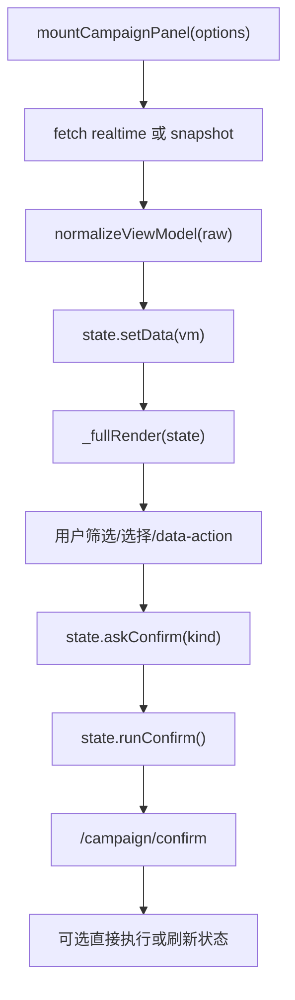

# 前端设计说明

## 目的

本篇说明 AD-Agent 当前前端的结构、状态归属、Campaign panel 模块、API 交互和需要保留的 UX 约束。

## 当前代码真源

- 主页面：`ad-direction-agent/demo/ad-asisitant-agent.html`
- Campaign panel：`ad-direction-agent/demo/campaign-panel`
- Campaign API：`ad-direction-agent/app/api/campaign.py`
- ViewModel：`ad-direction-agent/app/api/campaign_viewmodel.py`

## 代码锚点地图

| 职责 | 代码位置 | 说明 |
| --- | --- | --- |
| 全局 API base/timeout | `demo/ad-asisitant-agent.html:964`、`:966` | 主页面 API 和超时 |
| 全局请求封装 | `ad-asisitant-agent.html:1894` `callAPI()` | 主页面 tab 请求 |
| Campaign panel 挂载 | `ad-asisitant-agent.html:3732` import；`:3754`、`:3781` mount | tab5 挂载 Campaign panel |
| Campaign panel 入口 | `demo/campaign-panel/panel.js:32` `mountCampaignPanel()` | 创建骨架、state、事件、加载数据 |
| panel API timeout | `panel.js:19` `API_TIMEOUT` | campaign/snapshot 请求超时 |
| realtime 请求 | `panel.js:274` `_fetchRealtime()` | `POST /campaign/viewmodel` |
| snapshot 请求 | `panel.js:286` `_fetchSnapshot()` | `GET /campaign/snapshot` |
| 状态对象 | `state.js:6` `createCampaignState()` | selection、filters、confirm、toast、budget override |
| 确认/执行流 | `state.js:190`、`:222`、`:248` | askConfirm、runConfirm、`/campaign/confirm` |
| 组合预算执行 | `state.js:407` 到 `:419` | `/campaign/execute-portfolio-budget` |
| toast | `state.js:486` `_toast()`；`panel.css:459` 起 | 固定宽度、sticky、可关闭、可复制 |
| 事件委托 | `events.js:8` `mountEventDelegation()` | 统一处理 `data-action` |
| 渲染入口 | `render.js:108` `_fullRender()` | overview、summary、cards、warnings |
| ViewModel normalize | `viewmodel.js:77` `normalizeViewModel()` | 新旧格式兼容 |

## 前端定位

当前前端是单页 HTML 应用，承担：

- ASIN 输入和分析入口。
- 前置策略/诊断/执行展示。
- Campaign tab 展示。
- 用户确认、拒绝、执行 Campaign 建议。
- 与后端 API 的轻量状态同步。

它不是独立前端工程化项目；模块化主要体现在 Campaign panel 目录。

## 主页面

`ad-asisitant-agent.html` 负责：

- 全局 API base。
- 页面布局和 tab。
- 基础分析状态。
- 决策上下文。
- Campaign panel 挂载点。

主页面和 Campaign panel 的关系：

- 主页面负责 tab、基础策略工作流、决策上下文和进入 Campaign tab 的时机。
- Campaign panel 是 tab5 的独立模块，有自己的 `_callAPI()`，不复用主页面 `callAPI()`。
- 主页面通过 `mountCampaignPanel(root, options)` 传入 `asin`、`days`、`mode`、`decision_id`、`analysis_mode` 等上下文。
- 如果存在进行中分析，主页面应避免误显“可执行”状态，后端 confirm 也会做最新批次和 in-progress 门禁。

### 左侧配置栏一键保存(2026-08-04)

左侧配置栏(战略层/策略层/P3/方向)原 4 个分散保存键(`btnTactics`/`p3AcosLeftBtn`/`p3BudgetLeftBtn`/`btnSaveDirections`)已由底部 sticky「💾 一键保存」(`#codexSaveAllBar`/`#codexSaveAllBtn`)取代,`btnStrategy` 战略层保留原键原行为。

- 前端入口:`saveAllConfig()`(`demo/ad-asisitant-agent.html` 一键保存 JS 块):收集策略 2 + P3 2 + 方向 1 共 5 字段 → `POST /long-term-config/{asin}/save-all` → 成功回调 `applyConfigSnapshotToEditable(snap)`(回读真源回填所有控件 + 刷新脏/已存标签)+ `applySaveAllSideEffects(snap, body, aiSnapshot)`(保留原 4 键副作用:tab 解锁/renderP3/反馈捕获/徽标)。
- 显示门禁:`_syncSaveAllBar()` — **只属于 C 态**(`_decisionContext.in_progress && !shouldUseSnapshotMode()`),B 态快照不显示;MutationObserver 监听 `cardP3Override` class 变化同步。
- 回读对称:`loadAll` 末尾(非快照分支)调 `GET /long-term-config/{asin}/latest` → 同一 `applyConfigSnapshotToEditable`,空行显空;与保存后回读同一套函数。
- 面板加载统一:`_ensureInsightPanelsLoaded()` — `diagnosisLoaded` 短路 + `_insightPanelsLoadPromise` 共享缓存 + `.finally` 清理;`enableTabsForReturnVisit` await 它,一键保存路径 `.then/.catch` 不阻塞保存结果。防并发双拉。
- 校验:前端空数组拦截(策略/方向至少 1 项)+ 后端 `SaveAllConfigRequest` `min_length=1`/`ge=5 le=100`/`gt=0` 双保险;战略层 3 列未保存 → 后端 409。
- 行为变更:策略层保存不再解锁 Tab2/3(已由 `loadTactics → enableTabsForReturnVisit` 无条件承担,见方案纠偏)。

## Campaign panel 模块

| 文件 | 责任 |
| --- | --- |
| `panel.js` | 初始化、挂载、请求 realtime viewmodel 和 snapshot |
| `state.js` | panel 状态、选择、确认/拒绝、执行组合预算、toast |
| `events.js` | 事件委托 |
| `viewmodel.js` | normalizeViewModel、兼容旧格式、action class |
| `render.js` | DOM 渲染 |
| `panel.css` | Campaign panel 样式 |

Campaign panel 状态流：

前端临时状态包括 `_selection`、筛选器、密度、展开详情、组合预算临时覆盖。业务状态以后端 viewmodel/ERP 为准。

## API 交互

主要请求：

- `POST /campaign/viewmodel`：运行或读取分析并返回前端模型。
- `GET /campaign/snapshot`：读取已有快照。
- `POST /campaign/confirm`：提交确认/拒绝；approve 分支内部先确认再调统一提交/轮询服务（`submit_and_poll`）。
- `POST /campaign/execute-portfolio-budget`：执行组合预算动作。
- `GET /decision/execution-status`：只读查询 pending 执行状态（task_id/execute_status/execute_msg/execute_time），不驱动执行。

> 历史 `POST /campaign/execute` 已于 2026-08-03 删除（生产 0 次访问）；终态由后台轮询器按 3/6/12/24 分钟回写 pending，前端只读状态。

前端通常通过 viewmodel 展示，而不是直接消费原始 `CampaignAnalysisResult`。

API 入参/出参边界：

| API | 前端调用点 | 入参关键字段 | 返回如何消费 |
| --- | --- | --- | --- |
| `/campaign/viewmodel` | `panel.js:274` | asin、days、temp、run_id、write_erp、analysis_mode、ERP URL 上下文 | normalize 后进入 state |
| `/campaign/snapshot` | `panel.js:286` | asin、可选 decision_id | 只读快照模式 |
| `/campaign/confirm` | `state.js:248` | decision_id、decisions(card id)、operator | applied/skipped、execute 结果、move_errors |
| `/campaign/execute-portfolio-budget` | `state.js:419` | decision_id、portfolio budget overrides | 组合预算 MCP 执行结果 |

## 状态原则

- 后端 ERP 是批次和执行状态真源。
- 前端保存临时 UI 选择状态。
- `vm.is_latest === true` 是判断当前批次是否可执行的重要条件。
- 用户确认/拒绝后，应重新拉取或更新 viewmodel，避免本地状态漂移。

## UX 约束

当前 Campaign panel 对失败 toast 有明确约束：

- 保持固定宽度弹窗形态。
- 失败活动名以普通文本追加展示。
- 活动之间使用分号分隔。
- 文本应可选择、可复制。

除非有明确需求，不应把该 toast 改造成复杂弹窗或打断式交互。

确认/执行 UX 边界：

- “同意所选”先弹确认弹窗；真正执行绑定在确认按钮上，取消不执行。
- 可执行性不能只看按钮显示，还要看 `vm.is_latest`、后端 in-progress、confirm_status、execute_status 和 Advert MCP 开关。
- `move_errors` 里包含活动名、分组、原因；前端展示时应保留活动名，不要只显示数量。
- sticky toast 用于执行结果和失败信息，必须支持长文本换行和手动关闭。

## 常见误区

- 前端 item key 不一定等于数据库主键。
- viewmodel 的兼容逻辑不能随意删除，否则旧快照可能无法展示。
- 执行按钮可见不代表真实执行开关已开启，后端还有 `advert_mcp_enabled` 和 dry-run。
- Campaign tab 的状态不能只靠本地数组判断，必须尊重后端最新批次标记。

## 更新检查清单

- 修改 viewmodel 字段后，同步更新 `viewmodel.js`、`render.js` 和本篇。
- 修改 confirm/execute API 返回后，同步更新 `state.js`。
- 修改 Campaign card 分类后，同步检查 action class 和 CSS。
- 修改 toast 行为前，确认是否破坏可复制和固定宽度约束。
