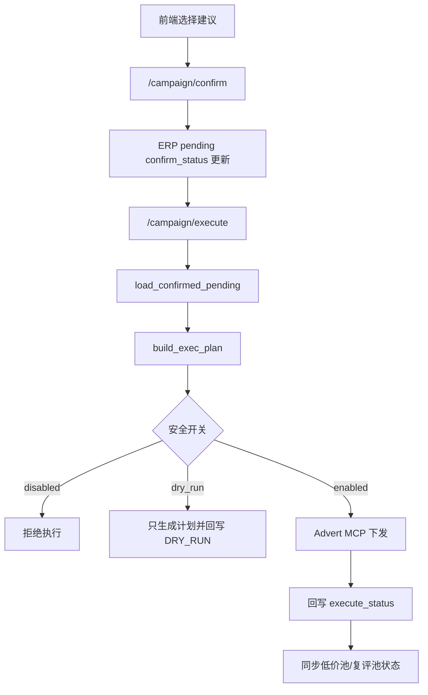

# 广告执行链路与安全开关

## 目的

本篇说明从“用户确认建议”到“Advert MCP 执行”的链路，以及防止误动真实广告的安全开关和幂等边界。

## 当前代码真源

- API：`ad-direction-agent/app/api/campaign.py`
- 执行步骤：`ad-direction-agent/app/workflow/steps/advert_execution.py`
- 组合预算执行：`ad-direction-agent/app/workflow/steps/portfolio_execution.py`
- 执行 MCP 客户端：`ad-direction-agent/app/data/advert_mcp_client.py`
- 执行参数映射：`ad-direction-agent/app/persistence/erp_writer/advert_exec_mapper.py`
- ERP repository：`ad-direction-agent/app/persistence/erp_writer/repository.py`
- 配置：`ad-direction-agent/app/config/settings.py`

## 代码锚点地图

| 职责 | 代码位置 | 说明 |
| --- | --- | --- |
| API 执行入口 | `app/api/campaign.py:511` `/campaign/execute` | 执行已确认 pending |
| API 组合预算入口 | `campaign.py:534` `/campaign/execute-portfolio-budget` | 执行组合预算 |
| 执行总开关 | `app/config/settings.py:228`、`:229` | `advert_mcp_enabled`、`advert_exec_dry_run` |
| 常规执行 | `workflow/steps/advert_execution.py:249` `submit_execution()` | load confirmed pending、build plan、MCP、回写状态 |
| 直接执行 | `advert_execution.py:408` `submit_execution_direct()` | 按 card_ids 拉 pending，合并同意+执行 |
| 组合预算执行 | `workflow/steps/portfolio_execution.py:83` `execute_portfolio_budget()` | 查询 portfolio、构造预算调整、MCP |
| pending 读取 | `erp_writer/repository.py:297` `load_confirmed_pending()` | CONFIRMED + `execute_status=PENDING` |
| card_ids pending 读取 | `repository.py:338` `load_pending_by_card_ids()` | direct 执行路径 |
| 执行状态回写 | `repository.py:425` `update_pending_execute_status()` | campaign/keyword/placement pending |
| 执行计划 | `erp_writer/advert_exec_mapper.py:70` `ExecPlan`；`:82` `build_exec_plan()` | 三类 MCP payload + ops |
| 结果解析 | `advert_exec_mapper.py:289`、`:326` | envelope 成功判断、task id 提取 |
| pool sync | `advert_execution.py:32` `_sync_pool_entries_from_exec()` | 成功淘汰入池、恢复离池 |

## 链路概览

## 安全开关

| 配置 | 默认值 | 作用 |
| --- | --- | --- |
| `advert_mcp_enabled` | `False` | 执行总开关，关闭时拒绝真实执行 |
| `advert_exec_dry_run` | `True` | 空跑开关，默认不动真实广告 |
| `advert_mcp_url` | 空 | Advert MCP 网关 |
| `advert_mcp_token` | 空 | Advert MCP token |
| `advert_mcp_timeout` | `120` | 单次执行工具超时 |

生产执行必须同时满足：

- MCP URL/token 配置正确。
- `advert_mcp_enabled=true`。
- `advert_exec_dry_run=false`。
- pending 项已经确认且仍处于可执行状态。

## 执行计划

`build_exec_plan()` 从 ERP pending 快照构造三类调用：

1. `params_vo_list`：修改已有活动、关键词、placement，走 `agent_async_batch_update_advert`。
2. `create_calls`：新建活动，逐 card 走 `agent_create_portfolio_campaign`。
3. `negative_calls`：否定词，走 `agent_create_negative_keywords`。

同时生成 `ops`，用于把每个 pending 行的执行结果回写。

`ExecPlan` 关键字段：

| 字段 | 来源 | 用途 |
| --- | --- | --- |
| `params_vo_list` | campaign/keyword/placement pending | `agent_async_batch_update_advert` 修改已有活动 |
| `create_calls` | CREATE card + pending | `agent_create_portfolio_campaign` 新建活动 |
| `negative_calls` | negative keyword pending | `agent_create_negative_keywords` |
| `ops` | 每个 pending 行 | 回写 execute_status/execute_msg/execute_time |
| `warnings` | mapper 校验失败 | 返回前端/日志，不一定阻断全部执行 |
| `move_errors` | portfolio 匹配失败 | 前端 toast 展示具体活动名和原因 |

## 字段映射

placement 三套命名需要特别注意：

- pending：`TOP_OF_SEARCH`、`REST_OF_SEARCH`、`PRODUCT_PAGE`
- Advert MCP：`placementTopPercent`、`placementRestPercent`、`placementProductPagePercent`
- record/op：保持 pending 的 placement_type

状态映射：

- pending `new_state` 转 MCP `campaignState` 或 `keywordState`
- 支持 `enabled`、`paused`
- 否定词走独立 negative 路径

## Portfolio 解析

执行前会查询 `agent_query_portfolio_list`。

用途：

- CREATE 路径：为新建活动匹配目标 portfolio，匹配失败时严格模式下跳过新建。
- MODIFY 路径：为挪组注入 `portfolioId`，匹配失败时移除 `campaignGroupType`，其他调整继续。

前端 move failure toast 的活动名来自执行回传的 `move_errors`，不要在前端丢弃活动名。

Portfolio 匹配失败处理：

- CREATE 路径：严格依赖目标 portfolio，匹配失败时跳过该新建活动。
- MODIFY 挪组路径：匹配失败时移除该活动的 `campaignGroupType`，其他 bid/budget/state/placement 调整继续下发。
- 失败详情写入 `move_errors`，用于前端提示“哪些活动未挪组”，而不是让整批执行失败。

## 幂等边界

常规执行：

- `load_confirmed_pending` 只取待执行项。
- 执行后回写 `execute_status`。
- 已执行行不应被重复拉取。

直接执行：

- `submit_execution_direct()` 合并“同意+执行”。
- 直接从指定 card_ids 拉 pending。
- 不写 confirm_status/record 的部分路径需要特别谨慎。

状态回写语义：

| 场景 | execute_status | 说明 |
| --- | --- | --- |
| dry-run | `DRY_RUN` | 计划构造成功但没有真实下发 |
| MCP 真跑提交成功 | `IN_PROGRESS` 或后续成功状态 | 异步 task 已提交，具体完成由后续系统/记录确认 |
| direct 真跑后补写 | `SUCCESS` | 代码里为弥补直接执行历史缺口，会尝试回写 pending |
| mapper 跳过 | 不应回写成功 | 缺 campaign_id/keyword_id/portfolio 等不能伪造成执行成功 |

幂等关键点是 `load_confirmed_pending()` 只取 `execute_status=PENDING`。如果直接 SQL 改状态，可能绕过幂等保护。

## 低价池/复评池同步

执行成功后，系统会根据建议类别同步 `t_advert_agent_pool_entry`：

- 淘汰到低价池：成功后 upsert pool entry。
- 恢复/离池：成功后 mark exit。

MCP 部分失败时，ops 里应逐条带状态，避免把失败动作误同步到池。

## 常见误区

- 写入 pending 不等于执行。
- confirm_status 已确认不等于一定会执行，仍受 execute_status、安全开关和 dry-run 影响。
- dry-run 返回 ok 只说明计划构造成功。
- 新建活动和修改已有活动不是同一个 Advert MCP 工具。
- portfolio 匹配失败不应阻断所有其他非挪组调整。

## 更新检查清单

- 修改 `advert_exec_mapper.py` 后，同步更新字段映射和工具 schema。
- 修改 `advert_execution.py` 安全开关行为后，同步更新本篇。
- 修改 portfolio 匹配逻辑后，同步检查前端 move failure 展示。
- 修改 pending 表状态枚举后，同步检查 ERP 文档、前端和测试。
