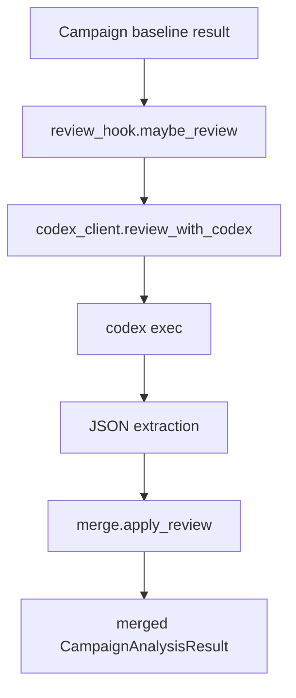

# Codex复核组件说明

## 目的

本篇说明项目内 Codex 复核组件的边界、当前调用方式、输入输出和维护注意事项。

注意：这里的 Codex 复核组件是 AD-Agent 项目内部的广告建议复核/优化模块，不是开发者使用的外部 coding agent。

## 当前代码真源

同工作区项目：

- `AD_Agent_codexV2/PROJECT_OVERVIEW.md`
- `AD_Agent_codexV2/review_hook.py`
- `AD_Agent_codexV2/codex_client.py`
- `AD_Agent_codexV2/codex_config.py`
- `AD_Agent_codexV2/merge.py`
- `AD_Agent_codexV2/run_review.py`
- `AD_Agent_codexV2/batch_review.py`
- `AD_Agent_codexV2/server.py`
- `AD_Agent_codexV2/preview_boot.py`
- `AD_Agent_codexV2/asin_sync.py`
- `AD_Agent_codexV2/sync_erp_utf8.py`

AD-Agent 接入点在 Campaign 分析流程附近，具体以 `review_hook.maybe_review()` 调用位置为准。

## 代码锚点地图

| 职责 | 代码位置 | 说明 |
| --- | --- | --- |
| 复核入口 | `AD_Agent_codexV2/review_hook.py:133` `maybe_review()` | 开关判断、prompt、Codex 调用、merge、fail-open |
| 输入字段裁剪 | `review_hook.py:29` `ITEM_FIELDS`；`:37` 新建活动字段 | 防止把完整结果无筛选送入 Codex |
| KB 注入 | `review_hook.py:58` `build_kb_content()` | 复用 AD-Agent 业务 KB preset |
| Prompt 组装 | `review_hook.py:96` `build_review_prompt()` | baseline result + target ACOS + KB |
| Codex CLI 调用 | `codex_client.py:55` `review_with_codex()` | `codex exec`，默认 timeout 240 秒 |
| JSON 提取 | `codex_client.py:23` `_extract_json()` | 从 CLI 噪声中抽最后一个含 decisions 的 JSON |
| 合并逻辑 | `merge.py:25` `apply_review()` | keep/modify/drop/uncovered/new_campaigns filtering |
| per-ASIN 开关 | `codex_config.py:27` `is_codex_enabled()` | 读 `t_advert_agent_decision_config.enable_codex` |
| 单 ASIN CLI | `run_review.py:31` `run()` | baseline → maybe_review → 可选写库 |
| 批量 CLI | `batch_review.py:70` `run_batch()` | 并发跑多个 ASIN |
| Web 预览 | `server.py:34` `/api/review` | 返回 baseline/复核结果对比 |
| 测试环境同步 | `preview_boot.py:33` middleware | 测试身份/配置同步辅助 |

## 组件定位

Codex 复核组件位于 baseline Campaign 分析之后。

它的目标是：

- 读取已有 Campaign 分析结果。
- 复核建议是否过激、遗漏或不一致。
- 产出 keep/modify/drop/uncovered 等补丁式结论。
- 通过 merge 逻辑合并回 baseline 结果。

它不负责：

- 拉取 MCP 原始数据主链路。
- 替代 Campaign 分析引擎。
- 直接执行广告。
- 作为开发 Agent 读取本知识图谱。

## 当前主链路

`codex_client.review_with_codex()` 通过命令行调用 `codex exec`，并带超时控制。`merge.apply_review()` 负责把复核结果应用到原始结果。

当前调用边界：

| 步骤 | 当前实现 | 风险/约束 |
| --- | --- | --- |
| 是否启用 | `force` 显式控制，否则读 per-ASIN `enable_codex` | 配置表不可用时应 fail-open |
| 输入范围 | 只传 `ITEM_FIELDS` 和新建活动必要字段 | 不应把完整 MCP payload/ERP snapshot 直接传入 |
| KB | `build_kb_content()` 从业务 KB preset 取内容 | KB 过大会拖慢 CLI |
| CLI | 每次 `codex exec` 是新 session | 无共享上下文，超时要明确 |
| 失败 | catch 异常返回 `ReviewOutcome(reviewed=False, error=...)` | baseline 必须保留 |
| 合并 | `apply_review()` 修改原 result 或其 dict | 合并后仍要走原 ERP 写入链 |

## 输出语义

复核输出的核心动作：

- `keep`：保留原建议。
- `modify`：修改原建议。
- `drop`：删除原建议。
- `uncovered`：指出 baseline 未覆盖项。
- `new_campaigns` filtering：对新建活动建议做过滤或调整。

这类输出天然更适合“稀疏补丁”而不是完整重写整个结果。

merge 语义细节：

| decision | 行为 |
| --- | --- |
| `keep` | 原 item 保留，通常标记 AI_REVIEWED 或保持原建议 |
| `modify` | 按 Codex 显式给出的 proposed/action/reason 等字段覆盖；未显式给的字段不应随意清空 |
| `drop` | 从 adjustments 或 new_campaigns 中移除 |
| 未覆盖 | baseline item 保守保留，并可标记未复核 |
| `action=keep` 且无显式 proposed 字段 | merge 会清理某些 baseline 修正值，避免 keep 仍携带调价字段 |

复核输出不应直接执行广告。它只是 CampaignAnalysisResult 的后处理，后续仍必须经过 ERP mapper、前端确认和 Advert MCP 安全开关。

## 当前风险边界

当前复核如果仍在请求路径中被 `await`，会占用 baseline 分析 worker。

维护时要特别关注：

- 超时是否会阻塞用户请求。
- JSON 提取失败时是否有 fallback。
- 复核失败是否保留 baseline 结果。
- 是否把过大的完整 JSON 直接塞给 CLI。
- 是否与主 Agent 共用 worker 或资源池。

## 推荐演进方向

项目长期方向应倾向：

- 独立异步复核任务。
- baseline 分析完成后释放请求 worker。
- Codex 复核使用工具/skill 获取必要证据。
- 输出 schema 收窄为 patch-like 结构。
- 有 watchdog、timeout 和失败回退。
- 前端可展示 baseline 结果和复核增量状态。

本节是架构约束，不代表当前代码已经全部实现。

## 运维/调试入口

| 入口 | 典型用途 | 注意 |
| --- | --- | --- |
| `python run_review.py <ASIN>` | 单 ASIN 对照复核并可写库 | `--dry-run` 不写 ERP；`--force-codex` / `--no-codex` 可覆盖配置 |
| `python batch_review.py --enabled-only` | 批量跑启用 Codex 的 ASIN | `--concurrency` 控制并发 |
| `server.py` `/api/review` | Web 对比 baseline 和复核后结果 | 适合人工观察，不是主生产入口 |
| `asin_sync.py` / `sync_erp_utf8.py` | 测试/预览环境数据同步 | 只同步配置/测试数据，不是 Campaign 主分析 |

## 与开发 Agent 的区别

- 本组件是项目内业务复核器，输入是广告建议，输出是广告建议补丁。
- 开发者使用的 Codex/coding agent 读取的是本项目知识图谱、源码和测试，不应与业务复核器共用职责描述。
- 本文档给 coding agent 读时，目标是让它理解“项目内 Codex 复核”这个子系统，而不是指导它如何调用自己。

## 常见误区

- 不要把项目内 Codex 复核等同于外部开发者使用的 Codex。
- 不要让复核失败覆盖 baseline 成功结果。
- 不要默认它已经异步化；要以当前调用位置为准。
- 不要把完整 ERP 快照、完整 MCP payload 和完整 LLM prompt 无筛选送入复核。

## 更新检查清单

- 修改 `maybe_review()` 接入位置后，同步更新本篇主链路。
- 修改复核输出 schema 后，同步更新 `merge.py` 语义。
- 改成异步任务后，补充队列、状态表、前端状态和失败回退说明。
- 修改超时后，同步检查运行时设置文档。
