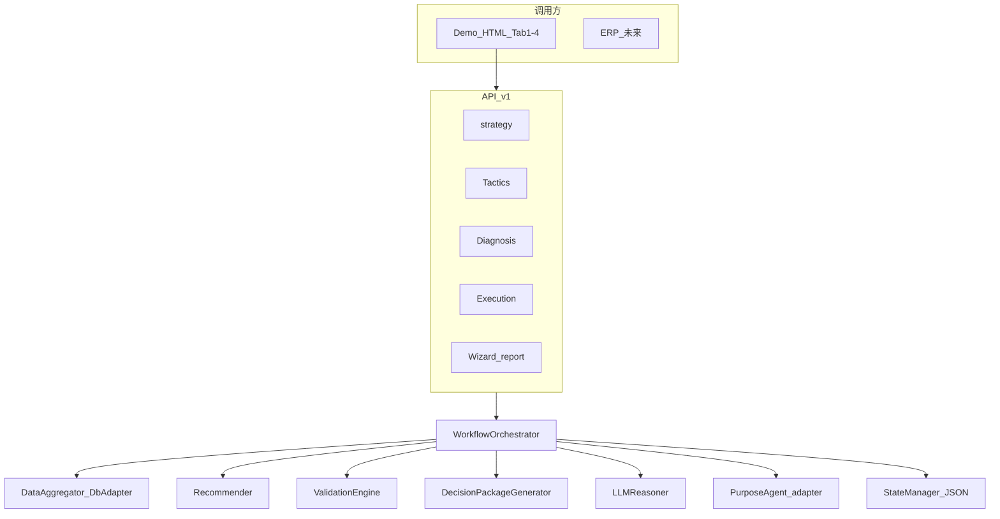
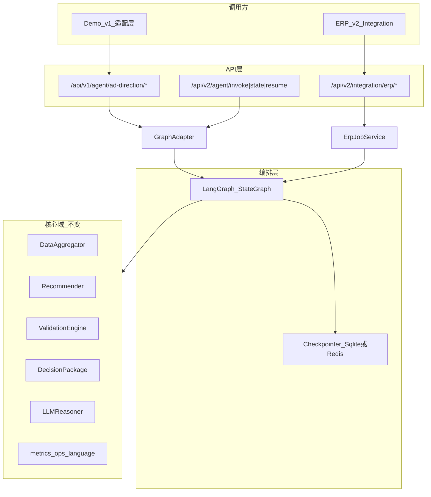
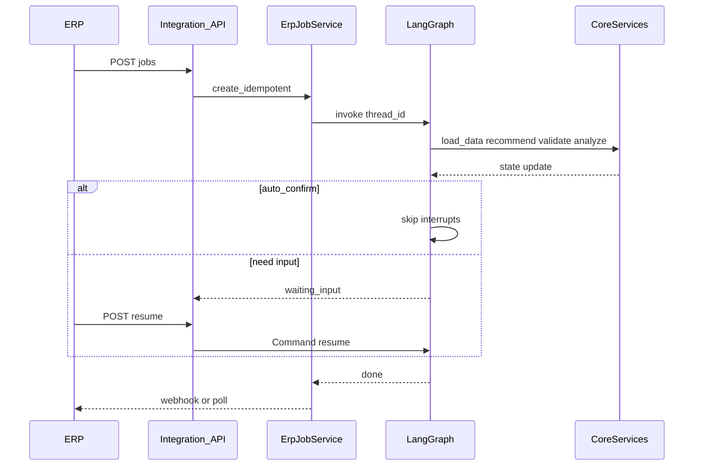

# LangGraph + ERP 接入完整方案

> **文档版本**: 1.0  
> **编写日期**: 2026-05-21  
> **适用项目**: AD_assistant_agent-v2.4  
> **现状**: Python 3.13 / FastAPI / `WorkflowOrchestrator` / JSON 状态 / DeepSeek / Doris  
> **LangGraph**: 交接文档 Phase 7 已规划，**代码未落地**（无 `agents/`，`requirements.txt` 无 langgraph）

---

## 一、目标与边界

### 1.1 业务目标

| 目标 | 说明 |
|------|------|
| **G1 LangGraph 编排** | 四层向导 + 校验报告 + P3 推荐，用 StateGraph 显式建模；支持 interrupt/resume、checkpoint |
| **G2 ERP 对接** | 公司 ERP 可创建分析任务、查询结果、回写选择；输出以**结构化 JSON** 为主（决策包、评分、可选 AI 报告） |
| **G3 Demo 不断服** | 现有 `ad-direction-agent/demo/ad-asisitant-agent.html` 与 `/api/v1/agent/ad-direction/*` 在过渡期**可不改 URL** |
| **G4 可演进** | 编排与集成外置；规则/Prompt/数仓适配器**不重写** |

### 1.2 非目标（首期不做）

- 不在 LangGraph 内重写 18 条校验规则（仍调 `app/core/validation_engine.py`）
- 不把 ERP 字段硬编码进 Demo 页面
- 不强制首期上 Redis / 多 worker（与现 `--workers 1` 约束一致）

---

## 二、现状架构（As-Is）



**关键耗时（决定 ERP 不宜全长同步）**：

- 数仓：`FETCH_TIMEOUT = 35s`（`workflow_orchestrator.py`）
- LLM：`LLM_TIMEOUT = 60s`（单次 analyze / recommend_execution / P3）
- 完整报告：多方向 `validate` + 1 次 `analyze`，最坏 **>90s**

**已有可复用 ERP 载荷**：

- `DecisionPackage`（`app/models/decision.py`）：`tasks[]`（priority/action/details）
- `run_validation_and_report` 返回：`validations`、`decisions`、`analysis`（v2.4 已 `sanitize_analysis_for_display`）
- 校验项 `display_message`（`app/core/validation_ops.py`）

---

## 三、目标架构（To-Be）



**分层原则**：

1. **核心域**：与 UI/ERP 无关，只接受 `asin、days、long_term、selected_directions` 等纯数据。
2. **编排层**：LangGraph 管节点顺序、interrupt、重试。
3. **集成层**：`app/integrations/erp/` 管 Job、幂等、鉴权、回调。
4. **适配层**：v1 每个 REST 端点 = 对图的 `invoke` / `get_state` / `resume` 的薄封装。

---

## 四、LangGraph 方案详述

### 4.1 状态模型 `AgentState`（建议字段）

| 字段 | 类型 | 来源/用途 |
|------|------|-----------|
| `thread_id` | str | `{asin}:{days}` 或 UUID job |
| `source` | demo \| erp | 决定 interrupt 行为 |
| `asin` / `days` | str / int | 业务主键 |
| `erp_ref` | str? | ERP 单据号，幂等 |
| `long_term` | dict | 战略+策略（可来自 ERP 预填） |
| `asin_data` | 序列化摘要 | load_data 后填充 |
| `data_summary` | dict | LLM 上下文 |
| `scores` | list | 四方向评分 |
| `eligible_directions` | list | 门禁 |
| `execution` | dict | `selected_directions`、`sub_options` |
| `validations` | dict | 按方向校验结果 |
| `decisions` | dict | 决策包 |
| `analysis` | dict | LLM 报告（已 sanitize） |
| `p3` | dict? | 目标 ACOS/预算（若走 P3 节点） |
| `current_node` | str | 对外展示进度 |
| `error` | str? | 失败原因 |
| `auto_confirm` | bool | ERP headless：跳过 interrupt |

### 4.2 主图节点（与现 Orchestrator 方法一一映射）

| 节点 ID | 现方法 | 类型 | 说明 |
|---------|--------|------|------|
| `load_data` | `_ensure_data` | 同步 | 4h 缓存逻辑可迁入或委托 |
| `strategy_options` | `get_strategy_options` | 同步 | 仅选项，无 LLM |
| `strategy_confirm` | `confirm_strategy` | **interrupt** | Demo/ERP resume 写入 |
| `tactics_recommend` | `get_tactics_recommendations` | LLM | 调 purpose-agent |
| `tactics_confirm` | `confirm_tactics` | **interrupt** | |
| `diagnosis` | `get_diagnosis` | 同步 | 只读 |
| `p3_recommend` | `get_unified_recommendation` | LLM | 可选子图 |
| `execution_recommend` | `get_execution_options` | 规则+LLM | |
| `execution_confirm` | `confirm_execution` | **interrupt** | 选方向 |
| `validation_report` | `run_validation_and_report` | 规则+LLM | 含 sanitize |
| `finalize` | — | 同步 | 写 ERP 回调队列 |

**条件边示例**：

- `source == erp` 且 `auto_confirm == true` → 用 `long_term` / 默认策略跳过部分 interrupt（需产品确认默认规则）
- `selected_directions` 为空 → 不进入 `validation_report`，返回错误状态

### 4.3 Checkpoint 策略

| 方案 | 优点 | 缺点 | 建议 |
|------|------|------|------|
| **SqliteSaver** | 交接文档已规划；单机简单 | 多 worker 需单文件+锁 | **Phase 1–2 默认** |
| **Postgres/Redis Saver** | 生产多实例 | 基建成本 | ERP 全量上线后评估 |
| **JSON 双写** | Demo 兼容 | 两套真相 | **过渡期 2–4 周**，逐步只读 JSON |

`long_term_config.json` **保留**：战略/策略跨会话配置，不必塞进 checkpoint 全文。

### 4.4 v2 Agent API（与 LangGraph 对齐）

交接文档已规划：

| 方法 | 路径 | 行为 |
|------|------|------|
| POST | `/api/v2/agent/invoke` | 创建/继续 thread，`input` 含 asin、days、source |
| GET | `/api/v2/agent/state/{thread_id}` | 当前节点、是否 interrupt、局部结果 |
| POST | `/api/v2/agent/resume/{thread_id}` | 传入 confirm 载荷，继续图 |

Demo v1：`confirm_strategy` 等内部改为 `resume(thread_id, payload)`。

### 4.5 LangGraph 实施阶段与工时

| 阶段 | 内容 | 工时（1 人） | 风险 |
|------|------|-------------|------|
| **P0** | 依赖、AgentState、SqliteSaver、空图编译 | 1–2 天 | 低 |
| **P1** | Tab4 子图 POC（execution→interrupt→report） | 3–5 天 | 中 |
| **P2** | 全四层节点 + v1 API 适配 + JSON 双写 | 1–2 周 | 中高 |
| **P3** | Purpose 子图、P3 节点、LangSmith、熔断 | 1 周 | 中 |
| **P4** | 下线重复 Orchestrator 路径、仅保留委托 | 可选 | 高（回归） |

**综合难度：6/10**（编排清晰；难点在 API/状态/ERP 并发）

---

## 五、ERP 接入方案详述

### 5.1 ERP 与 Demo 的需求差异

| 维度 | Demo | ERP |
|------|------|-----|
| 交互 | 人多步 Tab | 系统调用、批量 |
| 等待 | 前端 loading | 不能长时间占 HTTP |
| 认证 | 内网 | API Key / mTLS / IP 白名单 |
| 输出 | HTML 渲染 | JSON + 可选 webhook |
| 幂等 | 弱 | **必须**（同一 `erp_ref` 不重复跑满链路） |

### 5.2 五种接入方式对比（核心决策表）

| 方式 | 流程 | 典型延迟 | ERP 改造量 | 我方改造量 | 完整 AI 报告 | 推荐度 |
|------|------|----------|------------|------------|--------------|--------|
| **A. 全同步** | POST 一次等到底 | 60–180s+ | 最小 | 中 | 是 | **不推荐**（超时/重试难） |
| **B. 异步 Job + 轮询** | POST job → GET 状态 | 解耦 | 中 | 中 | 是 | **主推** |
| **C. 异步 Job + Webhook** | POST job → 回调 URL | 解耦 | 中（要回调服务） | 中高 | 是 | **推荐**（与 B 组合） |
| **D. 仅轻量同步** | quick 只评分+决策包 | <30s | 小 | 低 | 否 | **补充**（列表预览） |
| **E. 消息队列** | ERP 发 MQ → 消费者 | 解耦 | 大 | 高 | 是 | 企业已有 MQ 时考虑 |

**结论**：

- **主路径：B + C**（创建 Job，轮询为兜底，Webhook 为首选通知）。
- **辅路径：D**（ERP 商品列表页快速看四方向分）。
- **避免：A** 作为全量报告唯一入口。

### 5.3 Integration API 契约（建议 v2 前缀）

**鉴权**：`Authorization: Bearer <integration_token>` 或 Header `X-ERP-Key`（与 Demo 分离）。

#### 5.3.1 创建任务（重接口）

```http
POST /api/v2/integration/erp/jobs
```

请求体示例：

```json
{
  "erp_ref": "SO-20260520-001",
  "asin": "B0XXXX",
  "days": 7,
  "long_term": {
    "product_stage": "收割利润期",
    "ad_purposes": ["盈利型"]
  },
  "selected_directions": ["balance_maintain", "optimize_acos"],
  "auto_confirm": true,
  "include_llm_report": true,
  "callback_url": "https://erp.internal/hooks/ad-agent"
}
```

响应：

```json
{
  "job_id": "uuid",
  "thread_id": "B0XXXX:7",
  "status": "pending",
  "created_at": "ISO8601"
}
```

**幂等**：相同 `erp_ref` + 相同业务参数 → 返回已有 `job_id`（不重复跑 LLM）。

#### 5.3.2 查询任务

```http
GET /api/v2/integration/erp/jobs/{job_id}
```

`status`：`pending` | `running` | `waiting_input` | `done` | `failed`

- `waiting_input`：图在 interrupt，ERP 需调 resume（若 `auto_confirm=false`）。

`result`（done 时）：

```json
{
  "direction_scores": [],
  "decision_packages": {},
  "validations": {},
  "analysis": {
    "overall_analysis": "",
    "direction_analyses": []
  },
  "query_plan": {}
}
```

#### 5.3.3 回写人工选择（可选）

```http
POST /api/v2/integration/erp/jobs/{job_id}/resume
```

等价 Demo 的 `confirm_execution` / 各层 confirm。

#### 5.3.4 轻量同步（可选）

```http
POST /api/v2/integration/erp/recommendations/quick
```

仅：`load_data` + `recommend` + `decision_package`（无 LLM analyze），同步返回，**<30s**。

#### 5.3.5 Webhook 载荷

POST `callback_url`，Header 签名 `X-Signature: HMAC-SHA256(body, secret)`。

Body 与 `GET jobs/{id}` 的 `result` 同结构，并含 `erp_ref`、`job_id`、`event: "job.completed"`。

失败重试：建议 3 次指数退避；ERP 需幂等消费。

### 5.4 ERP 与 LangGraph 的协作



- `job_id` 与 `thread_id` 映射存表或 SQLite 元数据表（不必只靠 checkpoint）。
- LangGraph **不替代** ERP 鉴权/幂等，这些在 `ErpJobService`。

### 5.5 建议新增目录结构

```
ad-direction-agent/app/
  integrations/
    erp/
      schemas.py      # ErpJobCreate / ErpJobResult
      service.py      # ErpJobService
      auth.py         # API Key 校验
      webhook.py      # 签名与发送
  agents/
    state.py
    graph.py
    nodes/*.py
    adapters/
      v1_legacy.py    # Orchestrator 委托（P1）
```

---

## 六、Demo / v1 / v2 / ERP 四者关系

| 通道 | 用途 | 过渡期策略 |
|------|------|------------|
| v1 REST | Demo Tab1–4 | 保留；内部转调 GraphAdapter |
| v2 agent | 调试、全流程 invoke | 与 LangGraph 原生一致 |
| v2 ERP | 企业生产对接 | Job + webhook |
| 旧 legacy | `/recommend` `/validate` | 标记 deprecated，不删 |

---

## 七、注意事项与风险清单

### 7.1 技术

| 项 | 说明 | 缓解 |
|----|------|------|
| 超时 | 全链路 >120s | 异步 Job；节点级 timeout |
| 多 worker | 文件锁 + checkpoint | 先 workers=1；后 Redis saver |
| LLM 失败 | 现已有降级文案 | 图上加 fallback 边，不抛 500 |
| 运营文案回归 | v2.4 sanitize | report 节点固定调用 `sanitize_analysis_for_display` |
| Purpose 跨目录 | `ad-purpose-agent` | 保持 adapter 节点，不搬代码 |
| Python 3.13 | langgraph 版本兼容 | P0 锁定版本并跑通 compile |

### 7.2 产品与合规

| 项 | 说明 |
|----|------|
| ERP 预填策略 | `auto_confirm` 默认值需运营/产品签字 |
| 数据出境 | LLM/数仓地址与 ERP 环境一致（内网） |
| 审计 | Job 表记录：谁（erp_ref）、何时、输入 hash、结果版本 |

### 7.3 组织与交付

| 项 | 说明 |
|----|------|
| ERP 联调窗口 | 先给 Mock Job API + 样例 JSON |
| 契约先行 | OpenAPI / JSON Schema 先评审再写图 |
| 回滚 | P1–P2 保留 Orchestrator 原方法委托 |

---

## 八、推荐实施路线图

| 顺序 | 任务 | 工期（粗估） |
|------|------|-------------|
| 1 | ERP Integration OpenAPI/JSON Schema 评审 | 3–5 天 |
| 2 | LangGraph P0–P1（Tab4 子图 POC） | 1–2 周 |
| 3 | ErpJobService Mock + 幂等 | 1 周（可与 2 并行） |
| 4 | LangGraph P2（全图 + v1 适配） | 1–2 周 |
| 5 | ERP 联调（Webhook + 轮询） | 2 周 |
| 6 | P3 可观测 + Docker checkpoint | 1 周 |

**总工期**：约 **6–10 周** 达到 ERP 生产可用（含联调）；仅 LangGraph POC 约 **1–2 周**。

---

## 九、验收标准

### LangGraph

- [ ] Tab4 路径：与现 `wizard/report` 字段一致（含 v2.4 无 BM/半窗）
- [ ] `wizard/state` 可恢复 interrupt 节点
- [ ] LLM 超时走降级，job 状态 `failed` 带 `error`

### ERP

- [ ] 相同 `erp_ref` 重复 POST 不重复触发 LLM
- [ ] Job 轮询 + webhook 至少一种在生产验证
- [ ] `decision_packages.tasks` 可被 ERP 解析为工单字段
- [ ] 鉴权失败 401，不泄露内部堆栈

---

## 十、决策摘要

| 问题 | 建议 |
|------|------|
| 上 LangGraph 吗？ | **上**；有 ERP + 多步向导，长期收益 > 成本 |
| 先做全图还是 Tab4？ | **Tab4 POC → 全图** |
| ERP 主接入方式？ | **异步 Job + Webhook（轮询兜底）** |
| 要轻量接口吗？ | **要**，`quick` 同步评分为辅 |
| Demo 何时切 v2？ | **ERP 契约稳定后**；v1 适配层可撑 1–2 月 |
| Checkpoint？ | **Sqlite 起步**，ERP 上线前评估 Redis |

---

## 十一、实施待办清单

- [ ] 输出 ERP Integration OpenAPI/JSON Schema（jobs、resume、webhook、quick）并与 ERP 方评审
- [ ] LangGraph P0–P1：AgentState、SqliteSaver、Tab4 子图 POC，节点委托现有 Orchestrator/Reasoner
- [ ] P2：全四层图 + v1 REST 适配 invoke/resume + JSON checkpoint 双写
- [ ] 实现 ErpJobService（幂等 erp_ref、Job 表、轮询 API、Webhook 签名）
- [ ] ERP 联调：Mock → 预发 → 生产；验收决策包与 analysis 字段
- [ ] P3：LangSmith、节点熔断、Docker checkpoint volume；评估 Redis checkpointer

---

## 十二、相关文档与代码索引

| 文档/代码 | 路径 |
|-----------|------|
| Tab4 全链路 | `docs/广告方向推荐-全链路梳理.md` |
| 交接与 Phase 7 | `交接文档.md` |
| v2.4 产品变更 | `docs/announcements/v2.4.md` |
| 编排中枢 | `ad-direction-agent/app/core/workflow_orchestrator.py` |
| 状态持久化 | `ad-direction-agent/app/persistence/state_manager.py` |
| LLM 与 Prompt | `ad-direction-agent/app/llm/reasoner.py` |
| 决策包模型 | `ad-direction-agent/app/models/decision.py` |
