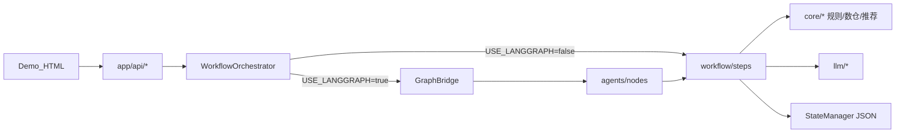
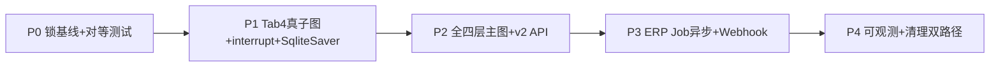
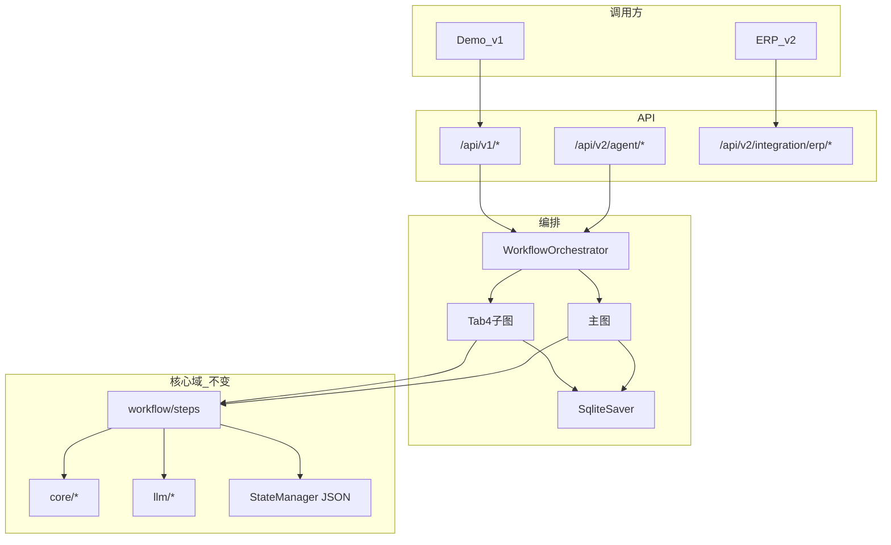
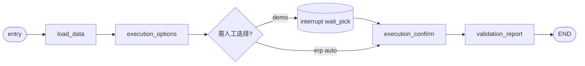

# LangGraph 实施方案（可执行版）

> **文档版本**: 1.0  
> **编写日期**: 2026-05-22  
> **适用项目**: AD_assistant_agent-v2.3 / v2.4  
> **依据**: 当前仓库代码 + [项目模块与文件说明.md](项目模块与文件说明.md) + [LangGraph与ERP接入完整方案.md](LangGraph与ERP接入完整方案.md)  
> **定位**: 在已有 P0 薄包装基础上，分阶段落地真实 StateGraph、Checkpoint、v2 API、ERP Job

---

## 一、现状对齐（起点）

| 维度 | 现状 |
|------|------|
| 依赖 | `langgraph>=0.2.0`、`langchain-core>=0.3.0` 已在 `requirements.txt` |
| 开关 | `settings.use_langgraph` 默认 `false`（`.env` → `USE_LANGGRAPH`） |
| Graph | `compile_single_node_graph`：每个 HTTP 端点 → 单节点子图 `run → END` |
| State | `AgentState` 仅含 `asin`、`days`、`refresh`、`endpoint`、`req`、`result` |
| Nodes | `app/agents/nodes/*.py` 共 13 个，**仅**委托 `workflow/steps.run_*` |
| Checkpoint | **无**；状态仍由 `StateManager` JSON（`config/{asin}/`） |
| 测试 | `tests/workflow/test_api_parity.py` 验证 bridge 被调用，**未**做 classic vs graph 响应对等 |
| ERP | 未接入 |

**结论**：P0 薄包装约完成 **50%**；P1（真子图 + interrupt + SqliteSaver）**未做**。当前 `USE_LANGGRAPH=true` 仅多一层 `ainvoke` 入口，**未获得** LangGraph 的 interrupt / checkpoint / 全流程编排能力。

### 当前架构（As-Is）



### 已有 endpoint 映射（`bridge.ENDPOINT_NODES`）

| endpoint_id | 节点文件 | 对应 step |
|-------------|----------|-----------|
| `strategy.options` | `nodes/strategy.py` | `run_get_strategy_options` |
| `strategy.confirm` | `nodes/strategy.py` | `run_confirm_strategy` |
| `tactics.options` | `nodes/tactics.py` | `run_get_tactics_options` |
| `tactics.recommendations` | `nodes/tactics.py` | `run_get_tactics_recommendations` |
| `tactics.confirm` | `nodes/tactics.py` | `run_confirm_tactics` |
| `diagnosis` | `nodes/diagnosis.py` | `run_get_diagnosis` |
| `execution.options` | `nodes/execution.py` | `run_get_execution_options` |
| `execution.confirm` | `nodes/execution.py` | `run_confirm_execution` |
| `p3.target_acos` | `nodes/p3.py` | `run_get_target_acos_recommendation` |
| `p3.budget_bid` | `nodes/p3.py` | `run_get_budget_bid_recommendation` |
| `p3.unified` | `nodes/p3.py` | `run_get_unified_recommendation` |
| `wizard.report` | `nodes/validation_report.py` | `run_validation_and_report` |
| `wizard.state` / `wizard.reset` | `nodes/wizard.py` | 同步节点 |

**未走 LangGraph 的 orchestrator 方法**：`get_wizard_state`、`reset_asin`、P3 的 `save_*_override` / `clear_*_override`。

---

## 二、总体路线与原则



### 不变原则

1. **`workflow/steps` 是唯一业务真相**：`agents/nodes` 不写规则、SQL、Prompt，只做「取参 → 调 step → 写 state」。
2. **JSON 持久化保留至 P3 前**：Checkpoint 与 `StateManager` **双写**，不一次性切换。
3. **Demo URL 不动**：`/api/v1/agent/ad-direction/*` 仍经 `WorkflowOrchestrator`；新能力放 `/api/v2`。
4. **开关可灰度**：由单一 `USE_LANGGRAPH` 逐步拆为 `USE_LANGGRAPH_TAB4` → `USE_LANGGRAPH_FULL` → `LANGGRAPH_ROUTING_MODE`。

### 目标架构（To-Be）



---

## 三、P0 — 锁基线（1–3 天）

**目标**：证明当前薄包装与经典路径输出等价；锁定依赖版本。

### 3.1 改动清单

| # | 文件/动作 | 内容 |
|---|-----------|------|
| 1 | `requirements.txt` | 钉死 `langgraph`、`langgraph-checkpoint-sqlite` 版本；本地 `pip install` + import 验证 |
| 2 | `tests/workflow/test_api_parity.py` | 13 个 endpoint：classic vs graph 输出对等（Pydantic 需 `model_dump` 归一化） |
| 3 | `app/agents/state.py` | 扩展 `AgentState`（`thread_id`、`source`、`long_term`、`selected_directions` 等，向前兼容） |
| 4 | `docs/LangGraph与ERP接入完整方案.md` | 修正文首「代码未落地」描述为「P0 薄包装已落地」 |

### 3.2 AgentState 扩展草案

```python
class AgentState(TypedDict, total=False):
    endpoint: str
    source: Literal["demo", "erp"]
    thread_id: str
    asin: str
    days: int
    refresh: bool
    long_term: dict
    selected_directions: list[str]
    sub_options: dict
    req: Any
    result: Any
    auto_confirm: bool
    error: str | None
```

### 3.3 验收

- [ ] `pytest tests/workflow/` 全绿（含 13 项 parity）
- [ ] `USE_LANGGRAPH=true` 下 Demo 走通 Tab1–4 + 报告，与默认路径一致
- [ ] 生产默认仍为 `USE_LANGGRAPH=false`

---

## 四、P1 — Tab4 真子图 + Checkpoint（1–2 周）

**目标**：将 `execution.options` → `execution.confirm` → `wizard.report` 合成 **一张 StateGraph**，具备 interrupt / resume / SqliteSaver。

### 4.1 新增/改造文件

| 操作 | 路径 |
|------|------|
| 新增 | `app/agents/checkpointer.py` |
| 新增 | `app/agents/graphs/tab4.py` |
| 新增 | `tests/agents/test_tab4_graph.py` |
| 改造 | `app/agents/bridge.py`（增加 `run_subgraph`） |
| 改造 | `app/core/workflow_orchestrator.py`（Tab4 三步映射同一 thread） |
| 改造 | `app/config/settings.py`（`use_langgraph_tab4`、`langgraph_sqlite_path`） |

### 4.2 Tab4 子图结构



| 节点 | 委托 | interrupt |
|------|------|-----------|
| `load_data` | `ctx.ensure_data` | — |
| `execution_options` | `execution.run_get_execution_options` | — |
| `wait_pick` | `interrupt({...})` 等待用户选方向 | **是** |
| `execution_confirm` | `execution.run_confirm_execution` | — |
| `validation_report` | `validation_report.run_validation_and_report` | — |

**条件边**：`auto_confirm=true` 且已有 `selected_directions` → 跳过 `wait_pick`。

### 4.3 Checkpointer

- 实现：`AsyncSqliteSaver`（`langgraph-checkpoint-sqlite`）
- 路径：`config/_langgraph/checkpoint.sqlite`（与 `config/{asin}/` 同 volume）
- 约束：与现网 `--workers 1` 一致；多 worker 留 P3+ 评估 Postgres/Redis saver

### 4.4 thread_id 与 Demo 兼容

| 场景 | thread_id |
|------|-----------|
| Demo Tab4 | `tab4:{asin}:{days}` |

- `get_execution_options`：`ainvoke` 至 `wait_pick` 中断，返回 `execution_options`
- `confirm_execution`：`Command(resume={selected_directions, sub_options})`
- `run_validation_and_report`：`aget_state` 取 `result`；无 thread 时 fallback 经典路径

**Demo HTML 与 v1 URL 不改**。

### 4.5 双写

`run_confirm_execution` 仍写 `workflow_state.json`，Checkpoint 损坏或关开关时可从 JSON 恢复。

### 4.6 验收

- [ ] Tab4 路径 classic vs graph：`validations`、`decisions`、`analysis` 字段集一致
- [ ] v2.4 报告清洗（`sanitize_analysis_for_display`）保留
- [ ] 进程重启后未完成 thread 可 resume
- [ ] LLM 失败返回降级结构，不 500

---

## 五、P2 — 全四层主图 + v2 Agent API（2–3 周）

**目标**：Tab1–Tab4 + 报告一张主图；新增 v2 调试/全流程接口。

### 5.1 主图节点

| 节点 ID | 委托 step | interrupt（demo） |
|---------|-----------|-------------------|
| `load_data` | `ctx.ensure_data` | — |
| `strategy_options` | `strategy.run_get_strategy_options` | — |
| `strategy_confirm` | `strategy.run_confirm_strategy` | **是** |
| `tactics_options` | `tactics.run_get_tactics_options` | — |
| `tactics_confirm` | `tactics.run_confirm_tactics` | **是** |
| `diagnosis` | `diagnosis.run_get_diagnosis` | — |
| `execution_options` | `execution.run_get_execution_options` | — |
| `execution_confirm` | `execution.run_confirm_execution` | **是** |
| `validation_report` | `validation_report.run_validation_and_report` | — |
| `finalize` | 写回调/清理 | — |

**P3 推荐**（目标 ACOS / 预算 / unified）独立子图 `graphs/p3.py`，由 API 按需调用，不强串入主图。

### 5.2 v2 Agent API

| 方法 | 路径 | 行为 |
|------|------|------|
| POST | `/api/v2/agent/invoke` | 创建/继续 thread |
| GET | `/api/v2/agent/state/{thread_id}` | 当前节点、是否 interrupt、局部结果 |
| POST | `/api/v2/agent/resume/{thread_id}` | `Command(resume=payload)` |

**thread_id**：

- Demo：`demo:{asin}:{days}`
- ERP：`erp:{erp_ref}`

### 5.3 灰度模式

| 模式 | 说明 |
|------|------|
| `classic` | 仅 steps（默认） |
| `shadow` | classic 对外；后台 graph 影子比对，差异写日志 |
| `graph` | graph 为主，classic fallback |

灰度顺序：只读 endpoint（`options`、`diagnosis`、`state`）→ `confirm` / `report`。

### 5.4 验收

- [ ] `auto_confirm=true` + 预填 `long_term` 可一次跑至 `validation_report`
- [ ] 50 个 mock ASIN 回归无字段漂移
- [ ] v1 Demo 在 `graph` 模式下行为与 classic 一致

---

## 六、P3 — ERP Job 异步层（2–3 周）

**目标**：ERP 不占用长 HTTP；幂等 + 轮询/Webhook。

### 6.1 接入方式（已定）

| 方式 | 用途 | 推荐 |
|------|------|------|
| **B. 异步 Job + 轮询** | 主路径 | **主推** |
| **C. Webhook** | 完成通知 | **与 B 组合** |
| **D. quick 同步** | 仅评分+决策包，无 LLM | **补充** |
| A. 全同步 | 60–180s+ | **不做** |

### 6.2 新增目录

```
app/integrations/erp/
  schemas.py        # ErpJobCreate / ErpJobResult
  service.py        # ErpJobService（幂等 + 后台任务）
  auth.py           # X-ERP-Key
  webhook.py        # HMAC-SHA256 + 重试
  jobs_store.py     # erp_jobs 表（erp_ref UNIQUE）
app/api/v2/integration_erp.py
```

### 6.3 职责边界

| 组件 | 负责 |
|------|------|
| LangGraph | 节点顺序、interrupt、checkpoint、单 thread 状态 |
| ErpJobService | 鉴权、幂等、Job 表、Webhook、跨进程调度 |
| StateManager JSON | 长期配置、双写过渡期 |

**`thread_id = erp:{erp_ref}`**：同 `erp_ref` 重复创建 Job → 复用 checkpoint，**不重复调 LLM**。

### 6.4 v2 ERP API

| 方法 | 路径 |
|------|------|
| POST | `/api/v2/integration/erp/jobs` |
| GET | `/api/v2/integration/erp/jobs/{job_id}` |
| POST | `/api/v2/integration/erp/jobs/{job_id}/resume` |
| POST | `/api/v2/integration/erp/recommendations/quick` |

`status`：`pending` | `running` | `waiting_input` | `done` | `failed`

### 6.5 验收

- [ ] 同 `erp_ref` 重复 POST 仅 1 次 LLM analyze
- [ ] Webhook 签名校验；失败不泄露堆栈
- [ ] `quick` P95 < 25s
- [ ] `decision_packages.tasks` 可被 ERP 解析

---

## 七、P4 — 可观测与清理（1 周）

| 项 | 内容 |
|----|------|
| LangSmith | `LANGCHAIN_TRACING_V2`、按 thread 追踪 |
| 节点超时 | `tactics_options`、`validation_report`：`asyncio.wait_for(60s)` |
| 清理 legacy | 删除 `api/recommend.py`、`validate.py`、`confirm.py` 等废弃路由 |
| 统一开关 | `LANGGRAPH_ROUTING_MODE=classic\|shadow\|graph` |
| 收敛 bridge | 下线单节点子图 `run_endpoint`，统一主图/Tab4/P3 子图 |

---

## 八、关键技术决策

| 议题 | 决策 |
|------|------|
| Checkpointer | P1–P3：`AsyncSqliteSaver`；路径 `config/_langgraph/checkpoint.sqlite` |
| interrupt | `langgraph.types.interrupt` + `Command(resume=...)` |
| JSON | P1–P3 双写；P4 评估 JSON 只读 |
| 多 worker | 保持 `--workers 1`；ERP 全量前评估 Redis/Postgres saver |
| LLM 失败 | 节点内降级，不抛 500；保留 `sanitize_analysis_for_display` |
| 耗时约束 | 数仓 ~35s、LLM ~60s、全报告最坏 >90s → ERP **必须**异步 Job |

---

## 九、测试矩阵

| 层 | 目录 | 要点 |
|----|------|------|
| Step | `tests/workflow/` | 业务输入输出 |
| Node | `tests/agents/nodes/` | mock ctx → 返回字段 |
| Graph | `tests/agents/graphs/` | interrupt → resume；checkpoint 恢复 |
| Parity | `tests/workflow/test_api_parity.py` | classic vs graph 13 endpoint |
| ERP | `tests/integrations/erp/` | 幂等、webhook、超时 |
| E2E | `tests/e2e/`（可选） | Demo HTTP 串接 |

**CI**：`USE_LANGGRAPH=false` 与 `true` 两套矩阵跑同一套测试。

---

## 十、风险与回滚

| 风险 | 缓解 | 回滚 |
|------|------|------|
| Sqlite 锁冲突 | thread_id 唯一 + workers=1 | 关 `USE_LANGGRAPH_*` |
| LangGraph 版本破坏 API | requirements 钉版本 | 镜像回退 |
| Demo 字段漂移 | nodes 只写约定字段；parity 测试 | `LANGGRAPH_ROUTING_MODE=classic` |
| ERP webhook 风暴 | 3 次退避 + DLQ | 暂停 webhook，仅轮询 |
| Python 3.13 兼容 | P0 锁定并 compile 测试 | 必要时 3.12 镜像 |

**原则**：任一阶段 `.env` 开关改回 `false` → 行为退回上一阶段，无需改 Demo。

---

## 十一、工时与里程碑

| 阶段 | 内容 | 工期（1 人全职） | 可独立上线 |
|------|------|------------------|------------|
| **P0** | 锁版本 + parity + state 扩展 | 1–3 天 | 是（默认 off） |
| **P1** | Tab4 子图 + SqliteSaver + interrupt | 1–2 周 | 是（按 ASIN 灰度） |
| **P2** | 全四层主图 + v2 agent API | 2–3 周 | 是（shadow→graph） |
| **P3** | ERP Job + 幂等 + Webhook + quick | 2–3 周 | 是（ERP 联调） |
| **P4** | 可观测 + 清理 | 1 周 | 是 |

**合计**：约 **6–10 周** 达 ERP 生产可用；**P0+P1（2–3 周）** 即可演示第一份 LangGraph 价值（Tab4 interrupt + checkpoint）。

---

## 十二、第一周执行清单（可立即开工）

1. [ ] `requirements.txt` 钉版本 + 安装 `langgraph-checkpoint-sqlite`
2. [ ] 新增 `app/agents/checkpointer.py` + 单测
3. [ ] 扩展 `app/agents/state.py`
4. [ ] 补全 `test_api_parity.py`（13 endpoint 对等）
5. [ ] `settings.py` 增加 `use_langgraph_tab4`、`langgraph_sqlite_path`（默认 false）
6. [ ] 新增 `app/agents/graphs/tab4.py` 骨架 + compile 单测
7. [ ] 更新 `LangGraph与ERP接入完整方案.md` 现状段落
8. [ ] 与产品确认 `auto_confirm` 时默认 `selected_directions` 策略

---

## 十三、验收标准（总表）

### LangGraph

- [ ] Tab4：与现 `wizard/report` 字段一致（含 v2.4 无 BM/半窗）
- [ ] `wizard/state` 可反映 interrupt 节点
- [ ] LLM 超时 → 降级文案，job/graph 状态带 `error`
- [ ] classic vs graph parity 13/13 通过

### ERP（P3 后）

- [ ] 相同 `erp_ref` 不重复 LLM
- [ ] 轮询或 webhook 至少一种生产验证
- [ ] 鉴权失败 401，无内部堆栈

---

## 十四、相关文档与代码索引

| 文档/代码 | 路径 |
|-----------|------|
| 模块与文件说明 | [项目模块与文件说明.md](项目模块与文件说明.md) |
| ERP + LangGraph 规划（长文） | [LangGraph与ERP接入完整方案.md](LangGraph与ERP接入完整方案.md) |
| Tab4 全链路 | [广告方向推荐-全链路梳理.md](广告方向推荐-全链路梳理.md) |
| 部署与 Phase 7 | [../交接文档.md](../交接文档.md) |
| 编排器 | `ad-direction-agent/app/core/workflow_orchestrator.py` |
| Graph Bridge | `ad-direction-agent/app/agents/bridge.py` |
| 单节点编译 | `ad-direction-agent/app/agents/graph.py` |
| 业务步骤 | `ad-direction-agent/app/workflow/steps/` |
| 状态持久化 | `ad-direction-agent/app/persistence/state_manager.py` |

---

## 十五、决策摘要

| 问题 | 建议 |
|------|------|
| 是否上 LangGraph？ | **上**；ERP + 多步向导，长期收益 > 成本 |
| 先做哪块？ | **P0 → P1 Tab4 子图**（最快验证 interrupt/checkpoint） |
| Demo 何时切 v2？ | ERP 契约稳定后；v1 适配层可撑 1–2 月 |
| ERP 主接入？ | **异步 Job + Webhook（轮询兜底）** |
| Checkpoint？ | **Sqlite 起步**，多 worker 前评估 Redis |
| 业务逻辑放哪？ | **永远只在 `workflow/steps`** |

---

*本文档为可执行实施方案；实施过程中以仓库代码为准，阶段完成后请同步更新 [交接文档.md](../交接文档.md) Phase 7 状态表。*
