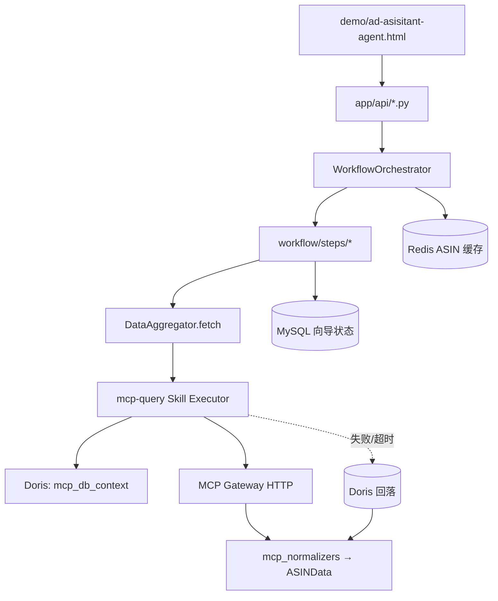

# MCP 数据接入与 v2.4 演进总结

> **文档目的**：从「接入 MCP 数仓网关」到当前仓库状态，结构化记录全部重要改动、每项改动的意义与具体实现，并给出**当前项目结构**全景。  
> **适用读者**：接手开发、联调运维、产品/架构评审。  
> **最后更新**：2026-05-26（仓库目录名可能仍为 `AD_assistant_agent-v2.3`，产品版本为 **v2.4 / 2.4.0**）

---

## 1. 演进时间线与目标

| 阶段 | 目标 | 结果 |
|------|------|------|
| **基线** | 四层向导 + Doris 直连（`DATA_SOURCE=db`） | 单进程 FastAPI，编排逻辑集中在 `WorkflowOrchestrator` |
| **MCP 接入** | 广告/商品/关键词等报表改走 ERP **Streamable MCP 网关**，降低应用内 SQL 维护成本 | `McpAdapter` + 工具映射 + 归一化 → 统一 `ASINData` |
| **可靠性** | MCP 慢/失败时不阻断业务 | 分阶段拉数、单工具超时、Doris 维度/全场景回落、`partial_failures` |
| **性能与状态** | 长耗时请求可缓存、多实例可共享状态 | Redis 短期 ASIN 缓存；MySQL 长期向导状态 |
| **可编排** | 数据拉取策略可配置、可版本化 | `mcp-query` Skill + `playbook.yaml` |
| **架构整理（v2.4）** | 模块边界清晰、可选 LangGraph、删除遗留 API | `workflow/steps/*` 薄编排 + 文档/测试对齐 |
| **前端体验** | 避免「后台 200、页面无数据/假加载」 | Demo 串行拉数、接口返回后再渲染、回访自动加载右侧 |

---

## 2. 当前项目结构（总览）

```
AD_assistant_agent-v2.3/          # 仓库根（产品版本 v2.4）
├── README.md                     # 5 分钟上手
├── .env / .env.example           # 根级敏感项（可选）
├── docker-compose.yml            # MySQL 状态 + Redis 缓存 + 主服务
├── Dockerfile
├── docs/                         # 设计/演进/公告（本文档）
├── 交接文档.md                   # 数仓字段、规则、部署细节
├── scripts/
│   └── pull_feedback.sh          # 反馈 JSON 拉取
├── .claude/skills/mcp-query/     # MCP 拉数 playbook（运行时由 app/skills 加载）
│   ├── playbook.yaml
│   └── SKILL.md
├── ad-direction-agent/           # 主服务（FastAPI + Demo + 数据层）
│   ├── start_server.py           # 启动、PYTHONPATH、DATA_SOURCE
│   ├── demo/
│   │   └── ad-asisitant-agent.html
│   ├── app/
│   │   ├── main.py               # 路由注册、规则 import、Skill 校验
│   │   ├── api/                  # 11 个路由模块（无 legacy recommend/validate）
│   │   ├── config/               # settings + tags/thresholds/layer_options.toml
│   │   ├── core/                 # 编排器、聚合器、推荐/校验/场景
│   │   ├── data/                 # db / mcp / mock / 回落 / 映射 / 归一化
│   │   ├── skills/               # Skill 注册与 mcp-query 执行器
│   │   ├── workflow/             # context、steps、meta_filters、data_status
│   │   ├── agents/               # LangGraph bridge + nodes（默认关闭）
│   │   ├── llm/                  # DeepSeek + reasoner + purpose_adapter
│   │   ├── models/               # ASINData、layers API 契约
│   │   ├── persistence/          # JSON/MySQL 状态、Redis 缓存
│   │   └── rules/                # PN/KE/OA/BM 校验规则
│   ├── tests/                    # rules / workflow / data / skills / persistence
│   ├── scripts/                  # MCP/DB 诊断与压测
│   └── logs/server.log
└── ad-purpose-agent/             # 策略层 AI（广告目的/词类/关键词分析）
    ├── agent_router.py
    └── knowledge_base/
```

### 2.1 运行时数据流（MCP 模式）



### 2.2 请求主路径（与 MCP 的关系）

Demo **按 Tab 分步**调用 API，每一步可能触发**不同 `meta_filter`**（见 `app/workflow/meta_filters.py`），从而只拉当前场景需要的 MCP 工具，而不是每次都全量 10+ 工具。

| 用户操作 | API | 数据行为 |
|----------|-----|----------|
| 加载分析 | `POST /strategy/options` + `/tactics/options` | 战略层触发 `preload_data`；策略层 `ensure_data` + 可能调 purpose-agent |
| 保存战略 | `POST /strategy/confirm` | MCP 模式下**仅用 Doris 解析上下文**，避免保存时并发全量 MCP |
| 保存策略 | `POST /tactics/confirm` | 解锁诊断/P3；前端拉 `/diagnosis`、`/execution/*` |
| 诊断刷新 | `POST /diagnosis` `refresh=true` | 可 `prefer_db` 跳过 MCP（配置项） |

---

## 3. MCP 接入：改动清单与意义

### 3.1 新增核心模块

| 文件 | 具体内容 | 意义 |
|------|----------|------|
| `app/data/mcp_client.py` | Streamable HTTP JSON-RPC 调用 MCP 网关；支持 token/header、重试 | 与 Cursor MCP 解耦，服务进程内可独立联调 |
| `app/data/mcp_mapping.py` | `META_*` → MCP 工具名；`McpContext`；`build_tool_args` | 与原有 `QueryRouter` 元脚本 ID **对齐**，业务层仍说 META，底层走 ERP 工具名 |
| `app/data/mcp_normalizers.py` | 各工具 JSON → 字段统一的 dict | MCP 响应形态不一，归一化后才能写入 `ASINData` |
| `app/data/mcp_adapter.py` | `fetch_asin_data`：并发调工具、`assemble_from_payloads` | **适配器模式**：上层只认 `ASINData`，可切换 db/mcp/mock |
| `app/data/mcp_db_context.py` | `resolve_mcp_context_from_db(asin)` → seller_sku、shop_account、父 ASIN | MCP 工具入参依赖 ERP 上下文，不能只用前端输入的 ASIN |
| `app/data/mcp_tool_fallback.py` | Bootstrap 工具列表、单工具失败后的 Doris 补数 | 避免一个慢工具拖死整包 |
| `app/data/fallback_merge.py` | 合并 MCP + Doris 结果；修剪已恢复的 `partial_failures` | 部分成功时仍可用，且前端可展示「部分失败」 |
| `app/data/field_mapping.py` | `asin_data_to_metrics` 等 | 供 purpose-agent、评分缓存一致性校验 |

**MCP 工具与业务维度映射（节选）**：

| META 脚本 ID | MCP 工具 |
|--------------|----------|
| `META_AD_PRODUCT` | `ad_product_report` |
| `META_KW_AD` | `ad_keyword_report` |
| `META_KW_COMPETITOR_RANK` | `keyword_competitors`, `keyword_child_asins` |
| `META_FLOW_KEYWORD` | `flow_keywords` |
| `META_TREND` | `product_sales` |
| `META_COMPETITOR` | `direct_competitors` |
| （引导） | `listing_basic_info`, `listing_inventory` |

### 3.2 配置项（`app/config/settings.py` + `.env.example`）

| 变量 | 典型值 | 意义 |
|------|--------|------|
| `DATA_SOURCE` | `mcp` / `db` / `mock` | 全局数据源开关 |
| `MCP_TRANSPORT` | `http` | 走 Streamable HTTP 网关 |
| `MCP_GATEWAY_URL` | `http://streamable-mcpserver.91cyerp.com/mcp` | ERP MCP 入口 |
| `MCP_RESOLVE_SKU_VIA_DB` | `true` | 用 Doris 补全 seller_sku / 店铺 |
| `MCP_FALLBACK_TO_DB` | `true` | MCP 工具失败或**空表** → Doris 补该维度 |
| `MCP_FAILOVER_FULL_DB` | `true` | 失败多时整场景回落（耗时长，可关） |
| `MCP_TOOL_TIMEOUT` | `1200` | 大报表（如 `ad_keyword_report`）可能 >2 分钟 |
| `MCP_MAX_CONCURRENCY` | `8` | 控制网关并发，防止打爆 |
| `MCP_REFRESH_VIA_DB` | `true` | 用户点「刷新诊断」时可直连 Doris |
| `SKILLS_ENABLED` | `true` | 启用 playbook 驱动拉数 |

**意义**：把「联调时常改的超时/回落策略」从代码提到环境变量，生产/测试可分级配置，而不改 Python。

### 3.3 Skill 化拉数（`app/skills/` + `.claude/skills/mcp-query/`）

| 组件 | 内容 | 意义 |
|------|------|------|
| `playbook.yaml` | 阶段：`context` → `mcp_bootstrap` → `mcp_reports` → `fallback` | **编排外置**：运维/开发改 YAML 即可调整阶段顺序与超时占位符 |
| `McpQuerySkillExecutor` | 按 playbook 执行；写结构化日志 `[skill:mcp-query] phase=...` | 与 `server.log` 对齐，便于排查「工具 ok 但无数据」 |
| `app/skills/registry.py` | 启动时加载 Skill；`DataAggregator` 在 `DATA_SOURCE=mcp` 时走 `skill_registry.run("mcp-query")` | 统一入口，后续可加更多 Skill（如仅 Doris 报表） |
| `phased_fetcher.py` | 薄封装，委托 Skill | 旧调用方（orchestrator）无需感知 Skill 细节 |

**playbook 阶段意义**：

1. **context**：Doris 解析 MCP 入参（快，~0.1s 级）；失败则 `missing_fields: ["context"]`。
2. **mcp_bootstrap**：listing + 库存，确认 ASIN 存在。
3. **mcp_reports**：按场景 `meta_filter` 拉广告/关键词/趋势等。
4. **fallback**：失败工具或 MCP 空表（`:empty`）回落 Doris；数仓仍无数据时保留 `mcp:{tool}:empty`，并设 `data_freshness=partial`。

### 3.4 数据质量字段（`ASINData` / API 响应）

| 字段 | 含义 | 前端/产品意义 |
|------|------|----------------|
| `data_missing` | 缺失维度 ≥3 等粗粒度不可用 | 可阻断保存或提示重试 |
| `missing_fields` | 失败工具/上下文列表 | 日志与运维对齐 |
| `partial_failures` | 如 `mcp:ad_keyword_report:timeout` | Demo `renderDataStatusBanner` 黄条提示 |
| `data_freshness` | `fresh` / `partial` / `stale_cache` | 区分全量成功与补数结果 |

**注意**：MCP 日志里 `status=ok` 只表示**调用成功**，归一化后仍可能无 ACOS/无关键词（空报表）。这是「后台无报错、前端像没数据」的常见根因之一。

### 3.5 场景化 Meta 过滤（`meta_filters.py`）

为 tactics / diagnosis / execution / p3 定义不同的 `META_*` 子集。

**意义**：

- 减少单次请求的 MCP 工具数与墙钟时间；
- 与「四层向导分步」一致，避免战略层预加载拉全量（仍可能后台 preload，见 §7 已知问题）。

### 3.6 测试与诊断脚本

| 路径 | 作用 |
|------|------|
| `tests/data/test_mcp_*.py` | 客户端、适配器、上下文单测 |
| `tests/workflow/test_mcp_db_parity.py` | MCP 与 DB 字段 parity |
| `tests/skills/test_mcp_query_playbook.py` | Playbook 加载与执行 |
| `tests/persistence/test_mcp_tool_fallback.py` | 回落合并 |
| `scripts/test_mcp_live.py` / `test_one_mcp_tool.py` | 联调网关 |
| `scripts/benchmark_all_mcp_tools.py` | 各工具耗时基线 |
| `scripts/diagnose_timeout_layers.py` | 分层定位超时（见 `docs/diagnose-timeout-root-cause.md`） |
| `docs/sql/warehouse_index_recommendations.md` | Doris 索引建议（配合 MCP 回落） |

---

## 4. 缓存与持久化改动

### 4.1 Redis 短期 ASIN 缓存（`app/persistence/redis_cache.py`）

| 项 | 说明 | 意义 |
|----|------|------|
| `REDIS_ENABLED` / `REDIS_URL` | 开关与连接 | 多 Tab 切换、回访时避免重复 50s+ MCP |
| `REDIS_SHORT_TTL` | 默认 7200s | 平衡新鲜度与成本 |
| `REDIS_PARTIAL_TTL` | 部分失败缓存更短 | 促使稍后重试失败维度 |

Orchestrator 的 `_ensure_data` / `_preload_data` 与 Redis 配合，**步骤层通过 `ctx.ensure_data` 使用**，步骤内不直接操作 Redis。

### 4.2 MySQL 长期状态（`mysql_state_manager.py` + `schema.sql`）

| 存储内容 | 原 JSON 路径 | 意义 |
|----------|--------------|------|
| 战略/策略长期配置 | `config/{asin}/long_term_config.json` | 多实例部署、备份恢复 |
| 工作流状态 | `workflow_state.json` | 关键词分析缓存、评分按 `days` 分桶 |
| P3 推荐缓存 | `p3_recommendation.json` | 目标 ACOS/预算 AI 结果 |
| 运营 override | 各类 override 文件 | 人工覆盖 AI |

`migrate_json_to_mysql.py` 在启动时把旧 JSON **一次性迁移**；`docker-compose.yml` 默认 `STATE_BACKEND=mysql`。

### 4.3 `docker-compose.yml`

三服务：`mysql-state`（3307）、`redis-cache`（6379）、`ad-direction-agent`（8010）。  
**意义**：本地与生产拓扑一致，联调 MCP 时状态/缓存不丢。

---

## 5. 架构整理（v2.4）改动

### 5.1 Workflow 拆分

| 改动 | 具体位置 | 意义 |
|------|----------|------|
| 编排器变薄 | `workflow_orchestrator.py` 主要保留缓存 + 委托 | 单文件不再数千行，改 Tab 逻辑找对应 `steps/*.py` |
| 步骤模块 | `strategy` / `tactics` / `diagnosis` / `execution` / `p3` / `validation_report` / `wizard` | 与 Demo Tab、API 一一对应 |
| 上下文对象 | `workflow/context.py` → `WorkflowContext` | 统一注入 aggregator、state、reasoner |
| 数据状态 | `workflow/data_status.py` | API 响应附带 `partial_failures`、`data_freshness` |

### 5.2 LangGraph（可选，默认关）

| 改动 | 意义 |
|------|------|
| `USE_LANGGRAPH=false` 默认 | 生产行为与经典路径一致，降低切换风险 |
| `agents/bridge.py` + `nodes/*.py` 仅转调 `workflow.steps` | 图编排不复制业务，避免双份逻辑 |
| `tests/workflow/test_api_parity.py` | 开关前后响应一致 |

### 5.3 遗留 API 清理

**删除**：根路径 `POST /recommend`、`/validate`、`/confirm` 及对应 `api` 模块与 `tests/api/`。

**保留（勿混淆）**：

- `POST /tactics/recommend` — 策略层 AI 重推
- `POST /execution/recommend` — P3 推荐

**意义**：Demo 只走 `/api/v1/agent/ad-direction/*` 四层契约，减少误用旧集成。

### 5.4 配置与仓库卫生

| 改动 | 意义 |
|------|------|
| 仅保留 `app/config/*.toml`（删除未加载的 yaml 副本） | 单一配置真相源 |
| 删除根目录 `sql/`、一次性脚本、`.claude` 设计技能副本（保留 `mcp-query`） | 减小仓库噪音；SQL 逻辑在 `db_adapter` / `db_sql_helpers` |
| 加固 `.gitignore` | 避免提交 `config/{asin}`、`.env`、`logs` |
| 产品版本 **v2.4** | `README`、`settings.app_version=2.4.0`、`pyproject.toml`、公告 `docs/announcements/v2.4.md` |

### 5.5 v2.4 产品/文案（与 MCP 无直接关系）

见 [announcements/v2.4.md](announcements/v2.4.md)：报告结构、运营化措辞（去 BM-x/半窗）、趋势优先的理由、待扩词完整列出等。  
实现分布在 `metrics_ops_language.py`、`validation_report.py`、`reasoner.py`、Demo `sanitizeOpsDisplayText`。

---

## 6. 前端 Demo 改动（`demo/ad-asisitant-agent.html`）

### 6.1 问题背景

- `loadAll` 结束后右侧常停留在 **「加载中...」**（未调用 `showMainContent`）；
- `strategy/options` 与 `tactics/options` 并行时，回访模式可能拿不到 `sec1Confirmed`；
- Tab2–4 在接口未返回时已显示空卡片或 `-`。

### 6.2 具体改动

| 改动 | 意义 |
|------|------|
| `loadStrategy` → `loadTactics` **串行** | 保证回访解锁条件正确 |
| 校验 `dimensions.length` 后再 `setHTML` | 无数据不渲染假 UI |
| `loadMainInsightPanels()` | 诊断/P3/执行方向 **await 完成后再 render** |
| `enableTabsForReturnVisit` 异步化 | 回访用户右侧打开前拉齐 Tab2–4 |
| `confirmTactics` 内 await 面板加载 | 保存策略后看到真实指标而非占位 |
| 关键接口超时 **120s** | 适配 MCP 慢工具（如 `ad_keyword_report`） |
| `MAIN_EMPTY_NEED_STRATEGY` 等文案 | 首次加载不再误导为「一直加载中」 |

### 6.3 推荐操作路径（联调 MCP 时）

1. 输入 ASIN → **加载分析**（左侧战略/策略就绪）  
2. 战略层 **保存** → 右侧 Tab1  
3. 策略层 **保存** → 自动加载诊断/P3/方向（Tab 内 spinner → 数据）  

已保存过战略+策略的 ASIN：**加载分析** 后应自动打开右侧并等待数据就绪。

---

## 7. 策略层与 MCP 的协作（`ad-purpose-agent`）

| 点 | 说明 |
|----|------|
| 调用链 | `tactics.py` → `purpose_adapter.recommend_tactics_from_purpose(data=ASINData, ...)` |
| 数据依赖 | `ensure_data(..., meta_filter=TACTICS_META_FILTER)` 先走 MCP/Doris 得到关键词与广告指标 |
| 缓存 | `workflow_state.keyword_analysis`、`target_scores` 按 `days` 存储；与 metrics 不一致时可触发重算 |
| 启动 | `start_server.py` 将 `ad-purpose-agent` 加入 `PYTHONPATH` |

**意义**：MCP 提供「事实数据」，purpose-agent 提供「策略标签与词类建议」，二者通过 `ASINData` 解耦。

---

## 8. 当前 API 面（`app/main.py`）

前缀：`/api/v1/agent/ad-direction`

| 模块 | 职责 |
|------|------|
| `strategy` | 战略 options/confirm |
| `tactics` | 策略 options/recommend/confirm |
| `diagnosis` | 诊断只读 |
| `execution` | 执行方向、P3、统一推荐 |
| `wizard` | 状态、校验报告 |
| `long_term_config` | 长期配置读写 |
| `llm` | 独立报告 |
| `chat` | Demo 浮动助手 |
| `feedback` | 反馈 |
| `announcements` | 版本公告 |

静态：`/demo/*` → `ad-direction-agent/demo/`。

---

## 9. 数据源模式对照

| `DATA_SOURCE` | 行为 | 适用场景 |
|---------------|------|----------|
| `mock` | `MockAdapter`，无外部依赖 | 单测、CI（`tests/conftest.py` 默认） |
| `db` | 仅 Doris `DbAdapter`；可选 MCP shadow 对比 | 数仓稳定、MCP 灰度验证 |
| `mcp` | Skill/playbook → MCP + Doris 回落 | **生产联调 ERP 网关** |
| `csv` | 本地 CSV 适配器 | 离线演示 |

启动示例：

```bash
cd ad-direction-agent
python start_server.py --data-source mcp --port 8010 --no-reload
# 或 docker compose up
```

Demo：**http://localhost:8010/demo/ad-asisitant-agent.html**

---

## 10. 已知问题与后续建议（摘自联调结论）

| 现象 | 原因 | 建议 |
|------|------|------|
| 前端超时 | 原默认 90s < MCP 单工具 120s+ | 已调至 120s；超大 ASIN 可再提高或异步化 |
| 日志全 ok、指标为 `-` | 空报表或归一化后无字段 | 查 MCP 返回体；看 `partial_failures` |
| 战略层保存慢 | 曾并发全量 MCP | 已改为 MCP 模式下 confirm 仅解析 DB 上下文 |
| `strategy/options` 触发 preload 全量 | 后台任务无 meta_filter | 可为 preload 增加轻量 meta 或延迟 |
| Doris 1064 / budget SQL | 数仓/代码问题 | 见 `docs/diagnose-timeout-root-cause.md` |
| `MCP_FAILOVER_FULL_DB=true` | 单工具失败拉全场景 | 生产可改为按维度回落以控时延 |

---

## 11. 相关文档索引

| 文档 | 说明 |
|------|------|
| [项目模块与文件说明.md](项目模块与文件说明.md) | 模块 ↔ 文件、修改注意 |
| [广告方向推荐-全链路梳理.md](广告方向推荐-全链路梳理.md) | Tab4 端到端 |
| [diagnose-timeout-root-cause.md](diagnose-timeout-root-cause.md) | 超时根因 |
| [sql/warehouse_index_recommendations.md](sql/warehouse_index_recommendations.md) | Doris 索引 |
| [协作指南.md](协作指南.md) | 分支与 API 契约 |
| [announcements/v2.4.md](announcements/v2.4.md) | 产品公告 |
| [../交接文档.md](../交接文档.md) | 数仓字段与规则清单 |

---

## 12. 改动意义总结（一句话）

**从「应用内写死 Doris SQL」演进为「MCP 网关拉 ERP 报表 + Doris 上下文与回落 + 场景化缓存 + 可配置 playbook」**，同时在 **v2.4** 完成 **工作流模块化、状态外置（MySQL/Redis）、API 契约收敛与 Demo 数据就绪后再渲染**，使联调 MCP 时行为可观测、可降级、可部署。
