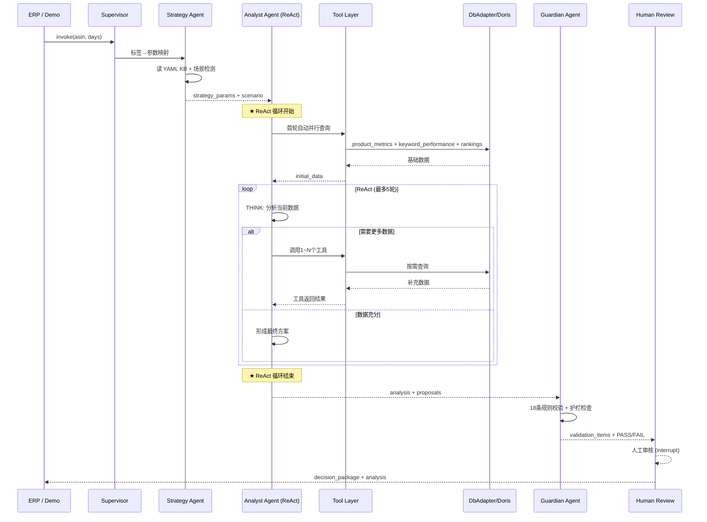

# ReAct 架构方案 — Analyst Agent 推理-行动循环

> **版本**: 1.0
> **日期**: 2026-05-22
> **基于**: 架构方案2.0.md 多智能体蓝图
> **定位**: 替代架构方案2.0中伪 ReAct（生成→校验→重试），设计真正的 Think→Act→Observe 迭代推理

---

## 一、什么是真正的 ReAct，为什么只有 Analyst 需要

### 1.1 真 ReAct vs 伪 ReAct

```
伪 ReAct（架构方案2.0）:
  一次LLM生成方案 → 校验 → 不通过就回到起点重试
  没有工具调用、没有逐步获取新信息、没有基于新观察调整推理

真 ReAct:
  Think: "ACOS 42%，偏高，需要定位根因"
    → Act: 调 tool 查高花费关键词明细
    → Observe: 词A花费$200/0转化，词B ACOS 68%且排名在掉
  Think: "词A明显是浪费，词B可能是因为竞品压价导致排名下滑"
    → Act: 调 tool 查词B的竞品排名变化 + 搜索词报告
    → Observe: 词B的竞品排名也在下滑，可能是该类目搜索量萎缩
  Think: "词B是类目趋势问题非个例，不该否定。词A该否定。"
    → Act: 调 tool 查可用拓词列表
    → Observe: 有15个未覆盖的高转化搜索词
  Think: "综合判断：优化ACOS + 扩词，否定词A，拓词补位"
    → 输出最终方案
```

每一次 Act 获取的新信息都可能**改变推理方向**，而不是按固定脚本走完查询。

### 1.2 为什么其他 Agent 不需要

| Agent | 工作内容 | 为什么不需要 ReAct |
|-------|---------|-------------------|
| Supervisor | ASIN→agent 路由 | 流程分支是确定性的，非推理 |
| Data Agent | 按场景+方向查询 | 8场景×4方向=固定查询矩阵（QueryRouter已实现），LLM决策只会更慢更不稳定 |
| Strategy Agent | 标签→参数查表 | YAML key→value，确定性操作 |
| Guardian Agent | 18条规则校验 | 规则是确定性的，无推理 |
| **Analyst Agent** | 诊断+方案生成 | **唯一需要迭代推理的环节**——根因分析天然是"发现问题→深入调查→修正判断"的循环 |

### 1.3 关键设计决策：Data Agent 工具化

在真 ReAct 架构中，Data Agent 不再是独立 Agent，而是**退化为工具层**（Tool Provider）。Analyst Agent 在其 ReAct 循环中直接调用数据工具：

```
旧：Data Agent(独立Agent) → 全量查询 → Analyst Agent(一次推理) → 输出
新：Analyst Agent(ReAct循环，内含工具调用) → 逐步查询+推理 → 输出
```

这样做的理由：
- Analyst 从"被动接收所有数据"变为"主动按需获取数据"
- 数据获取的决策权交给推理者，而不是前置路由
- 减少不必要的数据查询（很多场景下 placement/competitor 数据最终没被用到）

---

## 二、推荐架构总览

```
                          ┌──────────────────────────┐
                          │    Supervisor Agent       │
                          │   (确定性流程编排)          │
                          └─────┬────────┬───────────┘
                                │        │
                ┌───────────────┘        └───────────────┐
                ▼                                        ▼
      ┌─────────────────┐                    ┌─────────────────┐
      │  Strategy Agent  │                    │   Data Layer    │
      │ (确定性KB查表)    │                    │  (工具提供层)    │
      │                 │                    │                 │
      │ · 标签→参数映射  │                    │ · MCP工具封装    │
      │ · 场景识别      │                    │ · 缓存管理       │
      │ · 公式参数注入  │                    │ · 降级兜底       │
      └────────┬────────┘                    └────────┬────────┘
               │                                      │
               └───────────────┬──────────────────────┘
                               │ 策略参数 + 工具集
                               ▼
                     ┌─────────────────────────────────────┐
                     │        Analyst Agent (ReAct)         │
                     │                                     │
                     │  ┌─────────────────────────────┐    │
                     │  │       THINK (LLM推理)        │    │
                     │  │  · 当前数据揭示了什么问题？    │    │
                     │  │  · 还需要什么信息做判断？      │    │
                     │  │  · 什么工具能拿到这些信息？    │    │
                     │  └──────────┬──────────────────┘    │
                     │             │                        │
                     │    ┌────────┴────────┐              │
                     │    ▼                  ▼              │
                     │  有工具调用        无工具调用         │
                     │    │                  │              │
                     │    ▼                  ▼              │
                     │  ┌──────────────┐  ┌────────────┐   │
                     │  │  ACT + OBS   │  │ 输出最终方案 │   │
                     │  │ 调用工具取数  │  │            │   │
                     │  │ 观察返回结果  │  │ analysis   │   │
                     │  └──────┬───────┘  │ proposals  │   │
                     │         │          │ direction  │   │
                     │         └──────────│ scores     │   │
                     │             循环    └─────┬──────┘   │
                     └───────────────────────────┼─────────┘
                                                  │
                                                  ▼
                                        ┌─────────────────┐
                                        │ Guardian Agent   │
                                        │ (规则校验+护栏)   │
                                        └────────┬────────┘
                                                 │
                                        ┌────────┴────────┐
                                        ▼                 ▼
                                      PASS              FAIL
                                        │                 │
                                        ▼                 ▼
                                  ┌──────────┐    ┌──────────┐
                                  │Human Review│   │修正标记   │
                                  │(interrupt) │   │返回Analyst│
                                  └─────┬──────┘   │(max 1次) │
                                        │          └──────────┘
                                   ┌────┴────┐
                                   ▼         ▼
                              approved   modify/reject
                                   │         │
                                   ▼         ▼
                              ┌────────┐  Analyst(修正)
                              │ERP Job │
                              │Submit  │
                              └────────┘
```

**Agent 数量从 5 个缩减到 4 个**：砍掉独立的 Data Agent，变为工具层。

---

## 三、Analyst Agent ReAct 循环详解

### 3.1 循环结构

```
┌──────────────────────────────────────────────────────┐
│                  Analyst Agent (子图)                  │
│                                                      │
│   START                                               │
│     │                                                 │
│     ▼                                                 │
│  ┌──────────────────────────────────────┐            │
│  │          LLM Node (THINK)             │            │
│  │  · System Prompt: 广告分析师角色       │            │
│  │  · 输入: 策略参数 + 已有观察数据        │            │
│  │  · 输出: 工具调用 OR 最终方案           │            │
│  └──────────┬───────────────────────────┘            │
│             │                                         │
│     ┌───────┴───────┐                                │
│     ▼               ▼                                │
│  有 tool_calls   无 tool_calls                        │
│     │               │                                │
│     ▼               ▼                                │
│  ┌──────────┐  ┌──────────────────┐                  │
│  │Tool Node │  │  输出最终方案      │                  │
│  │(ACT+OBS) │  │  · analysis      │                  │
│  │ 并行执行  │  │  · proposals[]   │                  │
│  │ 工具调用  │  │  · direction     │                  │
│  │ 返回结果  │  │  · risk_warnings │                  │
│  └────┬─────┘  └────────┬─────────┘                  │
│       │                 │                            │
│       ▼                 ▼                            │
│  回到 LLM Node       END                             │
│  (带新数据)                                          │
│                                                      │
│  终止条件:                                            │
│  · LLM 输出不含 tool_calls（方案已形成）               │
│  · 循环达到最大轮次（max 5 轮）                        │
│  · 任一轮次 LLM 超时 → 降级输出                        │
└──────────────────────────────────────────────────────┘
```

### 3.2 LangGraph 实现

```python
from langgraph.graph import StateGraph, END
from langgraph.prebuilt import ToolNode

def build_analyst_subgraph(tools: list) -> StateGraph:
    builder = StateGraph(AnalystState)

    # LLM 节点: bind tools，让模型决定调用哪些
    llm_with_tools = ChatDeepSeek(model=...).bind_tools(tools)

    async def think_node(state: AnalystState):
        messages = state["messages"]
        response = await llm_with_tools.ainvoke(messages)
        return {"messages": [response]}

    # 工具节点: 执行实际的 MCP 查询
    tool_node = ToolNode(tools)

    # 条件边: 有 tool_calls → 执行工具 → 回到 think
    #         无 tool_calls → 结束（最终输出）
    def should_continue(state: AnalystState) -> str:
        last_msg = state["messages"][-1]
        if hasattr(last_msg, "tool_calls") and last_msg.tool_calls:
            return "tools"
        return END

    builder.add_node("think", think_node)
    builder.add_node("tools", tool_node)

    builder.set_entry_point("think")
    builder.add_conditional_edges("think", should_continue, {"tools": "tools", END: END})
    builder.add_edge("tools", "think")

    return builder.compile()
```

### 3.3 循环轮次约束

| 约束 | 值 | 说明 |
|------|---|------|
| 最大轮次 | 5 | 第 5 轮必须输出方案（prompt 约束 + 硬截断） |
| 每轮 LLM 超时 | 30s | 单次 think 超时 → 降级用已有数据出方案 |
| 每轮工具超时 | 15s | 单次工具调用超时 → 返回错误标记，LLM 决定跳过还是重试 |
| 空工具调用轮 | 不计入 | 工具返回空数据不计入轮次上限（LLM 可能误判需要某个数据） |

### 3.4 终止条件

| 条件 | 行为 |
|------|------|
| LLM 输出无 tool_calls | 正常终止，输出最终方案 |
| 第 5 轮仍有 tool_calls | 硬截断，强制注入 "你现在必须基于已有数据输出最终方案，不能再调用工具" |
| LLM 连续 2 次超时 | 降级输出，confidence=low |
| 工具全部返回空/错误 | 触发降级，用基础指标出方案 |

---

## 四、工具集定义

### 4.1 工具清单

Analyst Agent 的工具是现有 MCP 工具的薄封装，每个工具对应一个数据维度：

```python
# agents/tools/ad_tools.py

TOOL_DEFINITIONS = [
    {
        "name": "query_product_metrics",
        "description": "查询 ASIN 的广告汇总指标：ACOS、TACOS、CPC、CVR、CTR、花费、销售额、毛利率、库存量。返回一个简明的指标字典。",
        "parameters": {
            "asin": "string",
            "days": "int (7/14/30, 默认7)"
        }
    },
    {
        "name": "query_keyword_performance",
        "description": "查询指定关键词或全部关键词的广告表现：bid、acos、cvr、spend、orders、clicks。返回 TOP N 关键词的详细表现列表。用于定位哪个词在烧钱、哪个词效率高。",
        "parameters": {
            "asin": "string",
            "days": "int",
            "keyword_filter": "string (可选，留空查全部，填关键词模糊匹配，填'top_acos'返回ACOS最高20个，填'zero_orders'返回0转化词)"
        }
    },
    {
        "name": "query_keyword_rankings",
        "description": "查询关键词的自然排名和广告排名。返回各词的当前自然位、上次排名、排名变化、SP排名。用于判断排名趋势和广告依赖度。",
        "parameters": {
            "asin": "string",
            "filter": "string (可选: 'has_rank'只查有排名词, 'no_rank_high_spend'查高花费无排名词, 留空查全部)"
        }
    },
    {
        "name": "query_placement_performance",
        "description": "查询精准位(TOS)和非精准位(ROS)的 ACOS、CPC 对比。用于判断广告位策略是否合理，是否需要调整竞价位置。",
        "parameters": {
            "asin": "string",
            "days": "int"
        }
    },
    {
        "name": "query_trend_data",
        "description": "查询 ASIN 的每日趋势数据：ACOS、CVR、CPC、CTR、订单数、花费的日度变化。用于判断指标是在改善还是恶化。",
        "parameters": {
            "asin": "string",
            "days": "int",
            "metrics": "list[string] (可选，留空返回全部)"
        }
    },
    {
        "name": "query_competitor_landscape",
        "description": "查询直接竞品列表：竞品ASIN、价格、评分、BSR排名。用于竞品对比分析和威胁评估。",
        "parameters": {
            "asin": "string"
        }
    },
    {
        "name": "query_search_terms",
        "description": "查询搜索词报告：客户的搜索词、对应的广告花费和转化。用于发现否定词机会和拓词候选。",
        "parameters": {
            "asin": "string",
            "days": "int",
            "filter": "string (可选: 'wasteful'返回高花费零转化, 'candidate'返回高转化未收录, 留空返回全部)"
        }
    },
    {
        "name": "query_flow_keywords",
        "description": "查询 ASIN 的流量关键词列表（自然流量入口），用于发现可拓词的机会。",
        "parameters": {
            "asin": "string"
        }
    },
    {
        "name": "query_inventory_status",
        "description": "查询当前库存量、可售天数、断货风险。",
        "parameters": {
            "asin": "string"
        }
    },
]
```

### 4.2 工具分类

| 层级 | 工具 | 调用时机 |
|------|------|---------|
| **首轮必调** | `query_product_metrics` + `query_keyword_performance(top_acos)` + `query_keyword_rankings` | 每个 ASIN 进入 Analyst 时自动并行调用，提供初始视野 |
| **问题驱动** | `query_placement_performance` | ACOS异常时，查是不是广告位问题 |
| **问题驱动** | `query_search_terms(wasteful)` | 零转化词多时，定位具体搜索词 |
| **问题驱动** | `query_search_terms(candidate)` | 拓词方向考虑时，找候选词 |
| **问题驱动** | `query_competitor_landscape` | 怀疑竞品压价/排名被抢时 |
| **问题驱动** | `query_trend_data` | 需要判断是短期波动还是长期趋势时 |
| **问题驱动** | `query_flow_keywords` | 扩词方向决策时 |
| **问题驱动** | `query_inventory_status` | 库存紧张信号出现时 |

### 4.3 工具实现策略

工具不新建数据查询逻辑，直接复用 `DbAdapter`：

```python
# agents/tools/ad_tools.py

from app.data.db_adapter import DbAdapter

adapter = DbAdapter()  # 复用现有连接池

async def query_product_metrics(asin: str, days: int = 7) -> dict:
    """封装 DbAdapter._fetch_ad_summary + _fetch_gross_profit"""
    data = await adapter.fetch_asin_data(asin, meta_filter=["META_AD_PRODUCT"], days=days)
    return {
        "acos": data.ad_data.acos,
        "tacos": data.ad_data.tacos,
        "cpc": data.ad_data.cpc,
        "cvr": data.ad_data.cvr,
        "ctr": data.ad_data.ctr,
        "spend": data.ad_data.spend,
        "sales": data.ad_data.sales,
        "margin": data.margin,
        "inventory_qty": data.signals.inventory_qty if data.signals else None,
    }

async def query_keyword_performance(asin: str, days: int = 7, keyword_filter: str = "") -> list[dict]:
    """封装 DbAdapter._fetch_ad_keywords，按 filter 返回子集"""
    data = await adapter.fetch_asin_data(asin, meta_filter=["META_KW_AD"], days=days)
    keywords = data.keywords
    if keyword_filter == "top_acos":
        keywords = sorted(keywords, key=lambda k: k.acos or 0, reverse=True)[:20]
    elif keyword_filter == "zero_orders":
        keywords = [k for k in keywords if k.spend >= 15 and k.orders == 0]
    # ...
    return [{"keyword": k.keyword, "bid": k.bid, "acos": k.acos, "cvr": k.cvr,
             "spend": k.spend, "orders": k.orders} for k in keywords]
```

**关键**：工具层共享 `WorkflowOrchestrator._data_cache`，同一个 ASIN+days 组合只查一次 DB，多次工具调用从同一份 `ASINData` 切片。这意味着工具调用的 I/O 成本极低——第一次查询填充 `ASINData`，后续工具从缓存的不同字段取数。

---

## 五、Analyst System Prompt 设计

### 5.1 Prompt 结构

```markdown
你是一个亚马逊广告运营分析师。你的任务是：
1. 逐步诊断 ASIN 的广告表现
2. 调用工具获取需要的数据
3. 基于数据分析形成广告方向建议和具体调整方案

## 分析框架

按以下步骤逐步推进，每一步调用工具获取所需数据：

Step 1 — 整体诊断：调用 query_product_metrics 看全局指标
Step 2 — 关键词定位：调用 query_keyword_performance 定位问题词/机会词
Step 3 — 排名验证：调用 query_keyword_rankings 判断排名趋势
Step 4 — 深入调查（按需）：
  - ACOS高 → query_placement_performance 查是不是广告位问题
  - 零转化词多 → query_search_terms(wasteful) 定位搜索词
  - 扩词机会 → query_search_terms(candidate) + query_flow_keywords
  - 竞争威胁 → query_competitor_landscape
  - 趋势判断 → query_trend_data
Step 5 — 形成方案：综合所有数据，给出最终推荐

## 输出规范

当你确认已获取足够数据时，输出以下 JSON，不要再调用工具：

{
  "overall_analysis": "综合分析（80-150字，趋势为先）",
  "direction_scores": {
    "push_natural": {"score": 0-100, "reason": "评分依据"},
    "expand_keywords": {"score": 0-100, "reason": "评分依据"},
    "optimize_acos": {"score": 0-100, "reason": "评分依据"},
    "balance_maintain": {"score": 0-100, "reason": "评分依据"}
  },
  "priority_directions": ["按优先级排列的方向ID列表"],
  "proposals": [
    {
      "action": "negate_keyword|adjust_bid|add_keyword|change_placement|maintain",
      "keyword": "关键词（如适用）",
      "current_value": "当前值",
      "suggested_value": "建议值",
      "magnitude_pct": "调整幅度（如适用）",
      "reason": "建议理由（运营可读文案）"
    }
  ],
  "risk_warnings": ["风险提示列表"],
  "data_sources_used": ["本次分析用到的工具列表"]
}

## 约束

- 最多调用 5 轮工具。第 5 轮必须输出最终方案。
- 不要重复查询相同参数的工具（缓存已存在）。
- 如果工具返回空数据或错误，基于已有数据继续推理，不要卡住。
- 所有数值精确到 1%，不要用模糊区间。
- 理由必须用运营可读文案，不得出现内部规则编号。
- 当现有数据足以判断方向时，立即输出方案，不要为了"查全"而调用所有工具。
```

### 5.2 初始消息构造

```python
def build_initial_message(
    asin: str,
    days: int,
    strategy_params: dict,  # 来自 Strategy Agent
    scenario: dict,         # 场景识别结果
    initial_data: dict,     # 首轮必查结果
) -> str:
    return f"""## 分析任务

ASIN: {asin}
时间窗口: {days} 天

## 策略上下文

- 产品阶段: {strategy_params.get('product_stage', '未知')}
- 产品定位: {strategy_params.get('product_level', '未知')}
- 季节阶段: {strategy_params.get('season_stage', '未知')}
- 广告目的: {', '.join(strategy_params.get('ad_purposes', []))}
- 关键词类型: {', '.join(strategy_params.get('keyword_types', []))}

## 策略参数（来自知识库）

- ACOS 容忍上限: {strategy_params.get('acos_tolerance_max', 30)}%
- 日出价调整上限: {strategy_params.get('daily_adjustment_cap_pct', 0.15) * 100}%
- 允许的广告方向: {strategy_params.get('allowed_purposes', [])}
- 禁止的广告方向: {strategy_params.get('disallowed_purposes', [])}

## 场景判定

- 场景ID: {scenario.get('id', 'default')}
- 北极星指标: {scenario.get('north_star', '')}

## 初始数据（已自动查询）

{json.dumps(initial_data, indent=2, ensure_ascii=False)}

请基于以上信息开始分析。如果现有数据不足以做出判断，调用工具获取更多数据。
"""
```

---

## 六、完整多 Agent 工作流

### 6.1 两层图架构：单 ASIN 子图 + 批量父图

LangGraph 的 `Send` API 天然支持「一个父图扇出到 N 个子图，每个子图独立执行、独立 checkpoint」。这正好对应批量 ASIN 分析的需求：

```
单 ASIN 模式:  直接调用 asin_workflow 子图
批量模式:      调用 batch_supervisor 父图 → Send 扇出到 N 个 asin_workflow
```

**同一个 `asin_workflow` 子图被两种模式复用**，不写两套代码。

### 6.2 单 ASIN 子图（asin_workflow）

这是核心分析图，单 ASIN 和批量共用：

```python
# agents/graphs/asin_workflow.py

def build_asin_workflow() -> StateGraph:
    """单 ASIN 分析子图: strategy → analyst(ReAct) → guardian → human_review"""
    builder = StateGraph(AsinState)

    builder.add_node("strategy", strategy_node)              # KB查表
    builder.add_node("analyst", build_analyst_subgraph())    # ★ ReAct子图
    builder.add_node("guardian", guardian_node)              # 规则校验
    builder.add_node("human_review", human_review_node)      # interrupt

    builder.add_edge(START, "strategy")
    builder.add_edge("strategy", "analyst")

    builder.add_conditional_edges(
        "guardian",
        route_after_guardian,
        {"human": "human_review", "analyst": "analyst"}  # FAIL 返回修正，仅1次
    )

    builder.add_conditional_edges(
        "human_review",
        route_after_review,
        {"analyst": "analyst", "end": END}
    )

    return builder.compile()
```

### 6.3 批量父图（batch_supervisor）— 核心：Send 扇出

```python
# agents/graphs/batch_supervisor.py

from langgraph.graph import StateGraph, END
from langgraph.types import Send
from langgraph.checkpoint.sqlite import SqliteSaver

class BatchState(TypedDict):
    """批量任务全局状态"""
    batch_id: str
    asins: list[dict]              # [{"asin": "B0XXX", "days": 7}, ...]
    erp_ref: str | None
    auto_confirm: bool
    source: str                     # "erp" | "demo"

    # 每个 ASIN 的结果（由 asin_workflow 子图写入各自的 AsinState，
    # aggregate 节点通过 get_state(thread_id) 读取）
    results: Annotated[list[dict], merge_batch_results]

    # 聚合产出
    total: int
    succeeded: int
    failed: int
    completed_at: str | None
    cross_insights: dict | None      # 可选跨ASIN统计


def init_batch(state: BatchState) -> dict:
    """初始化批量任务，不做数据查询，只准备扇出"""
    return {
        "total": len(state["asins"]),
        "succeeded": 0,
        "failed": 0,
    }


def fan_out_to_asins(state: BatchState) -> list[Send]:
    """★ 关键节点：为每个 ASIN 创建一个 Send，指向 asin_workflow 子图

    每个 Send = 一个完全独立的子图执行，有自己的 thread_id 和 checkpoint。
    不同 ASIN 的数据、LLM 消息、文件读写物理上不相交。
    """
    sends = []
    for entry in state["asins"]:
        asin = entry["asin"]
        days = entry.get("days", 7)

        # thread_id = batch_id + asin，确保每个 ASIN 有独立 checkpoint
        thread_id = f"{state['batch_id']}:{asin}"

        sends.append(Send(
            node="asin_workflow",           # 目标子图
            arg={
                "asin": asin,
                "days": days,
                "source": state["source"],
                "batch_id": state["batch_id"],
                "auto_confirm": state.get("auto_confirm", True),
            }
        ))

    return sends


async def aggregate_results(state: BatchState) -> dict:
    """汇聚所有 ASIN 子图的结果

    批量父图在每个 Send 完成后自动流入此节点。
    state["results"] 已由 merge_batch_results reducer 自动累积。
    """
    succeeded = sum(1 for r in state["results"] if r.get("status") == "completed")
    failed = sum(1 for r in state["results"] if r.get("status") == "failed")

    # 可选：跨 ASIN 统计（只基于每个 ASIN 的最终输出，不混合原始数据）
    insights = None
    if len(state["results"]) >= 2:
        insights = compute_cross_asin_insights(state["results"])

    return {
        "succeeded": succeeded,
        "failed": failed,
        "completed_at": datetime.now(timezone.utc).isoformat(),
        "cross_insights": insights,
    }


def build_batch_supervisor() -> StateGraph:
    builder = StateGraph(BatchState)

    builder.add_node("init_batch", init_batch)
    builder.add_node("asin_workflow", build_asin_workflow())  # 复用于图
    builder.add_node("aggregate", aggregate_results)

    builder.add_edge(START, "init_batch")

    # ★ 扇出：init_batch 返回 N 个 Send → N 个 asin_workflow 并行执行
    builder.add_conditional_edges(
        "init_batch",
        fan_out_to_asins,           # 返回 list[Send]，每个指向 asin_workflow
        path_map=["asin_workflow"]  # 所有 Send 去同一个节点
    )

    # 每个 asin_workflow 完成后 → aggregate
    builder.add_edge("asin_workflow", "aggregate")
    builder.add_edge("aggregate", END)

    return builder.compile()
```

### 6.4 两种调用模式

```python
# ── 模式 1: 单 ASIN 分析（Demo / 单 ASIN ERP Job）──
result = await asin_workflow.ainvoke(
    {"asin": "B0B7S3PWWB", "days": 7, "source": "demo", "auto_confirm": False},
    config={"configurable": {"thread_id": "B0B7S3PWWB:7"}}
)

# ── 模式 2: 批量分析（批量 ERP Job）──
batch_graph = build_batch_supervisor()
result = await batch_graph.ainvoke(
    {
        "batch_id": "batch-20260522-001",
        "asins": [
            {"asin": "B0B7S3PWWB", "days": 7},
            {"asin": "B0DNZNWGX5", "days": 14},
            {"asin": "B0DTPBX66G", "days": 7},
        ],
        "source": "erp",
        "auto_confirm": True,
        "erp_ref": "BATCH-20260522-001",
    },
    config={"configurable": {"thread_id": "batch-20260522-001"}}
)
```

### 6.5 为什么 Send 天然保证隔离

```
batch_supervisor 图
    │
    init_batch ─── fan_out_to_asins() 返回:
    │
    ├── Send("asin_workflow", {asin:"A", ...})
    │       └── 独立子图执行，thread_id="batch:X:A"
    │            ├── AsinState 只有 ASIN A 的数据
    │            ├── Analyst ReAct 循环只有 A 的关键词和竞品
    │            ├── LLM messages 只有 A 的上下文
    │            ├── checkpoint 写到独立分区
    │            └── 子图完成后返回 {status, analysis, proposals, ...}
    │
    ├── Send("asin_workflow", {asin:"B", ...})
    │       └── 独立子图执行，thread_id="batch:X:B"
    │            └── ... 与 A 完全隔离 ...
    │
    └── Send("asin_workflow", {asin:"C", ...})
            └── 独立子图执行，thread_id="batch:X:C"
                 └── ... 与 A/B 完全隔离 ...

    所有子图完成后 → aggregate 汇总结果
```

每个 `Send` = 一次完整的 `asin_workflow.ainvoke()`（LangGraph 引擎自动处理）。Send 之间：

| 维度 | 隔离方式 |
|------|---------|
| **State** | 每个 Send 创建独立的 `AsinState` 实例，state 字典不共享 |
| **Checkpoint** | 每个 Send 有独立的 `thread_id`，SqliteSaver 按 thread_id 分区存储 |
| **LLM messages** | 每个子图的 Analyst ReAct 循环内 messages 独立累积 |
| **DB 查询** | 工具函数接收各自 ASIN 的 state，SQL WHERE 限定各自 ASIN |
| **文件写入** | StateManager 按 `asin` 写到 `config/{ASIN}/`，物理路径不同 |
| **并发控制** | Semaphore 在工具层控制 DB/LLM 并发度（见批量方案文档） |

### 6.6 并发行为

LangGraph 对 `Send` 返回的多个子图是**并行执行**的。但并发度可以通过工具层的 Semaphore 控制（见 [批量ASIN分析方案](批量ASIN分析方案.md) 第二节）。

```python
# 工具层的 Semaphore 对所有子图的工具调用统一限流
db_semaphore = asyncio.Semaphore(5)
llm_semaphore = asyncio.Semaphore(3)

# 即使 batch_supervisor 扇出 50 个 ASIN：
# - 最多 5 个同时查 DB
# - 最多 3 个同时调 LLM
# - 其余在 Semaphore 队列等待
# - 每个子图独立推进，互不阻塞
```

### 6.7 两份图的文件组织

```
ad-direction-agent/app/agents/
├── graphs/
│   ├── asin_workflow.py       # 单 ASIN 子图（模式1+2复用）
│   └── batch_supervisor.py   # 批量父图（Send 扇出）
├── nodes/
│   ├── strategy.py
│   ├── analyst.py             # ReAct 循环子图
│   ├── guardian.py
│   └── human_review.py       # interrupt 节点
├── tools/
│   └── ad_tools.py            # 9个工具函数
└── state.py                   # AsinState + BatchState
```

### 6.2 AgentState（全流程状态）

```python
class MasterState(TypedDict, total=False):
    # 会话
    thread_id: str
    asin: str
    days: int
    source: Literal["demo", "erp", "batch"]

    # Strategy 产出
    strategy_params: dict       # ← 原 kb_params + formula_params 合并
    scenario: dict

    # Analyst 产出 (ReAct 循环后)
    analysis: dict              # overall_analysis + direction_scores
    proposals: list[dict]       # 具体调整建议
    react_trace: list[dict]     # Think→Act→Observe 完整轨迹（可选保留）

    # Guardian 产出
    self_check_result: Literal["ALL_PASS", "PARTIAL_PASS", "FAIL"]
    validation_items: list[dict]
    risk_warnings: list[str]

    # Human Review
    human_decision: Literal["approved", "modified", "rejected"] | None
    human_modifications: dict | None

    # ERP
    erp_ref: str | None
    erp_response: dict | None

    # 错误
    error: str | None
    current_agent: str

    # LLM 对话历史（Analyst ReAct 循环内）
    messages: Annotated[list[BaseMessage], add_messages]
```

### 6.3 数据契约

```
Supervisor ──(asin, days, source)──→ Strategy Agent
Strategy Agent ──(strategy_params, scenario)──→ Analyst Agent
Analyst Agent ──(analysis, proposals, react_trace)──→ Guardian Agent
Guardian Agent ──(self_check_result, validation_items)──→ Human Review
Human Review ──(human_decision)──→ ERP Submit / Analyst(修正)
```

### 6.4 完整时序



---

## 七、与现有代码的复用关系

| 现有模块 | 复用方式 | 备注 |
|---------|---------|------|
| `app/data/db_adapter.py` | 工具层直接调用 | 730行，8维度查询，连接池 |
| `app/core/scenario_analyzer.py` | Strategy Agent 调用 | 8场景检测逻辑不变 |
| `app/core/recommender.py` | 作为 Analyst 的 fallback | LLM超时时降级用规则评分 |
| `app/core/validation_engine.py` | Guardian Agent 调用 | 18条规则调度不变 |
| `app/rules/*.py` | Guardian Agent 调用 | 规则函数不变 |
| `app/llm/client.py` | Analyst + Strategy 共用 | DeepSeek HTTP + Key池 |
| `app/persistence/state_manager.py` | 保留 long_term_config JSON | 战略/策略跨会话配置 |
| `app/models/asin_data.py` | 工具层+Analyst 共用 | ASINData 结构不变 |
| `app/config/tags.toml` | Strategy Agent 读 | 方向定义 |
| `app/config/thresholds.toml` | Strategy YAML KB 替代 | 迁移到 kb/strategy_params.yaml |
| `ad-purpose-agent/` | Strategy Agent 调用 | 广告目的推荐 |
| `demo/ad-asisitant-agent.html` | 新增 "Agent 模式" 开关 | 保留现有四层向导 |

### 不复用（由新方案替代）

| 现有模块 | 替代方案 |
|---------|---------|
| `workflow_orchestrator.py` 编排逻辑 | LangGraph Supervisor Agent |
| `workflow/steps/execution.py` LLM 调用 | Analyst ReAct 循环 |
| `workflow/steps/validation_report.py` LLM报告 | Guardian → ERP Submit 路径 |
| `workflow/steps/p3.py` 目标ACOS/预算 | Analyst 输出中内嵌 |
| `app/llm/reasoner.py` Prompt（EXECUTION_SYSTEM_PROMPT） | Analyst System Prompt（见第五节） |
| `app/core/query_router.py` | 工具层的按需查询 + LLM自主决策 |

---

## 八、与架构方案2.0（伪ReAct）的对比

| 维度 | 架构方案2.0（旧） | 本方案（真ReAct） |
|------|-----------------|------------------|
| Agent 数量 | 5 (Supervisor+Data+Strategy+Analyst+Guardian) | 4 (砍掉Data Agent，退化为工具层) |
| Analyst 推理 | 单次LLM→校验→不通过重试 | Think→Act(Tool)→Observe→Think 真迭代 |
| 数据获取 | Data Agent 按场景全量前置查询 | Analyst 按需驱动，逐步深入 |
| 工具调用 | 无（数据全在一轮给完） | 多轮工具调用，每轮获取新信息 |
| 循环终止 | 校验通过或3次重试 | 无工具调用（方案形成）或5轮上限 |
| 查询效率 | 可能查了用不上的数据（placement/search_terms） | 只在需要时查 |
| 推理可追溯 | 有限（只看输入/输出） | 完整 Think→Act→Observe 轨迹 |
| 降级路径 | 单次失败→算法降级 | 每轮独立超时控制 + 最终降级 |

---

## 九、实施路线图

```
Phase 1 (2-3天): 基础设施
├── 安装 langgraph + langgraph-checkpoint-sqlite
├── 创建 MasterState + AnalystState
├── 创建空主图编译骨架
├── 创建 tools/ 目录 + 9个工具函数（封装 DbAdapter）
└── 创建 kb/strategy_params.yaml（从 thresholds.toml + prompt_kb.md 提取）

Phase 2 (3-4天): Analyst ReAct 子图
├── 实现 think_node（LLM + bind_tools）
├── 实现 tool_node（LangGraph ToolNode + 自定义执行器）
├── 实现条件边 + 轮次计数 + 超时控制
├── 设计 Analyst System Prompt + 初始消息构造
├── 实现降级路径（LLM超时 → 规则评分兜底）
└── 单元测试：Mock 工具 + 多轮对话场景

Phase 3 (2-3天): Strategy + Guardian + Human Review
├── Strategy Agent: 读 YAML KB + 标签匹配 + scenario_analyzer
├── Guardian Agent: 对接 ValidationEngine
├── Human Review 节点: interrupt 实现 + resume 三条路径
├── ERP Submit 节点: 决策包 + 结构化JSON
└── SqliteSaver checkpoint 验证

Phase 4 (2-3天): 前端适配 + 联调
├── Demo 新增 "Agent 模式" 开关（v1/v2 并存）
├── ReAct 过程可视化（Think→Act→Observe 步骤展示）
├── 审核卡片 UI（Human Review interrupt）
├── v1 API 适配层（转发到 LangGraph invoke/resume）
└── 端到端测试（B0B7S3PWWB 等4个测试ASIN）

Phase 5 (后续)
├── KB 完善（formulas.yaml、guardrails.yaml、ops_language.yaml）
├── ERP Job Service（异步 Job + Webhook）
├── 批量 ASIN 处理
└── LangSmith 可观测性
```

---

## 十、验收标准

### Analyst ReAct
- [ ] 同一 ASIN，ReAct 输出与当前 `run_validation_and_report` 字段结构一致（analysis + proposals + direction_scores）
- [ ] at least 1 轮工具调用（首轮自动）被触发
- [ ] LLM 在 2-3 轮内输出最终方案（不需要 5 轮）
- [ ] 工具超时降级不阻塞全图
- [ ] react_trace 可被前端渲染为步骤展示

### 全图
- [ ] 与当前 `wizard/report` 字段一致（含 v2.4 无 BM/半窗）
- [ ] Human Review interrupt → resume 正常恢复
- [ ] SqliteSaver checkpoint 重启后状态可恢复
- [ ] v1 API 适配层转发不破坏现有 Demo

### 回归
- [ ] 4 个测试 ASIN 的最终决策包与当前版本一致或更优
- [ ] 规则校验结果与当前版本一致
- [ ] 前端兼容：现有四层向导 Tab1-4 不报错
