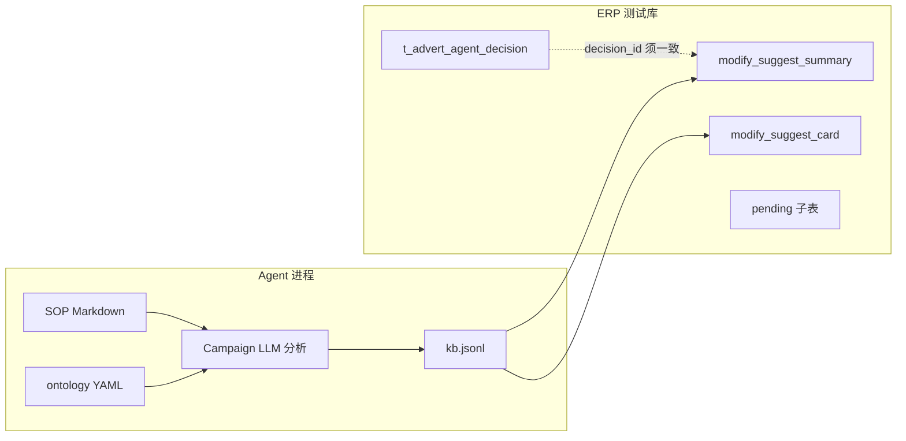

# Ontology 部署方案

> 本文件为 **ontology 目录内权威部署说明**，吸收 `ontology方案/21-Ontology第一期落地方案.md` 并叠加 **规则 23（广告组合与预算分配）** 的 Phase 1b 扩展。  
> 不修改原有 SOP Markdown；本期（Phase 1 / 1b）**不修改** `ad-direction-agent` 运行时代码。

---

## 1. Ontology 与知识库、Agent 的关系

| 层 | 回答的问题 | 载体 |
| --- | --- | --- |
| 知识库（SOP） | 什么情况下该做什么、阈值、冲突裁决、输出格式 | `docs/knowledge_base/**/*.md` |
| Ontology | 对象是什么、属于谁、能否被调整、动作是否合法、证据是否够、预算组合如何回算 | `docs/knowledge_base/ontology/*.yaml` |
| Agent 运行时 | 拉数、LLM 分析、写 ERP | `ad-direction-agent/`（Phase 2 再接 ontology） |

一句话：

> **知识库负责「怎么决策」，Ontology 负责「先别认错对象」；budget_groups 负责「活动合理但整体预算不失控」。**

---

## 2. 存储选型

第一期与 Phase 1b 均采用 **Markdown（KB）+ YAML（Ontology）**，不上 Neo4j。

| 优势 | 说明 |
| --- | --- |
| 可读 | 运营、产品、研发可直接 review |
| 可切片注入 | 按 `campaign_type` / `group_type` 检索片段进 Prompt |
| 可迁移 | 后续可导入图数据库或 Schema 校验器 |

| 阶段 | 存储 | 适用 |
| --- | --- | --- |
| Phase 1 / 1b | Markdown + YAML | 对象、动作、证据、预算组合（**当前**） |
| Phase 2 | JSON Schema + Python 校验 | 输出前自动校验 ONT / GROUP |
| Phase 3 | SQLite / Postgres | 规则版本、回归用例、输出日志 |
| Phase 4 | Neo4j / GraphRAG | 跨 Agent 关系查询（可选） |

---

## 3. 分阶段路线图

| 阶段 | 交付物 | Agent 改代码 | 状态 |
| --- | --- | --- | --- |
| **Phase 1** | `entities.yaml`、`campaign_types.yaml`、`actions.yaml`、`evidence.yaml`、`validation_rules.yaml`（ONT-001~010） | 否 | 已完成 |
| **Phase 1b** | `budget_groups.yaml`、GROUP-001~007、README、本部署方案 | 否 | **本期** |
| **Phase 2** | `kb_loader` ontology preset；按 campaign_type / group_type 切片；输出前校验 | 是 | 待做 |
| **Phase 3** | 规则版本库；预算回算回归用例（含 23 §11 数值案例） | 是 | 待做 |
| **Phase 4** | Neo4j / GraphRAG（可选） | 是 | 待做 |

### Phase 1b 文件清单

```text
docs/knowledge_base/ontology/
├── README.md
├── 部署方案.md          ← 本文件
├── entities.yaml
├── campaign_types.yaml
├── actions.yaml
├── evidence.yaml
├── validation_rules.yaml
└── budget_groups.yaml   ← 新增
```

---

## 4. Prompt 注入方式

不要把整份 ontology 塞进 Prompt；每次任务组装 **Ontology Card** + **Budget Card**（如适用）+ **SOP 片段** + **业务数据** + **输出契约**。

### 4.1 四类注入内容

| 注入块 | 作用 |
| --- | --- |
| Ontology Card | 对象类型、Campaign Type、允许/禁止动作 |
| Budget Card | 组合类型、归类优先级、回算原则、必填汇总字段 |
| SOP Rule | KB 触发规则、护栏、阈值 |
| Business Data | 当前 ASIN / Campaign / 组合预算数据 |
| Output Contract | proposed_actions / blocked_actions + portfolio_budget_summary |

### 4.2 模板（Phase 1 + 1b）

```text
你是 Amazon 广告调整 Agent。

你必须先执行 ontology 校验：
1. 判断 object_class、campaign_type
2. 判断 action_code 是否允许作用于该对象
3. 判断证据是否满足
4. 若父 ASIN 有 Campaign 预算调整，执行预算组合归类与回算（GROUP-002/003）
5. 违反 ontology 或 GROUP 规则时，必须阻断或降级

【Ontology Card】
{retrieved_ontology_cards}

【Budget Ontology Card】
{retrieved_budget_cards — 来自 budget_groups.yaml 切片}

【SOP Rule】
{retrieved_sop_rules}

【Business Data】
{asin_campaign_keyword_group_budget_data}

【Output Contract】
每条动作：ontology_validation_status, ontology_rule_refs, source_report_refs
父 ASIN 级（多 Campaign 时必填）：
  portfolio_budget_summary
  budget_groups[]
```

### 4.3 Budget Card 示例

```text
【Budget Ontology Card】
parent_asin: B0XXXX
parent_target_daily_budget: 100
classification_priority: elimination > auto_broad > promotion > testing
GROUP-BUDGET-004: 推广组 7d 花费>=5 且有出单 → 完全保护，测试组优先压缩
elimination_group: 组合预算 $1，Bid $0.20，释放预算仅来自活动层降至 $1
allocation_if_insufficient: weighted 60% / 20% / 20% (promotion/testing/auto_broad)
must_output: portfolio_budget_summary, budget_groups[]
rule_refs: [GROUP-002, GROUP-003, GROUP-004]
```

---

## 5. 规则 23 落地案例（预算回算）

来源：[23-广告组合与预算分配规则.md](../执行规则/23-广告组合与预算分配规则.md) §11；结构化见 [budget_groups.yaml](./budget_groups.yaml) `example_case_11`。

**输入：**

```yaml
parent_asin: B0XXXX
parent_target_daily_budget: 100
available_increase_budget: 10
group_requested_deltas:
  promotion_group: +20
  testing_group: +3
  auto_broad_group: +7
eliminated_campaign_release: 20
```

**计算：**

```text
请求增加总额 = 20 + 3 + 7 = 30
活动层淘汰释放 = 20
净新增需求 = 10
父 ASIN 允许净增 = 10
```

**结论：** 淘汰释放 $20 抵扣部分增加需求；父 ASIN 再净增 $10；各组合可按请求增量调整（或按 `proportional_by_requested_delta` 分配可用额度）。

**若父 ASIN 不允许净增：** 可用增加预算 = 释放 $20，按 20:3:7 比例压缩推广/测试/广泛组正向增量，父 ASIN 净变化 = 0。

---

## 6. 与 Campaign 分析 / ERP 的关系（说明性）



| 环节 | 本期 | 说明 |
| --- | --- | --- |
| Campaign JSONL | 活动级 `adjustments` | 已有 |
| 组合汇总 | `portfolio_budget_summary` + `budget_groups` | Phase 1b 契约在 YAML；**JSONL 字段扩展属 Phase 2** |
| ERP 表 | `modify_suggest_*` 活动卡粒度 | 组合级字段落库需 WHP/DBA 后续设计 |
| decision_id | 须与 `t_advert_agent_decision.id` 一致 | **程序问题**，见 ERP 接入排查；非 ontology DDL 问题 |

---

## 7. 第一期 + 1b 验收清单

### 对象与动作（ONT）

| ID | 检查项 | 规则 |
| --- | --- | --- |
| AC-01 | 不对 SearchTerm 直接调 Bid | ONT-001 |
| AC-02 | broad/phrase/auto 不输出 placement_adjustment | ONT-002 |
| AC-03 | 不输出 ad_purpose=maintain | ONT-003 |
| AC-04 | 缺库存不输出增长型动作 | ONT-004 |
| AC-05 | 缺 Placement 只阻断 Placement | ONT-005 |
| AC-06 | 动作含 object_class、证据、校验状态 | output_fields |

### 预算组合（GROUP）

| ID | 检查项 | 规则 |
| --- | --- | --- |
| AC-07 | 每 Campaign 有 group_type | GROUP-001 |
| AC-08 | 预算变更后含 portfolio_budget_summary | GROUP-002 |
| AC-09 | 回算父 ASIN 总预算 | GROUP-003 |
| AC-10 | 淘汰组 $1 / $0.20 Bid | GROUP-004 |
| AC-11 | 推广组不被挤断供 | GROUP-005 |
| AC-12 | 不允许净增时已压缩 | GROUP-006 |
| AC-13 | 含 budget_groups[] 明细 | budget_groups.yaml |

完整条目见 [validation_rules.yaml](./validation_rules.yaml)。

---

## 8. Phase 2 接入建议（本期不实施）

1. 在 `ad-direction-agent/app/llm/kb_loader.py` 增加 `ontology` / `budget_groups` preset。
2. 检索键：`parent_asin` + `campaign_type` + `group_type` + 拟输出 `action_code`。
3. Campaign 分析结束后、写 JSONL 前：
   - 为每个 Campaign 填 `group_type`
   - 汇总 `portfolio_budget_summary`
   - Python 校验 GROUP-002/003/004
4. `write_erp_from_jsonl` 使用 `t_advert_agent_decision.id` 作为 `decision_id`（与 WHP 主表对齐）。

---

## 9. 明确不做（Phase 1b）

- 不修改 `docs/knowledge_base/执行规则/23-*.md`（Ontology 为其镜像）。
- 不修改 `kb_loader.py`、`reasoner.py`、Campaign 写入逻辑。
- 不修改 ERP DDL（组合汇总字段协商后另立项）。
- 不删除 `cursor临时文件/reference_sources/ontology方案/` 历史草案。

---

## 10. 修订记录

| 日期 | 说明 |
| --- | --- |
| 2026-06-03 | 初版：合并 21 落地方案 + 规则 23 Phase 1b |
