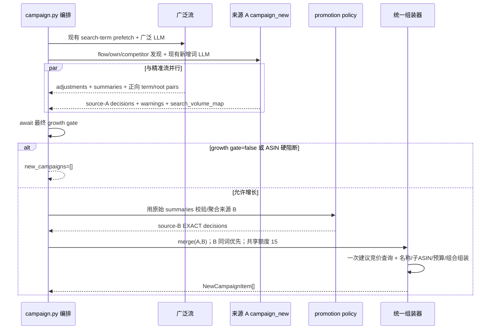

# Campaign 新增扩词双来源统一组装 Implementation Plan

> **For agentic workers:** REQUIRED SUB-SKILL: Use `subagent-driven-development` (recommended) or `executing-plans` to implement this plan task-by-task. Steps use checkbox (`- [ ]`) syntax for tracking.

**Goal:** 在不新增独立搜索词分析管线、不重复调用 LLM/MCP 的前提下，让新增活动同时接收“流量词库探索词”和“广泛/词组/自动活动搜索词提精”两个来源，并由同一套代码完成去重、匹配类型、命名、子 ASIN、Bid、预算、组合归属和数量截断。

**Architecture:** 广泛流继续使用现有 `_search_term_data`，其 LLM 在原有返回 JSON 中额外输出“搜索词 → 规范词根”的正向候选键值对；Python 只接受本批真实搜索词，并用原始搜索词报告重新计算订单、ACOS 和词根聚合，不信任 LLM 回吐数值。现有 `campaign_new` 拆为“来源 A 发现/语义选择”和“统一组装器”：来源 A 的未验证流量词默认建 BROAD，来源 B 通过确定性准入后固定建 EXACT；两源在同一组装器中合流，来源 B 不再进入第二次新增词 LLM。正常路径仍并行启动精准流、广泛流和来源 A，待广泛流返回后只做内存合流和一次统一 Bid 查询。

**Tech Stack:** Python 3.11、asyncio、Pydantic v2、pytest、现有 MCP `ad_campaign_search_term_report` 与建议竞价接口、现有 ERP CREATE 卡/Pending 映射。

---

## 一、定夺与范围

### 1. 双来源的业务定义

| 来源 | 当前事实入口 | LLM 职责 | Python 职责 | 最终匹配类型 |
| --- | --- | --- | --- | --- |
| A：探索词 | `flow_keywords` + `own_keyword_flow`，由 `NewKeywordFetcher` 读取 | 现有双轮 LLM 判断 create/skip、关键词类型、相关性和文案 | 硬过滤、来源识别、趋势门禁、去重、组装 | 未验证 `flow` 默认 `BROAD`；满足完整排名机会条件或竞品专门规则时才允许 `EXACT` |
| B：搜索词提精 | 广泛流已经预取并注入的 `_search_term_data` | 在原广泛批次输出里同时给出真实搜索词及规范词根，不输出最终 Bid/预算/命名，不回吐权威指标 | 校验词保真，重新聚合订单/花费/销售额/ACOS，判断订单/词根准入，固定组装 `EXACT` | `EXACT`，进入精准测试组 |

这里的“两来源”不是“两条新增活动管线”。来源 B 依附广泛流的既有 MCP 与 LLM 调用，只多一个返回集合；两源只在最终候选/决策层合流。

### 2. 必须保持的现有行为

- 精准活动调整、广泛活动调整和否词输出结构不变；新增的正向候选集合不能影响 `campaign_adjustments` 解析。
- `campaign_overview.allow_growth_analysis=false` 时，来源 A、来源 B 都不得生成新增活动；广泛流本身仍运行存量活动诊断。
- `settings.campaign_new_enabled=false` 时同样同时关闭来源 A、来源 B，不能只让旧包装函数关闭来源 A。
- ASIN 级新增阻断（库存、退货、评分、清货期）对两个来源一致生效。
- 新活动的名称、目标子 ASIN、默认预算、建议竞价公式、主投位和组合归属仍由代码生成。
- 全预过滤路径没有可运行的广泛流，因此只能产出来源 A；不得为补来源 B 另拉一次搜索词报告。
- 竞品词源继续受现有配置开关控制，但不再因旧的来源优先级挤占已验证搜索词。
- ERP 继续沿用现有 CREATE 卡、keyword pending、campaign pending 结构；本改造不加表、不加列。

### 3. 明确不做

- 不写 `ASINData.available_new_keywords` / `expand_keyword_candidates` 来另起规则管线。
- 不新增搜索词 MCP，不重复调用 `ad_campaign_search_term_report`。
- 不让来源 B 再经过 `recommend_new_campaigns()`，避免同一词被两个 LLM 重复判断。
- 不让 LLM 决定 `match_type`、预算、Bid、名称、子 ASIN或组合。
- 不把本 ASIN CVR、活动 CVR 或 LLM 常识冒充“品类平均 CVR”。
- 不修改根目录旧文件 `交接文档-新增扩词双来源缺口.md`。

### 4. 当前数据边界

`23号§3.4` 有订单、词根、CVR 三个独立通道。当前运行上下文具备搜索词 `orders/cost/sales/clicks/cvr`、目标 ACOS 和目标 CPA，但没有真实的 `category_avg_cvr` 字段或 MCP 映射。因此本改造可完整实现：

- 订单通道：7 天订单 ≥ 3 且聚合 ACOS ≤ 目标 ACOS；
- 词根通道：同一规范词根合计订单 ≥ 3，或合计 ACOS ≤ 目标 ACOS；
- CVR 通道：暂不启用。只有后续把权威 `category_avg_cvr` 接入 `CampaignStrategyContext`，才可按同一策略模块增加该分支并强制 `HIGH_RISK_REVIEW`。

缺少该基准时必须表现为“该通道不可判”，不能用常量、零值、ASIN 自身 CVR 或 fail-open 生成精准活动。

---

## 二、目标数据契约

### 1. 广泛 LLM 新增的顶层集合

在 `_CAMPAIGN_BROAD_PROMPT` 原 JSON 中增加，与 `campaign_adjustments`、`batch_summary` 平级：

```json
{
  "campaign_adjustments": [],
  "exact_promotion_candidates": [
    {
      "cid": "C2",
      "search_term": "strapless sticky bra",
      "keyword_root": "sticky bra",
      "keyword_class": "long_tail",
      "relevance_tier": "R1",
      "reason": "该搜索词与产品本体直接相关",
      "evidence": ["来自本活动搜索词报告"]
    }
  ],
  "batch_summary": {}
}
```

约束：

- `cid` 必须来自当前批次；`search_term` 必须逐字符归一后命中该 `cid` 的 `_search_term_data`。
- `keyword_root` 只允许为空或为 `search_term` 的连续 token 子串；空值表示只参加搜索词直接聚合，不参加词根聚合。
- LLM 不输出 orders/cost/sales/ACOS/CVR；即使意外输出，解析层也丢弃。
- LLM 只标识语义相关的正向候选，R4、明显不相关词和已经判为否词的词不进入该集合。
- 同一 `(cid, search_term, keyword_root)` 重复返回只保留一条。

### 2. Python 中间模型

在 `app/models/campaign.py` 增加两个明确分层的模型，避免继续把“原始候选”和“已作出建活动决定”混在 `NewCampaignCandidate` 中：

```python
class SearchTermPromotionCandidate(BaseModel):
    campaign_key: str
    campaign_name: str
    campaign_match_type: str
    search_term: str
    keyword_root: str = ""
    keyword_class: str = ""
    relevance_tier: str = ""
    reason: str = ""
    evidence: list[str] = Field(default_factory=list)
    clicks: int = 0
    orders: int = 0
    cost: float = 0.0
    sales: float = 0.0


class NewCampaignDecision(BaseModel):
    keyword_text: str
    keyword_class: str = ""
    relevance_tier: str = ""
    source: str
    trigger_scene: str
    prescribed_match_type: Literal["EXACT", "BROAD", "PHRASE"]
    reason: str = ""
    evidence: list[str] = Field(default_factory=list)
    confidence: str = "medium"
    review_level: str = "MANUAL_REVIEW"
    negative_strategy: str = ""
    search_volume: int = 0
    natural_rank: int | None = None
    suggested_bid: float | None = None
```

`CampaignBatchResult` 增加 `exact_promotion_candidates: list[SearchTermPromotionCandidate]`。`NewCampaignItem` 仍是唯一的最终输出模型。

### 3. 来源码与触发码

- 来源 A 普通探索词：`SRC_FLOW_EXPLORATION`，触发码沿用当前具体场景；未命中特定场景时使用 `KEYWORD_POOL_EXPANSION`。
- 来源 A 完整排名机会：`SRC_RANKING_OPPORTUNITY`，触发码 `RANKING_OPPORTUNITY_NO_EXACT`。
- 来源 A 竞品词：`SRC_COMPETITOR_ASIN`，触发码 `COMPETITOR_INTERCEPT_WINDOW`。
- 来源 B 有成交搜索词：`SRC_CONVERTED`；无成交但来自 AUTO：`SRC_AUTO_CLICKED` 或 `SRC_AUTO_BROAD_TERM`；来自 BROAD/PHRASE：`SRC_BROAD_DERIVED`。最终触发码统一为 `KEYWORD_PROMOTED_FROM_BROAD`。

来源码写入 `NewCampaignItem.source`；ERP 无对应独立列，审计通过既有 `trigger_rule` 和确定性 evidence 保留，不新增 schema。

---

## 三、目标时序



失败隔离：广泛流失败时来源 A 仍可组装；来源 A 失败时来源 B 仍可组装；来源 B 某条不满足词保真或数值准入只丢该条，不影响广泛活动调整和否词。

---

## 四、确定性规则

### 1. 词保真与指标权威

- 归一化只做 `strip + lower + 连续空白压缩`；不做模糊匹配或同义词替换。
- `search_term` 必须命中对应活动注入的搜索词报告；代码用报告中的 `orders/cost/sales/clicks` 覆盖一切 LLM 值。
- `keyword_root` 必须是至少两个字符、且为实际搜索词连续 token 子串；否则置空，不让它进入词根通道。
- 指标聚合唯一键为 `(campaign_key, normalized_search_term)`；同一搜索词在不同活动中的真实数据可以累加，同一活动重复 LLM 输出不能重复计数。
- ACOS 统一由 `sum(cost) / sum(sales) * 100` 计算；`sales<=0` 时 ACOS 为不可用，不能因零除或默认零而达标。

### 2. 来源 B 准入

- 搜索词直接通道：按规范搜索词跨活动聚合，要求 `orders >= 3`、`sales > 0`、聚合 ACOS `<= target_acos`、相关性为 R1、且不存在同文本 EXACT 活动。
- 词根通道：按规范词根跨活动聚合，要求相关性为 R1、不存在同文本 EXACT 词根，且满足 `orders >= 3` 或 (`sales > 0` 且聚合 ACOS `<= target_acos`)。
- 一个词同时命中直接与词根通道时只产生一条；优先使用完整搜索词直接通道，evidence 合并两个命中依据。
- 来源 B 全部固定 `prescribed_match_type="EXACT"`、`ai_portfolio_class=PORTFOLIO_TEST`、`MANUAL_REVIEW`。本期没有满足“历史有效词定义”的独立长窗，因此不使用 KB28 中的 `AUTO_APPROVED` 放宽项。
- 代码 evidence 至少写明来源码、命中通道、7 天聚合 orders/cost/sales/ACOS、原活动名；LLM evidence 只能追加，不能替代这些事实。

### 3. 来源 A 匹配类型修正

- 删除“`keyword_class=long_tail` 就自动 EXACT”的来源无关映射。
- `SRC_FLOW_EXPLORATION` 无论 LLM 判 generic/long_tail，默认 `BROAD`；LLM 的 `keyword_class` 只用于分类、排序和展示。
- `SRC_RANKING_OPPORTUNITY` 只有同时满足：当前自然位 28–48、7 天趋势无缺口且排名连续改善、无同文本 EXACT 活动，才固定 `EXACT`；否则降为普通探索词并走 `BROAD`，不得只凭当前自然位打精准触发码。
- “连续改善”定义为按时间升序的排名数字单调不增且至少一次严格下降；任一日缺失、历史查询失败或关闭均不满足。
- `SRC_COMPETITOR_ASIN` 保持 `EXACT`，但强制 `HIGH_RISK_REVIEW`；不再享受最终排序最高优先级。

### 4. 两源去重和共享额度

- 来源 A 普通探索词沿用“任何现有匹配类型同词均阻断”，避免重复探索。
- 来源 B 只由“现有 EXACT 同词”阻断；同词已经存在 BROAD/PHRASE/AUTO 正是提精场景，不能被 `existing_keywords` 全量集合误杀。
- `existing_exact_keywords` 必须从 `campaign_data.campaigns` 的全部真实活动构造，包含之后被预过滤、进淘汰池或不参加本轮 LLM 的 EXACT 活动；不能只从 `exact_list` 构造，否则会重复新建已存在但本轮未分析的精准词。
- 两源相同规范词时，来源 B 已验证 EXACT 决策覆盖来源 A 探索决策；合并来源说明和 evidence，但不同时建 BROAD 与 EXACT 两张卡。
- 最终统一硬上限改为 15，与每日新词额度一致；只在最终决策层截断，不分别给两源各 15。
- 最终排序：来源 B 订单通道 → 来源 B 词根通道 → 完整排名机会 → 来源 A 普通探索 → 竞品高风险；同档再按 R1/R2/R3、搜索量、词文本稳定排序。

---

## 五、文件改动清单

| 文件 | 改动 |
| --- | --- |
| `ad-direction-agent/app/models/campaign.py` | 增加两个中间模型；`CampaignBatchResult` 携带来源 B 候选；修正旧字段注释 |
| `ad-direction-agent/app/llm/reasoner.py` | 广泛 prompt 增加正向 term/root 集合；解析时按 cid 回填真实搜索词指标并去重；新增词 prompt 去掉“长尾必然精准”暗示 |
| `ad-direction-agent/app/workflow/steps/campaign.py` | 广泛流返回来源 B 候选；三流 gather 后统一 gate、验证、合流和组装；全预过滤路径保持来源 A-only |
| `ad-direction-agent/app/workflow/steps/campaign_new.py` | 拆出来源 A 决策、跨源合并、统一建议竞价与最终组装；删除来源无关 match_type 推导和旧的各自最终截断 |
| `ad-direction-agent/app/workflow/steps/campaign_search_term_promotion.py` | **新增**纯策略模块：词保真、term/root 聚合、订单/词根准入、来源码、审计 evidence |
| `ad-direction-agent/app/config/settings.py` | `campaign_new_max_creates` 默认值 20→15；旧候选输入配额保留为来源 A 的 LLM 输入限流，不再代表最终额度 |
| `ad-direction-agent/app/llm/kb_loader.py` | 广泛切片显式保留 `31号§10` 已有提词规则；若切片测试证明当前整份 31 已包含则只改注释，不重复注入 23/28 全文 |
| `docs/knowledge_base/执行规则/16-新增活动规则.md` | 在 §4 明确“未验证流量词默认 BROAD，搜索词验证/完整排名机会才是 EXACT” |
| `docs/knowledge_base/执行规则/28-新增词来源相关性与场景化配额规则.md` | 补 `SRC_FLOW_EXPLORATION`，明确它与 `SRC_CONVERTED/SRC_BROAD_DERIVED` 的不同验证状态；不改既有三通道阈值 |
| `ad-direction-agent/tests/workflow/test_campaign_search_term_promotion.py` | **新增**来源 B 纯策略单测 |
| `ad-direction-agent/tests/workflow/test_campaign_dual_source_orchestration.py` | **新增**正常/失败/gate/全预过滤时序与合流测试 |
| `ad-direction-agent/tests/workflow/test_campaign_new_quota.py` | 改为统一来源优先级、同词来源 B 覆盖、共享 15 条 |
| `ad-direction-agent/tests/test_new_keyword_priority_caps.py` | 锁定 flow long-tail→BROAD、完整 ranking→EXACT、趋势缺失→BROAD |
| `ad-direction-agent/tests/test_kb_slicing.py` | 锁定广泛 prompt 新 schema 与新增词 prompt 不再暗示探索长尾必为 EXACT |
| `ad-direction-agent/tests/persistence/test_erp_gray_cards.py` | 增加来源 B EXACT CREATE 卡映射回归；确认无需 DDL |

`mappers.py`、repository 和前端预计无需业务代码修改；若测试揭示现有 CREATE 映射丢失 `trigger_rule/evidence/match_type/精准测试组` 中任一字段，才在现有映射内修正，不扩表。

---

## 六、分步实施计划（TDD）

命令约定：所有 `pytest` / `python -m compileall` 命令在 `AD_assistant_agent-v3.2/ad-direction-agent` 下执行；所有 `git add` / `git commit` 命令在仓库根 `AD_assistant_agent-v3.2` 下执行。实现时不得把当前工作区中不属于本方案的修改带入提交。

### Task 1：锁定中间模型和广泛 LLM 输出契约

**Files:**
- Modify: `ad-direction-agent/app/models/campaign.py`
- Modify: `ad-direction-agent/app/llm/reasoner.py`
- Modify: `ad-direction-agent/tests/test_kb_slicing.py`
- Create: `ad-direction-agent/tests/workflow/test_campaign_search_term_promotion.py`

- [ ] 先写 prompt 测试，断言广泛输出 schema 包含 `exact_promotion_candidates/cid/search_term/keyword_root/relevance_tier`，精准 prompt 不包含该集合。
- [ ] 写 reasoner 解析测试：有效 cid + 本批真实 search term 被保留并回填权威指标；幻觉词、无效 cid、重复 pair 被丢弃；原 `campaign_adjustments` 仍正常返回。
- [ ] 运行失败测试：

  ```powershell
  pytest tests/test_kb_slicing.py tests/workflow/test_campaign_search_term_promotion.py -q
  ```

  预期：新断言因字段/模型尚不存在而失败。

- [ ] 增加 `SearchTermPromotionCandidate`、`NewCampaignDecision` 和 `CampaignBatchResult.exact_promotion_candidates`。
- [ ] 修改 `_CAMPAIGN_BROAD_PROMPT` 及 `recommend_campaign_batch()` 的 broad-only 解析；exact 分支始终返回空候选。
- [ ] 重新运行同一命令，预期全绿。
- [ ] 提交时只包含本 Task 文件：

  ```powershell
  git add ad-direction-agent/app/models/campaign.py ad-direction-agent/app/llm/reasoner.py ad-direction-agent/tests/test_kb_slicing.py ad-direction-agent/tests/workflow/test_campaign_search_term_promotion.py
  git commit -m "feat: expose broad search-term promotion candidates"
  ```

### Task 2：实现来源 B 的纯确定性准入模块

**Files:**
- Create: `ad-direction-agent/app/workflow/steps/campaign_search_term_promotion.py`
- Modify: `ad-direction-agent/tests/workflow/test_campaign_search_term_promotion.py`

- [ ] 先补纯函数测试：归一化、term 跨活动聚合、root 跨批聚合、重复输出不重复计数、sales=0 时 ACOS 不可用。
- [ ] 补准入测试：订单通道全条件通过/任一条件失败；词根 `orders OR ACOS`；R2 被挡；已有 EXACT 被挡；已有 BROAD 不挡。
- [ ] 补保真测试：幻觉 search term、非连续子串 root、空 root；这些只丢候选，不抛出影响主流的异常。
- [ ] 补来源码和审核测试：AUTO 成交、AUTO 点击、BROAD/PHRASE 衍生；所有当前可用通道均为 MANUAL；evidence 使用代码重算值。
- [ ] 运行测试并确认先失败：

  ```powershell
  pytest tests/workflow/test_campaign_search_term_promotion.py -q
  ```

- [ ] 实现无 I/O 策略模块。公开入口建议为：

  ```python
  def build_search_term_promotion_decisions(
      candidates: list[SearchTermPromotionCandidate],
      *,
      existing_exact_keywords: set[str],
      target_acos: float | None,
  ) -> tuple[list[NewCampaignDecision], list[str]]:
      ...
  ```

- [ ] 对 CVR 通道只保留明确的未满足数据契约说明，不写不可达的伪判定分支。
- [ ] 重跑该文件，预期全绿。
- [ ] 提交：

  ```powershell
  git add ad-direction-agent/app/workflow/steps/campaign_search_term_promotion.py ad-direction-agent/tests/workflow/test_campaign_search_term_promotion.py
  git commit -m "feat: validate search-term exact promotions"
  ```

### Task 3：把来源 A 改为“决策输出”，抽出唯一组装器

**Files:**
- Modify: `ad-direction-agent/app/workflow/steps/campaign_new.py`
- Modify: `ad-direction-agent/tests/test_new_keyword_priority_caps.py`
- Modify: `ad-direction-agent/tests/workflow/test_campaign_new_quota.py`

- [ ] 先写回归：普通 flow 候选即使 LLM 返回 `long_tail`，最终规定匹配仍是 BROAD。
- [ ] 写 ranking 测试：28–48 + 完整连续改善 + 无 EXACT 才是 EXACT；缺历史、趋势有缺口、不连续均降为 flow/BROAD。
- [ ] 写 competitor 测试：固定 EXACT + HIGH_RISK，不因双轮一致变 AUTO_APPROVED。
- [ ] 写统一组装器测试：两源同词时来源 B EXACT 覆盖来源 A BROAD；名称、子 ASIN、Bid、预算、主投位和组合全部沿用现有函数。
- [ ] 写建议竞价调用测试：合流后的唯一关键词集合只查询一次，且来源 B 同样能拿到真实建议竞价。
- [ ] 运行并确认新测试失败：

  ```powershell
  pytest tests/test_new_keyword_priority_caps.py tests/workflow/test_campaign_new_quota.py -q
  ```

- [ ] 将当前 `analyze_new_campaigns()` 拆成：
  - `analyze_new_keyword_source(...) -> decisions, warnings, search_volume_map`；
  - `merge_new_campaign_decisions(source_a, source_b)`；
  - `finalize_new_campaigns(...) -> list[NewCampaignItem]`（唯一建议竞价和组装入口）。
- [ ] 删除 `_CLASS_TO_MATCH_TYPE` 和 `_derive_match_type()` 的来源无关决策；保留名称、Bid、子 ASIN等纯组装函数。
- [ ] 修改新增词 LLM prompt，去掉“长尾优先精准承接”和 long_tail→EXACT 示例；LLM 仍输出 keyword_class/relevance/reason，不输出 match_type。
- [ ] 最终共享上限改为 15，来源 B 优先；来源 A 的 40 条只是 LLM 输入上限，不等于输出额度。
- [ ] 重跑测试，预期全绿。
- [ ] 提交：

  ```powershell
  git add ad-direction-agent/app/workflow/steps/campaign_new.py ad-direction-agent/tests/test_new_keyword_priority_caps.py ad-direction-agent/tests/workflow/test_campaign_new_quota.py
  git commit -m "refactor: unify new campaign decision assembly"
  ```

### Task 4：贯通广泛流返回值和主流程时序

**Files:**
- Modify: `ad-direction-agent/app/workflow/steps/campaign.py`
- Modify: `ad-direction-agent/app/config/settings.py`
- Create: `ad-direction-agent/tests/workflow/test_campaign_dual_source_orchestration.py`

- [ ] 先写 `_run_round` / `_analyze_one_stream` 测试：broad 批次候选能汇总返回；exact 返回空；多批候选不丢失。
- [ ] 写正常主流程测试：来源 A 与 exact/broad 并行启动，broad 完成后才合流；来源 B 不调用 `recommend_new_campaigns()`。
- [ ] 写失败隔离测试：A 失败 B 成功、B 失败 A 成功、二者都空；warning 各自可见且不吞广泛 adjustments。
- [ ] 写门禁测试：`allow_growth_analysis=false` 时 broad adjustments 保留，但 A/B 新活动均为空。
- [ ] 写配置与硬阻断测试：`campaign_new_enabled=false`，以及库存/退货/评分/清货期任一阻断命中时，A/B 都为空；广泛调整不受影响。
- [ ] 写已有词集合测试：被预过滤或处淘汰池的 EXACT 仍能阻断同词来源 B；已有 BROAD 不阻断。
- [ ] 写全预过滤测试：只运行来源 A，不调用 search-term MCP，不要求 broad 返回第五项。
- [ ] 运行并确认失败：

  ```powershell
  pytest tests/workflow/test_campaign_dual_source_orchestration.py -q
  ```

- [ ] `_run_round()` 从 reasoner 结果构造 `CampaignBatchResult.exact_promotion_candidates`；`_analyze_one_stream()` 返回第五项。所有空流和异常 `_unpack_stream()` 分支对称返回五元组，避免 tuple 解包漂移。
- [ ] 正常路径的 gather 第三支改为来源 A 决策，不提前组装；gather 后统一判断 `campaign_new_enabled`、最终 growth gate 和 `_is_blocked_by_asin(strategy_context)`，再从全部 `campaign_data.campaigns` 构造 `existing_exact_keywords`、验证来源 B、合流并调用唯一组装器。
- [ ] 全预过滤路径调用来源 A 后直接走同一个组装器；传入空来源 B。
- [ ] 修改日志为 `exact+broad+source-a -> unified new campaigns`，删除“新增活动独立第三流已经完成最终输出”的旧注释。
- [ ] 将 `campaign_new_max_creates` 默认值设为 15。
- [ ] 重跑测试，预期全绿。
- [ ] 提交：

  ```powershell
  git add ad-direction-agent/app/workflow/steps/campaign.py ad-direction-agent/app/config/settings.py ad-direction-agent/tests/workflow/test_campaign_dual_source_orchestration.py
  git commit -m "feat: merge dual keyword sources after broad analysis"
  ```

### Task 5：知识库和 prompt 切片对齐

**Files:**
- Modify: `ad-direction-agent/app/llm/kb_loader.py`
- Modify: `ad-direction-agent/tests/test_kb_slicing.py`
- Modify: `docs/knowledge_base/执行规则/16-新增活动规则.md`
- Modify: `docs/knowledge_base/执行规则/28-新增词来源相关性与场景化配额规则.md`

- [ ] 先写切片测试，确认 broad prompt 中存在 `31号§10` 的搜索词提精准入与词保真约束，new prompt 只承担来源 A 相关性/分类，不同时注入另一套搜索词提精输出规则。
- [ ] 在 KB28 来源表增加 `SRC_FLOW_EXPLORATION`：未验证、默认 MANUAL、默认 BROAD/PHRASE 探索；不得与 `SRC_CONVERTED` 混同。
- [ ] 在 KB16 §4 增加来源到匹配类型的决定顺序：验证状态/触发来源优先于 keyword_class；long_tail 本身不能证明 EXACT。
- [ ] `campaign_adjustment_broad` 当前已经注入整份 KB31；只补准确注释和切片测试，不再重复注入 KB23/KB28 全文造成注意力稀释。
- [ ] 运行：

  ```powershell
  pytest tests/test_kb_slicing.py -q
  ```

- [ ] 提交：

  ```powershell
  git add ad-direction-agent/app/llm/kb_loader.py ad-direction-agent/tests/test_kb_slicing.py docs/knowledge_base/执行规则/16-新增活动规则.md docs/knowledge_base/执行规则/28-新增词来源相关性与场景化配额规则.md
  git commit -m "docs: define exploration and promotion source semantics"
  ```

### Task 6：ERP 映射与预算回算回归

**Files:**
- Modify: `ad-direction-agent/tests/persistence/test_erp_gray_cards.py`
- Modify only if a real assertion fails: `ad-direction-agent/app/persistence/erp_writer/mappers.py`
- Test only: `ad-direction-agent/app/workflow/steps/campaign_budget_reallocation.py`

- [ ] 增加来源 B `NewCampaignItem` 映射测试，断言：CREATE 卡、`trigger_rule=KEYWORD_PROMOTED_FROM_BROAD`、EXACT keyword pending、campaign pending、精准测试组、代码 evidence 和 child ASIN 全部保留。
- [ ] 增加来源 A BROAD 映射测试，断言无 placement pending、归广泛自动组。
- [ ] 增加预算回算聚合测试，断言合流后的 A/B 项都只按一个 `new_campaigns` 列表计入 `campaign_budget_sum_after`，同词不会重复计预算。
- [ ] 运行：

  ```powershell
  pytest tests/persistence/test_erp_gray_cards.py tests/workflow/test_budget_reallocation.py -q
  ```

- [ ] 若全部通过，不改 mapper/repository；若失败，只修现有 CREATE 映射缺失字段，不新增列。
- [ ] 提交测试及必要的最小映射修复：

  ```powershell
  git add ad-direction-agent/tests/persistence/test_erp_gray_cards.py ad-direction-agent/tests/workflow/test_budget_reallocation.py ad-direction-agent/app/persistence/erp_writer/mappers.py
  git commit -m "test: cover dual-source campaign persistence and budget"
  ```

### Task 7：切除旧逻辑并完成静态/回归验证

**Files:**
- Review: all files above

- [ ] 用全仓搜索确认没有旧的来源无关精准推导和 20 条最终截断残留：

  ```powershell
  rg -n "_CLASS_TO_MATCH_TYPE|_derive_match_type|campaign_new_max_creates.*20|EXACT\(精准\) 优先|独立并行管道" ad-direction-agent/app ad-direction-agent/tests
  ```

  预期：业务代码零命中；测试若引用旧名也应删除。

- [ ] 确认没有新增第二次搜索词 MCP 或第二次来源 B LLM：

  ```powershell
  rg -n "ad_campaign_search_term_report|recommend_new_campaigns|exact_promotion_candidates" ad-direction-agent/app
  ```

  预期：搜索词 MCP 仍只有现有 fetcher 接口；`recommend_new_campaigns` 只用于来源 A；来源 B 只出现在广泛 prompt、解析、策略和编排接线点。

- [ ] 编译：

  ```powershell
  python -m compileall app
  ```

  预期：exit code 0。

- [ ] 跑聚焦回归：

  ```powershell
  pytest tests/workflow/test_campaign_search_term_promotion.py tests/workflow/test_campaign_dual_source_orchestration.py tests/workflow/test_campaign_new_quota.py tests/test_new_keyword_priority_caps.py tests/test_kb_slicing.py tests/persistence/test_erp_gray_cards.py tests/workflow/test_budget_reallocation.py -q
  ```

  预期：全绿、无真实 sleep、无网络/生产库依赖。

- [ ] 跑 Campaign 相关回归：

  ```powershell
  pytest tests/workflow/test_campaign_guardrails.py tests/workflow/test_campaign_guardrail_retry.py tests/workflow/test_campaign_restart.py tests/workflow/test_campaign_cache_context.py tests/api/test_campaign_cancellation_fencing.py -q
  ```

  预期：全绿；若遇已知基线失败，必须用未包含本改动的基线对照证明，不能直接写“与本次无关”。

- [ ] 检查 dirty worktree，只提交本方案文件，不覆盖用户已有的 repository/配置保存等无关改动。

---

## 七、验收标准

1. 一个正常 Campaign 事件只调用一次现有搜索词 MCP；广泛 LLM 同一个 JSON 同时返回活动调整和正向 term/root pair。
2. 来源 B 不调用 `recommend_new_campaigns()`；来源 A 仍保持现有双轮语义筛选。
3. 普通流量词即使被 LLM 分类为 long_tail，也不会因此变成 EXACT。
4. 搜索词订单/词根指标满足规则时会生成 EXACT 精准测试 CREATE 卡；所有数值来自原始报告重算。
5. 幻觉搜索词、无效 cid、重复 pair、sales=0 的伪低 ACOS 不会生成卡，也不会破坏广泛调整结果。
6. 同词已经有 BROAD 时允许提精；已经有 EXACT 时阻断；A/B 同词只生成来源 B 的一张 EXACT 卡。
7. 两源共享最终 15 条上限；不是各自 15，也不是旧的 20。
8. 总览 growth gate=false、清货/低库存等 ASIN 硬阻断对两个来源完全对称。
9. 全预过滤路径不额外拉搜索词，仍可运行来源 A。
10. ERP 表结构不变，现有 CREATE 卡与两个 Pending 表写入保持兼容；来源 B 可由 trigger/evidence 审计。
11. 品类平均 CVR 未接入前，CVR 通道不产生建议；系统不使用错误替代值。

---

## 八、实现后文档记录

实现完成后在本方案末尾追加“实际改动偏差与验证结果”，只记录：实际文件、契约差异、测试命令/结果、CVR 数据契约状态。旧交接报告继续保持原样，避免一份历史问题报告同时承担实施状态和新设计两种职责。
