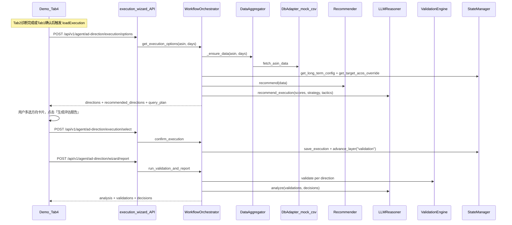
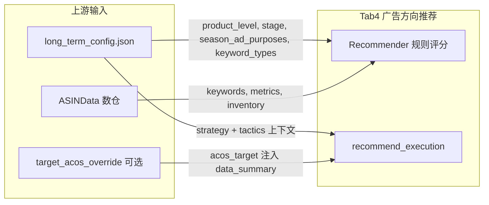

# 广告方向推荐板块 — 全链路梳理文档

> 聚焦 Demo Tab4「广告方向推荐」的完整技术实现，不含 Tab3（P3 目标 ACOS/预算）和 Tab1（广告目的与关键词推荐）的独立细节。

---

## 1. 模块定位与工作流层级

**广告方向推荐**对应 4-Layer 工作流的 **Layer 1.4 执行层**，位于战略（Layer 1.1）、策略（Layer 1.2）、诊断（Layer 1.3）之后，是工作流的第四步。

- Layer 定义：`ad-direction-agent/app/models/layers.py` L6 注释 — "多选，有 AI 推荐，不持久化"
- Demo 入口：`ad-direction-agent/demo/ad-asisitant-agent.html` Tab4（`panel-tab4`，L671–691）
- 触发时机：Tab2 诊断加载完成 → `setTabEnabled('tab4')`，或回访模式一次性解锁全部 Tab

### 四个广告方向

定义来自 `ad-direction-agent/app/config/tags.toml`：

| 方向 ID | 中文名 | 适用场景 | 核心动作 |
|---------|--------|----------|----------|
| `push_natural` | 推进自然位 | 上升词多、广告依赖词突出、核心位未进首页 | 倾斜预算推自然排名 |
| `expand_keywords` | 新增扩词 | 关键词覆盖少、有高转化未收录词、现有词 ACOS 健康 | 拓展关键词覆盖 |
| `optimize_acos` | 优化 ACOS | ACOS 超标、有高花费零转化词 | 降低 ACOS 提升效率 |
| `balance_maintain` | 平衡维持 | 指标稳定、无异常信号、排名稳固 | 维持现状微调 |

四个方向**可多选**，用户通过方向卡片切换选中状态，点击「生成评估报告」提交。

---

## 2. 端到端调用链

### 主路径时序



### 前端三步曲（`ad-direction-agent/demo/ad-asisitant-agent.html`）

**Step 1 — 加载方向选项**

- 函数：`loadExecution()`（L1784–1811）
- API：`POST /execution/options` → 请求体 `{ asin, days }`
- 返回：`direction[]`（含评分、标签、AI 推荐标记）+ `recommendation_summary`（AI 推荐理由）
- 渲染：grid 2x2 方向卡片，带颜色标签、评分 badge、AI 推荐 badge

**Step 2 — 持久化选择**

- 函数：`generateReport()` 第一步（L1821–1830）
- API：`POST /execution/select` → 请求体 `{ asin, selected_directions, sub_options:{} }`
- 写入：`workflow_state.json` → `execution.selected_directions`

**Step 3 — 获取报告**

- 函数：`generateReport()` 第二步（L1831–1841）
- API：`POST /wizard/report` → 请求体 `{ asin, days }`
- 返回：`validations` 校验结果 + `decisions` 决策包 + `analysis` AI 综合分析
- 渲染：`renderReport(data)`（L1847–1892）→ AI 分析段落 + 按方向嵌套的校验项 + 操作任务

### 后端核心方法（`ad-direction-agent/app/core/workflow_orchestrator.py`）

| 方法 | 行号 | 职责 |
|------|------|------|
| `get_execution_options()` | L662–747 | 拉数 → 注入 `long_term` → 规则评分 → LLM 推荐 → 组装响应 + query_plan |
| `confirm_execution()` | L749–757 | 写入 `workflow_state.json` 的 `execution` 段，推进到 `validation` 层 |
| `run_validation_and_report()` | L1001–1079 | 按选中方向逐一校验 → 生成决策包 → LLM analyze → query_plan |
| `_ensure_data()` | L128 | 数据源适配器调度（4h TTL 缓存） |
| `_build_data_summary()` | L1138 | 将 `ASINData` 转成 LLM 可消费的 `data_summary` 字典 |

### API 路由定义

全部位于 `ad-direction-agent/app/api/execution.py` 和 `ad-direction-agent/app/api/wizard.py`，前缀为 `/api/v1/agent/ad-direction`：

| 方法 | 路径 | 文件 | 行号 | 说明 |
|------|------|------|------|------|
| POST | `/execution/options` | `execution.py` | L24–34 | 获取方向选项（含 AI 推荐） |
| POST | `/execution/select` | `execution.py` | L37–47 | 确认选择（不持久化为长期配置） |
| GET | `/wizard/state/{asin}` | `wizard.py` | L11–14 | 恢复向导进度 |
| POST | `/wizard/reset/{asin}` | `wizard.py` | L17–22 | 重置工作流状态 |
| POST | `/wizard/report` | `wizard.py` | L25–30 | Layer 1.5 校验+报告 |

---

## 3. 涉及文件清单

### A. 入口与 API（必改时优先看）

| 文件 | 相对路径 | 角色 |
|------|----------|------|
| API 执行层 | `ad-direction-agent/app/api/execution.py` | `/execution/options`, `/execution/select` 端点 |
| API 向导 | `ad-direction-agent/app/api/wizard.py` | `/wizard/report` 端点 |
| 应用入口 | `ad-direction-agent/app/main.py` | 路由前缀 `/api/v1/agent/ad-direction`，CORS，静态文件挂载 |
| DI 注入 | `ad-direction-agent/app/api/deps.py` | 全局单例注入（orchestrator, recommender, reasoner 等） |

### B. 编排与算法

| 文件 | 相对路径 | 角色 |
|------|----------|------|
| 工作流编排器 | `ad-direction-agent/app/core/workflow_orchestrator.py` | `get_execution_options`, `confirm_execution`, `run_validation_and_report` |
| 方向推荐器 | `ad-direction-agent/app/core/recommender.py` | `_score_push_natural`(L22), `_score_expand_keywords`(L77), `_score_optimize_acos`(L127), `_score_balance_maintain`(L168), `recommend`(L215) — 4 方向规则评分 |
| 校验引擎 | `ad-direction-agent/app/core/validation_engine.py` | 运行注册的全部 `@validation_rule` |
| 决策包生成 | `ad-direction-agent/app/core/decision_package.py` | `DecisionPackageGenerator.generate()` — 校验后生成操作任务 |
| 场景分析器 | `ad-direction-agent/app/core/scenario_analyzer.py` | `detect_scenario`(L184) — 根据数据、阶段、目的返回场景 ID |
| SQL 查询路由 | `ad-direction-agent/app/core/query_router.py` | `QueryRouter.resolve()` — 场景+推荐方向 → SQL 元脚本 ID 列表 |
| 数据聚合器 | `ad-direction-agent/app/core/data_aggregator.py` | `DataAggregator.fetch()` — 适配器调度（db / mock / csv） |

### C. LLM

| 文件 | 相对路径 | 角色 |
|------|----------|------|
| LLM Reasoner | `ad-direction-agent/app/llm/reasoner.py` | `EXECUTION_SYSTEM_PROMPT`(L179), `recommend_execution`(L597), `analyze`(L744) |
| DeepSeek 客户端 | `ad-direction-agent/app/llm/client.py` | `DeepSeekClient.chat()` — httpx 异步调用 |
| API 密钥池 | `ad-direction-agent/app/llm/key_pool.py` | 多 API key 轮换 |

### D. 数据层

| 文件 | 相对路径 | 角色 |
|------|----------|------|
| DB 适配器 | `ad-direction-agent/app/data/db_adapter.py` | 生产环境：PyMySQL + DBUtils 连接 Doris/StarRocks |
| Mock 适配器 | `ad-direction-agent/app/data/mock.py` | 本地开发：硬编码假数据 |
| CSV 适配器 | `ad-direction-agent/app/data/csv_adapter.py` | 本地开发：从 Excel/CSV 读取 |
| 数据源接口 | `ad-direction-agent/app/data/base.py` | `DataSourceAdapter` 虚基类 |
| 字段映射 | `ad-direction-agent/app/data/field_mapping.py` | `ASINData` → purpose-agent `metrics` 字典转换 |
| SQL 模板注册 | `ad-direction-agent/app/data/template_registry.py` | 元 SQL 脚本注册 |
| ASIN 数据模型 | `ad-direction-agent/app/models/asin_data.py` | `ASINData`, `KeywordData`, 广告指标 Pydantic 模型 |

### E. 规则（每个方向 4–5 条 + 联动）

| 文件 | 相对路径 | 规则 |
|------|----------|------|
| 推进自然位 | `ad-direction-agent/app/rules/push_natural.py` | PN-1 ~ PN-5（上升词、预算倾斜、广告依赖、上升词 ACOS、核心排名） |
| 新增扩词 | `ad-direction-agent/app/rules/expand_keywords.py` | KE-1 ~ KE-4（可用新词、覆盖率、健康度、新增数量合理性） |
| 优化 ACOS | `ad-direction-agent/app/rules/optimize_acos.py` | OA-1 ~ OA-4（ACOS 超标、高花费零转化、Bid 空间、否定词机会） |
| 平衡维持 | `ad-direction-agent/app/rules/balance_maintain.py` | BM-1 ~ BM-5（波动检测、异常信号、参数合理性、排名稳定、子选项阈值） |
| 标签联动约束 | `ad-direction-agent/app/rules/cross_tag.py` | 阶段/目的与方向交叉约束（库存 < 14 天、测试期不符盈利等） |
| 规则注册 | `ad-direction-agent/app/rules/__init__.py` | `@validation_rule` 装饰器注册机制 |

### F. 配置与模型

| 文件 | 相对路径 | 角色 |
|------|----------|------|
| 方向标签配置 | `ad-direction-agent/app/config/tags.toml` | 4 方向定义、子选项表单、约束条件 |
| 规则阈值 | `ad-direction-agent/app/config/thresholds.toml` | 各规则阈值参数（ACOS、库存等） |
| 全局设置 | `ad-direction-agent/app/config/settings.py` | Pydantic Settings + TOML 加载 |
| 工作流模型 | `ad-direction-agent/app/models/layers.py` | `ExecutionOptionsResponse`, `ExecutionSelectRequest` 等 DTO |
| 决策模型 | `ad-direction-agent/app/models/decision.py` | `DirectionScore`, `RecommendResponse` |
| ~~标签模型~~ | ~~`models/tag.py`~~ | **已移除**（原 legacy `/recommend` 用） |
| 校验模型 | `ad-direction-agent/app/models/validation.py` | 校验项结果模型 |

### G. 状态持久化

| 文件 | 相对路径 | 角色 |
|------|----------|------|
| 状态管理器 | `ad-direction-agent/app/persistence/state_manager.py` | 全局单例；管理 `config/{asin}/` 下 JSON 文件 |
| 长期配置 | `config/{asin}/long_term_config.json` | Tab1 确认的战略/策略 — 上游输入（只读） |
| 工作流状态 | `config/{asin}/workflow_state.json` | `execution.selected_directions` — 本层写入（会话级） |
| 手动 ACOS 覆盖 | `StateManager.get_target_acos_override()` | 可选注入到 `data_summary.acos_target`（来自 Tab3） |

### H. 前端

| 文件 | 相对路径 | 关键函数 |
|------|----------|----------|
| Demo 页面 | `ad-direction-agent/demo/ad-asisitant-agent.html` | `loadExecution()(L1784)`, `generateReport()(L1821)`, `renderReport()(L1847)`, `fbCaptureExecution()(L992)` |

### I. 测试（改规则/评分时需回归）

| 文件 | 相对路径 |
|------|----------|
| PN 规则测试 | `ad-direction-agent/tests/rules/test_push_natural.py` |
| KE 规则测试 | `ad-direction-agent/tests/rules/test_expand_keywords.py` |
| OA 规则测试 | `ad-direction-agent/tests/rules/test_optimize_acos.py` |
| BM 规则测试 | `ad-direction-agent/tests/rules/test_balance_maintain.py` |
| 联动规则测试 | `ad-direction-agent/tests/rules/test_cross_tag.py` |
| ~~遗留 API 测试~~ | ~~`tests/api/*`~~ | **已移除** |
| 测试配置 | `ad-direction-agent/tests/conftest.py` |

### J. 遗留平行路径（非 Tab4 主链，修改时注意保持行为一致）

| 文件 | 相对路径 | 说明 |
|------|----------|------|
| ~~独立推荐/校验/确认~~ | ~~`recommend.py` / `validate.py` / `confirm.py`~~ | **已移除**（2026-05）；请使用四层向导 + `/wizard/report` |

---

## 4. 上游依赖（Tab4 运行前需要什么）



| 上游 | 来源 | 用途 |
|------|------|------|
| 战略/策略上下文 | Tab1 `POST /strategy/confirm` + `POST /tactics/confirm` → `StateManager.long_term_config` | 注入 `ASINData.ad_purpose`、`product_level`、`season_stage` 等，供 `Recommender` 评分与 LLM 分析 |
| 数仓指标 | `DataAggregator` → `DbAdapter`（`DATA_SOURCE=db`） | 关键词排名变化、ACOS、库存、可用新词、花费、订单等 |
| Tab4 解锁 | Tab2 `loadDiagnosis` 完成 → `setTabEnabled('tab4')` | 仅 UI 层面门禁；`loadExecution()` 也可在 Tab1 确认后预加载（L1312） |
| 手动目标 ACOS | Tab3 覆盖 → `StateManager.get_target_acos_override()` | 注入 `data_summary.acos_target` → 影响 `recommend_execution` / `analyze` 的 LLM 上下文，**不影响** `Recommender` 规则评分 |
| 时间窗口 | 请求体 `days`（默认 7） | 贯穿 `_ensure_data()` → `DbAdapter.fetch_asin_data()` |

**不直接依赖 `ad-purpose-agent`**：Tab4 只读已确认的 `long_term_config`，不再调用 purpose 的 LLM。

---

## 5. 下游产出（Tab4 之后谁消费）

| 产出 | 机制 | 说明 |
|------|------|------|
| Layer 1.5 报告 | `POST /wizard/report` | 包含 `validations`（18 条规则逐项校验）、`decisions`（决策包操作任务）、`analysis`（LLM 综合分析） |
| 诊断查询计划 | `query_plan` 嵌入 options/report 响应 | `QueryRouter` 按场景 ID + 推荐方向解析 SQL 元脚本清单，前端可供运营参阅 |
| 运营反馈 | `fbCaptureExecution()` → `POST /feedback` | `module: "广告方向推荐"`，记录 AI 推荐方向 vs 运营实际选择 |
| 工作流状态 | `workflow_state.json` `layer=validation` | 推进到校验层，不写入 `long_term_config`（不持久化为长期配置） |

---

## 6. 双引擎推荐机制

### 6.1 规则评分（确定性逻辑）

- 位置：`ad-direction-agent/app/core/recommender.py`
- 类：`Recommender`，全局单例 `recommender`
- 评分方法：4 个 `_score_*` 方法独立计算，每方向 0–100 分
- 分级：`≥70 → recommended`，`40–69 → available`，`<40 → not_recommended`

**评分逻辑简表**:

| 方向 | 加分因素 | 分值 |
|------|----------|------|
| 推进自然位 | 上升/优质词数 ×8（上限 30）+ 广告依赖词≥2（+20）+ 核心位 >5（+15）- 已进前5（-10） | 0–65 |
| 新增扩词 | 可用新词 ×10（上限 30）+ 覆盖率 <10 词（+20）+ 平均 ACOS 健康（+15）+ 非盈利目的（+10） | 0–75 |
| 优化 ACOS | ACOS>30（+30）+ 超标词 ×8（上限 25）+ 零转化词（+20）+ Bid 空间（+10） | 0–85 |
| 平衡维持 | 基值 50 + ACOS 波动<10%（+15）+ ACOS 在目标内（+10）+ 库存充足（+10）+ 排名稳定（+5）- 扩词机会（-15）- 超标词（-10） | 0–90 |

### 6.2 LLM 精选（概率性推理）

- 位置：`ad-direction-agent/app/llm/reasoner.py` L597–649
- 方法：`recommend_execution()`
- System Prompt：`EXECUTION_SYSTEM_PROMPT`（L179–229），约 50 行，包含：
  - 四个执行方向定义
  - 策略层（广告目的）到执行方向的推荐映射
  - 战略层（产品阶段）到执行方向的约束
  - 冲突检测规则
- 输入：战略层上下文 + 策略层上下文 + 4 方向评分列表
- 输出（JSON）：`{ recommended_directions: string[], reasoning: string, priority_order: string[], conflict_notes: string }`
- **降级逻辑**（L640–649）：LLM 失败时取评分 ≥40 的 Top 2 方向，兜底 `balance_maintain`
- 模型：DeepSeek，`temperature=0.3`，`response_format=json_object`

### 6.3 双引擎关系

```
规则评分（确定性） → 分数列表（0–100 四个值）
                  ↘
                    LLM 精选（概率性） → recommended_directions + reasoning
                  ↗
       战略/策略上下文（来自 Tab1 long_term_config）
```

规则评分是 LLM 的输入，不是 LLM 的替代。LLM 基于评分+战略/策略上下文做最终的精选推荐。

### 6.4 门禁（v2.4+ 混合模式）

| 条件 | LLM 能否推荐 | 前端「AI推荐」角标 |
|------|--------------|-------------------|
| 评分 ≥ 70 | 可以，优先 | 显示 |
| 40 ≤ 评分 < 70 | 可以，次优先 | 显示 |
| 评分 < 40 | **禁止**（后处理过滤） | 不显示 |

- 配置：`thresholds.toml` → `[scoring]`（含 `stage_adjustment` / `season_adjustment`）
- 代码：`Recommender.get_eligible_ids()`、`filter_recommended()`；`workflow_orchestrator.get_execution_options` 传入 LLM
- 报告：`analyze()` 仅展开 `selected_directions`；`decision_package` 按收割/旺季末期生成差异化任务

### 6.4 报告阶段 LLM

- 方法：`analyze()`（`reasoner.py` L744）
- System Prompt 内嵌全部 18 条规则说明（`SYSTEM_PROMPT` L19–78）
- 输入：`data_summary + scores + validations + decisions + strategy + tactics`
- 输出：`{ overall_analysis, direction_analyses[], action_priorities[], risk_warnings[] }`
- 降级：LLM 失败时使用 `_fallback_analysis()` → 基于校验结果的文本拼接

---

## 7. 校验规则体系（18 条）

规则统一通过 `@validation_rule` 注册，由 `ValidationEngine` 调度执行。

| 规则 ID | 所属方向 | 等级 | 核心条件 |
|---------|----------|------|----------|
| PN-1 | 推进自然位 | confirmed / suggest | 上升/优质词 ≥ 2 |
| PN-2 | 推进自然位 | suggest | budget_ratio > 50% |
| PN-3 | 推进自然位 | confirmed | 广告依赖词存在（ACOS≤30% 且自然位>20 且花费≥50） |
| PN-4 | 推进自然位 | suggest | 上升词 ACOS > 35% |
| PN-5 | 推进自然位 | confirmed / suggest | 最佳自然位 ≥5（有空间）/ 已进前5 |
| KE-1 | 新增扩词 | confirmed / suggest | available_new_keywords ≥ 2 |
| KE-2 | 新增扩词 | confirmed / suggest | keyword_count < 10 |
| KE-3 | 新增扩词 | confirmed | 平均 ACOS < 目标 ×1.2 |
| KE-4 | 新增扩词 | force_correct/suggest | target_count > 15 / > 推荐值 2 倍 |
| OA-1 | 优化 ACOS | force/suggest/confirm | 关键词 ACOS ≥50% / 30–50% / 均<30% |
| OA-2 | 优化 ACOS | force | 存在 spend≥15 且 orders=0 的词 |
| OA-3 | 优化 ACOS | confirmed | bid > 实际 CPC ×1.5 |
| OA-4 | 优化 ACOS | confirmed | impressions≥500 且 clicks>0 且 orders=0 |
| BM-1 | 平衡维持 | suggest | ACOS 波动 >15% 或销量波动 >15% |
| BM-2 | 平衡维持 | suggest | 库存为 0 或竞品价格低于我方 20% 以上 |
| BM-3 | 平衡维持 | suggest | ACOS 超出目标[25×0.5, 25×1.2]范围 |
| BM-4 | 平衡维持 | suggest | 有词 rank_change ≥5 |
| BM-5 | 平衡维持 | suggest | acos_tolerance <3 或 >20 |

**等级含义**：`force_correct` 必须纠正（红色警告）→ `suggest_optimize` 建议优化（黄色）→ `confirmed` 方向合理（绿色）。

---

## 8. 状态管理

### StateManager 读写路径

```
config/{asin}/
├── long_term_config.json        ← 上游只读（Tab1 写入）
│    ├── product_level, product_stage, season_stage
│    ├── ad_purposes[], keyword_types[]
│    └── acos_target_override(可选) / daily_budget_override(可选)
│
└── workflow_state.json          ← Tab4 读写
     ├── layer: str              → "validation" (confirm_execution 推进)
     └── execution: dict
          ├── selected_directions: string[]
          └── sub_options: dict (当前未使用，预留)
```

### Tab4 不持久化什么

- 四个方向的选择**不会**写入 `long_term_config.json`
- 每次会话独立，下次回访时需重新选择（回访模式会预加载全部 Tab，但方向选择仍为空）

---

## 9. 改动影响矩阵（快速定位）

| 想改什么 | 优先查阅文件 | 是否需要同步改动 |
|----------|--------------|------------------|
| 方向定义/子选项 UI 表单 | `tags.toml` + demo HTML `renderReport` & `loadExecution` | 修改 `tags.toml` 后 demo 侧需对应渲染 |
| 评分权重/分数逻辑 | `recommender.py` `_score_*` 四个方法(L22,L77,L127,L168) | 无需同步其他文件，但遗留 `recommend.py` API 也调用了 `recommend()` |
| AI 推荐话术/策略映射 | `reasoner.py` `EXECUTION_SYSTEM_PROMPT`(L179) + `recommend_execution`(L597) | 注意 `reasoner.py` `SYSTEM_PROMPT`(L19) 也包含 18 条规则说明供 `analyze` 使用 |
| 校验规则 | `app/rules/*.py` + `thresholds.toml` | 需同步 `reasoner.py` `SYSTEM_PROMPT` 中的规则说明文本 |
| LLM 报告结构 | `reasoner.analyze`(L744) + demo `renderReport`(L1847) | 两端响应字段需对齐 |
| 数据字段/指标 | `db_adapter.py` + `asin_data.py` | 需同步 `field_mapping.py` 和 mock 适配器 |
| 解锁/加载时机 | demo `loadDiagnosis(L1412)`, `confirmTactics(L1280)`, `enableTabsForReturnVisit(L1397)` | 确认是否影响 Tab4 状态判断 |
| 状态持久化位置/字段 | `StateManager` 全部方法 | 注意 `workflow_state.json` vs `long_term_config.json` 的语义区分 |
| 依赖 `ad-purpose-agent` 新增/删除 | 本 Tab4 不直接依赖 purpose | 无需改动 |

---

## 10. 环境与运行

| 项目 | 说明 |
|------|------|
| 配置文件 | `ad-direction-agent/.env`（`DATA_SOURCE`, `DB_HOST`, `DB_PORT`, `DB_USER`, `DB_PASS`, `DB_DATABASE`, `DEEPSEEK_API_KEY`, `DEEPSEEK_BASE_URL`, `DEEPSEEK_MODEL`, `LLM_TIMEOUT`） |
| 启动命令 | `python ad-direction-agent/start_server.py`（可选 `--data-source mock\|csv\|db`, `--port`, `--no-reload`） |
| Demo 访问 | `http://localhost:8010/demo/ad-asisitant-agent.html` |
| 运行时状态 | `ad-direction-agent/config/{asin}/`（gitignore，不提交仓库） |
| 底层引擎 | DeepSeek（API），Doris/StarRocks（数仓），PyMySQL（连接） |

---

## 附录：与遗留 API 的差异

| 维度 | Tab4 主路径（`/execution/options` + `/wizard/report`） | ~~遗留路径（`/recommend` + `/validate` + `/confirm`）~~ **已移除** |
|------|--------------------------------------------------------|------------------------------------------------------|
| 四层工作流 | 完整四层（Layer 1.1 → 1.5） | 无工作流概念，一次性调用 |
| LLM 推荐 | 有（`recommend_execution` + `analyze`） | 无（纯规则） |
| 长期上下文 | 读 `long_term_config.json`（战略/策略） | 无 |
| 方向选择 | 多选 | 单选 |
| 持久化 | `workflow_state.json`会话级 | 无持久化 |
| 远程诊断查询 | `query_plan` 返回 | 无 |
| 使用场景 | Demo Tab4 主交互 | 早期接口、外部 HTTP 调用兼容 |

---

## 版本历史

| 版本 | 日期 | 变更说明 |
|------|------|----------|
| 1.0 | 2026-05-19 | 初始版本，基于 v2.4 代码库编写 |
| 1.1 | 2026-05-19 | 评分配置化、eligible 门禁、阶段修正、报告/任务模板对齐 |
