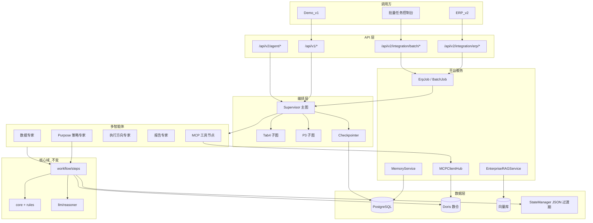

# 广告调整 Agent — 项目整理 V0.1

> **版本**: V0.1  
> **编写日期**: 2026-05-22  
> **适用项目**: AD_assistant_agent-v2.3 / v2.4  
> **依据**: 仓库代码 + `LangGraph实施方案.md` + `LangGraph与ERP接入完整方案.md` + `广告方向推荐-全链路梳理.md` + `协作指南.md`  
> **定位**: 统一架构（LangGraph / MCP / 企业 RAG / 记忆 / 批量父 ASIN / 多智能体 / 数据库 / 解耦）及工作进度安排  

---

## 0. 文档差异与现状对齐

| 文档说法 | 以代码为准的现状 |
|----------|------------------|
| ERP 方案写「LangGraph 未落地」 | **P0 已落地**：`app/agents/` 存在，默认 `USE_LANGGRAPH=false`，13 个 endpoint 单节点薄包装 |
| 业务逻辑在 Orchestrator | **已迁移**：真相在 `app/workflow/steps/`，nodes 只委托 |
| 状态在 JSON | `StateManager` + 计划中的 **Sqlite Checkpoint**（P1） |
| 策略 AI | 独立 **`ad-purpose-agent`**，经 `purpose_adapter` 调用 |
| MCP / 企业 RAG / 批量 / 正式记忆库 | **均未实现**，需新建模块 |

**架构原则**：

1. **`workflow/steps` = 唯一业务真相**（规则、评分、校验、数仓组装）  
2. **LangGraph = 编排 + interrupt + checkpoint**，不写业务  
3. **多智能体 = 子图/专家服务**，不复制 steps  
4. **MCP = 工具层**（取数、写回、外部系统），不是知识库  
5. **企业 RAG = 附录检索**；框架性规则仍用结构化 KB（`prompt_kb.md` 等）  
6. **批量 = Job 层**，不阻塞 HTTP  

---

## 1. 目标架构总览



---

## 2. 分层与解耦（需求 8）

| 层 | 目录建议 | 职责 | 依赖方向 |
|----|----------|------|----------|
| API | `app/api/v1`, `app/api/v2` | 鉴权、DTO、HTTP | → 编排/Job |
| 集成 | `app/integrations/erp`, `batch` | 幂等、异步、Webhook | → 编排 |
| 编排 | `app/agents/graphs`, `supervisor.py` | LangGraph、interrupt | → steps / 平台 |
| 多智能体 | `app/agents/specialists/*` + `ad-purpose-agent` | 子图、远程调用 | → steps / MCP / RAG |
| 平台 | `app/platform/memory`, `rag`, `mcp` | 横切能力 | → DB / 外部 |
| 核心域 | `app/workflow/steps`, `core`, `rules`, `data` | 业务算法 | → 数仓 |
| 持久化 | `app/persistence`, `repositories` | DB/JSON | 被上层调用 |

**禁止**：`api` 直接写 SQL；`agents/nodes` 内嵌大段 Prompt；MCP 内实现 18 条校验规则。

---

## 3. LangGraph 图编排（需求 1）

### 3.1 三张图 + Supervisor

| 图 | 范围 | 说明 |
|----|------|------|
| 主图 `main_wizard` | 战略→策略→诊断→执行→报告 | ERP 全流程 / `auto_confirm` |
| 子图 `tab4` | execution → interrupt → report | P1 POC |
| 子图 `p3` | ACOS / 预算 / unified | 按需 invoke |
| Supervisor | 路由子图/批量/quick | 多智能体入口 |

### 3.2 AgentState 扩展字段（概念）

`thread_id`, `source`, `erp_ref`, `batch_id`, `asin`, `parent_asin`, `days`, `auto_confirm`, `long_term`, `data_summary`, `scores`, `execution`, `validations`, `decisions`, `analysis`, `p3`, `rag_context`, `memory_context`, `mcp_audit`, `current_node`, `error`

### 3.3 Checkpoint

| 阶段 | Checkpoint | JSON |
|------|------------|------|
| P1–P3 | SqliteSaver | 双写 `workflow_state.json` |
| 生产 | Postgres/Redis Saver | JSON 仅长期配置 |

### 3.4 API

- v1：REST → `invoke` / `resume`（Demo URL 不变）  
- v2：`/api/v2/agent/invoke|state|resume`  
- ERP：仅 `ErpJobService` 后台 `ainvoke`  

对齐 `docs/LangGraph实施方案.md` 的 **P0→P4**。

---

## 4. MCP 工具接入（需求 2）

**角色**：可观测、可替换的工具总线，供 Tool 节点调用。

| 工具类 | 示例 |
|--------|------|
| 数仓 | Doris / `DbAdapter` 封装 |
| 企业数据 | StarRocks MCP 等 |
| ERP 写回 | 工单、策略草稿 |
| 运维 | 反馈、Job 状态 |

```
app/platform/mcp/
  registry.py
  client_hub.py
  policies.py
  langgraph_tools.py
```

原则：业务在 `steps`；每次调用审计入 `tool_invocations`。

---

## 5. 企业知识库 RAG（需求 3）

| 类型 | 存储 | 加载 |
|------|------|------|
| 框架 KB | `ad-purpose-agent/knowledge_base/*.md` | 全量 / manifest → system |
| 企业 RAG | 向量库 + PG 元数据 | Top-K 检索 → 附录 |

检索源：SOP、feedback、历史 analysis、ERP 备注。  
注入点：`tactics_recommend`、`execution_recommend`、`validation_report`。  
不注入：红线、JSON schema、五目标完整框架。

技术建议：pgvector + 自研薄层检索；embedding 与内网 API 一致。

---

## 6. 记忆系统（需求 4）

| 层级 | 名称 | 存储 | 内容 |
|------|------|------|------|
| L0 | 工作记忆 | AgentState + Checkpoint | 当前 run |
| L1 | 会话记忆 | workflow_state → `wizard_sessions` | Tab 进度、keyword 缓存 |
| L2 | 长期配置 | long_term_config | 战略/策略确认 |
| L3 | 语义记忆 | `memory_facts` | 提取事实 |
| L4 | 情景记忆 | RAG 索引 | 完整案例 |

```
app/platform/memory/
  service.py
  extractors.py
  policies.py
```

读取：`load_data` 后注入 `memory_context`；写入：`finalize`、confirm、feedback。

---

## 7. 批量父 ASIN（需求 5）

| 维度 | erp_jobs | batch_jobs |
|------|----------|------------|
| 触发 | 单笔 | 父 ASIN 列表 |
| 执行 | 1 thread | N 子 Job + 有界并发 |
| 失败 | failed | partial_done |

```http
POST /api/v2/integration/batch/jobs
GET  /api/v2/integration/batch/jobs/{batch_id}
GET  /api/v2/integration/batch/jobs/{batch_id}/items/{asin}
```

产品需确认：父 ASIN **展开子 ASIN（主推）** vs **聚合级 quick**。  
必须异步；限流 LLM + Doris（`FETCH_TIMEOUT=35s`，全链路最坏 >90s）。

---

## 8. 多智能体编排（需求 6）

Supervisor + 专家子图（非多个 Orchestrator）：

| 专家 | 实现 |
|------|------|
| DataExpert | load_data + MCP |
| StrategyExpert | purpose_adapter + RAG |
| DiagnosisExpert | diagnosis step |
| ExecutionExpert | recommender + reasoner + RAG |
| ValidationExpert | validation_engine + analyze |
| ToolExpert | MCP hub |

`ad-purpose-agent` 保持独立，经 adapter 调用。

---

## 9. 数据库设计（需求 7）

**PostgreSQL**：Job、记忆、RAG 元数据、审计；**Doris**：分析数仓。

| 表 | 用途 |
|----|------|
| agent_threads | thread 状态 |
| erp_jobs | 幂等 Job |
| batch_jobs / batch_job_items | 批量 |
| wizard_sessions | 向导状态（迁自 JSON） |
| long_term_configs | 长期配置 |
| memory_facts | L3 语义记忆 |
| rag_documents / rag_chunks | RAG |
| tool_invocations | MCP 审计 |
| feedback_entries | 反馈 → RAG |
| audit_logs | 合规审计 |

迁移：P1–P3 JSON 双写；P4+ wizard 迁 PG。

---

## 10. 工作进度安排

假设 1–2 名后端 + 0.5 ERP 联调。

### 阶段 A：编排基座（第 1–3 周）— P0–P2

| 周 | 交付 | 验收 |
|----|------|------|
| A1 | P0 parity、state 扩展 | 13 endpoint 对等 |
| A2 | P1 Tab4 子图 + SqliteSaver | interrupt/resume |
| A3 | P2 主图 + v2 agent API | 50 mock ASIN |

**M1**：单 ASIN `auto_confirm` 跑通报告。

### 阶段 B：ERP 与批量（第 4–7 周）

| 周 | 交付 | 验收 |
|----|------|------|
| B1 | PG：erp_jobs、agent_threads | 幂等 erp_ref |
| B2 | Job + 轮询 + Webhook + quick | quick P95 < 25s |
| B3 | BatchJob + Worker 池 | 100 ASIN 部分失败可查 |
| B4 | ERP 联调 | 契约签字 |

**M2**：ERP/批量异步生产可用。

### 阶段 C：平台能力（第 8–11 周）

| 周 | 交付 | 验收 |
|----|------|------|
| C1 | MCP ClientHub + Doris tool | 图中 MCP 取数 |
| C2 | RAG + pgvector | 反馈/SOP 可检索 |
| C3 | MemoryService L3 | 二次 run 有 context |
| C4 | Supervisor + 专家子图 | 目录与图一致 |

**M3**：RAG + 记忆 + 多智能体生效。

### 阶段 D：生产化（第 12–16 周）— P4

Checkpoint 迁 PG/Redis；LangSmith；JSON→PG；`LANGGRAPH_ROUTING_MODE=graph`。

**M4**：全架构上线，v1 适配层保留。

### 工期粗算

| 范围 | 周数 |
|------|------|
| 仅 ERP + LangGraph（原方案） | 6–10 |
| 含 MCP/RAG/记忆/批量/多智能体/PG | 12–16 |
| 最小演示（LangGraph + ERP Mock） | 5–7 |

### 甘特式总览

```text
周次:  1    2    3    4    5    6    7    8    9   10   11   12   13   14   15   16
A编排: [====P0-P2====]
B集成:          [====ERP+Batch====]
C平台:                      [====MCP+RAG+Memory+多Agent====]
D生产:                                  [====硬化+迁移====]
```

---

## 11. 决策摘要

| 问题 | 建议 |
|------|------|
| LangGraph | 上；主图 + Tab4/P3 + Supervisor |
| 业务 | 只在 `workflow/steps` |
| ERP | 异步 Job + Webhook；批量独立 API |
| Checkpoint | Sqlite → Postgres |
| RAG | 案例附录；框架 KB 仍 MD |
| MCP | 工具总线 |
| 记忆 | 五层 |
| 多智能体 | 专家子图 |
| Demo | v1 保留至 D3 |

---

## 12. 第一周执行清单

1. [ ] `test_api_parity.py` 13 项 + 扩展 `AgentState`  
2. [ ] `app/agents/graphs/tab4.py` + `checkpointer.py`  
3. [ ] PG schema v0：erp_jobs、batch_jobs、agent_threads  
4. [ ] OpenAPI：erp/jobs + batch/jobs  
5. [ ] `app/platform/` 接口骨架（memory/rag/mcp mock）  
6. [ ] 产品确认：父 ASIN 批量语义、`auto_confirm` 默认  

---

## 13. 相关文档索引

| 文档 | 路径 |
|------|------|
| LangGraph 可执行方案 | `docs/LangGraph实施方案.md` |
| ERP + LangGraph 长文 | `docs/LangGraph与ERP接入完整方案.md` |
| Tab4 全链路 | `docs/广告方向推荐-全链路梳理.md` |
| 协作指南 | `docs/协作指南.md` |
| 模块说明 | `docs/项目模块与文件说明.md` |
| 交接 | `交接文档.md` |

---

*V0.1 为架构整理稿；实施以仓库代码为准，阶段完成后同步更新交接文档 Phase 7 状态表。*
