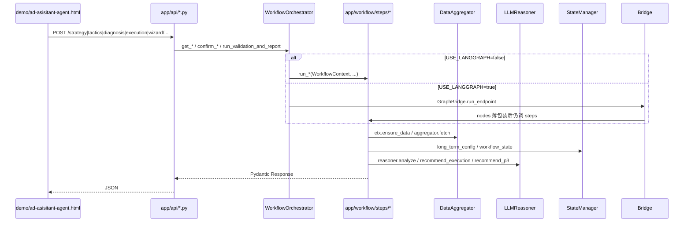
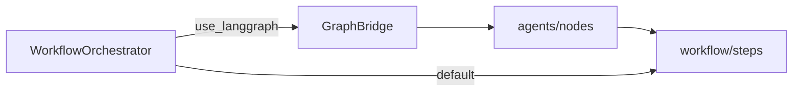

# 项目模块与文件说明

> 基于当前仓库结构（v2.4，workflow/steps 拆分 + 可选 LangGraph）。  
> 最后更新：2026-05-21

---

## 1. 仓库总览

```
AD_assistant_agent-v2.4/
├── README.md                 # 5 分钟上手
├── .env / .env.example       # DB、DeepSeek、USE_LANGGRAPH
├── Dockerfile
├── docs/                     # 设计/协作/公告（本文档所在）
├── 交接文档.md               # 数仓字段、规则清单、部署细节
├── scripts/pull_feedback.sh  # 运维：拉取反馈 JSON
├── ad-direction-agent/       # 主服务（FastAPI + Demo）
└── ad-purpose-agent/         # 策略层 AI（广告目的/词类，被主服务引用）
```

**启动链**：`start_server.py` → 设置 `PYTHONPATH` 含 `ad-purpose-agent` → `uvicorn app.main:app`。

---

## 2. 请求主路径（Demo 四层向导）

Demo 每次 HTTP 只走一步，**不会**一次跑完全图。



| Tab | 典型端点 | 步骤模块 | 持久化副作用 |
|-----|----------|----------|--------------|
| 1 战略 | `POST .../strategy/options`、`.../confirm` | `workflow/steps/strategy.py` | `long_term_config.json`，`advance_layer` → tactics |
| 2 策略 | `POST .../tactics/options`、`.../recommend`、`.../confirm` | `workflow/steps/tactics.py` + `purpose_adapter` | 写 `workflow_state` 关键词缓存 |
| 3 诊断 | `POST .../diagnosis` | `workflow/steps/diagnosis.py` | 可读缓存；`refresh=true` 清缓存重查 |
| 4 执行 | `POST .../execution/options`、`.../select` | `workflow/steps/execution.py` | 确认后推进层 |
| 4 P3 | `POST .../execution/recommend` 等 | `workflow/steps/p3.py` | `p3_recommendation.json`、override 文件 |
| 报告 | `POST .../wizard/report` | `workflow/steps/validation_report.py` | 无新层推进，出校验+LLM 报告 |
| 进度 | `GET .../wizard/state` | `workflow/steps/wizard.py` | 只读 `workflow_state.json` |

---

## 3. ad-direction-agent 模块 ↔ 文件

### 3.1 入口与配置

| 模块 | 文件 | 作用 | 被谁引用 |
|------|------|------|----------|
| 启动 | `start_server.py` | 端口检测、`DATA_SOURCE` 环境变量、`PYTHONPATH` 注入 purpose-agent | 人工 / Docker CMD |
| HTTP 入口 | `app/main.py` | FastAPI、CORS、挂载 `/demo`、注册路由、**启动时 import 全部 rules** | Uvicorn |
| 配置 | `app/config/settings.py` | `.env`、TOML 懒加载、`use_langgraph` | 全局 |
| 标签/阈值 | `app/config/tags.toml`、`thresholds.toml`、`layer_options.toml` | 规则与四层选项；**仅 TOML 生效** | `settings` → rules / steps |
| 依赖注入 | `app/api/deps.py` | `get_workflow_orchestrator`、`get_llm_reasoner` | `api/*.py` |

**修改注意**

- 改端口/数据源：优先 `start_server.py` 参数或 `.env` 的 `DATA_SOURCE`，不要硬编码进业务代码。
- 新增配置项：在 `settings.py` 声明字段，并在 `.env.example` 补说明。
- `main.py` 新增路由时只写参数校验 + `Depends(get_workflow_orchestrator)`，**不要**在 API 层写业务逻辑。

---

### 3.2 HTTP API 层（`app/api/`）

| 文件 | 路由前缀 | 作用 |
|------|----------|------|
| `strategy.py` | `/strategy/*` | 战略层 options/confirm |
| `tactics.py` | `/tactics/*` | 策略层 options/recommend/confirm |
| `diagnosis.py` | `/diagnosis` | 诊断只读 |
| `execution.py` | `/execution/*` | 执行推荐、选择、P3（target_acos、budget_bid、unified） |
| `wizard.py` | `/wizard/*` | 向导状态、校验报告 |
| `long_term_config.py` | `/long-term-config` | 长期配置读写 |
| `llm.py` | `/llm/report` | 独立 LLM 报告（非 Tab4 主路径） |
| `chat.py` | `/chat` | Demo 浮动助手（流式） |
| `feedback.py` | `/feedback/*` | 反馈收集/导出 |
| `announcements.py` | 公告 API | 读 `docs/announcements/*.md` |

**已移除**：根路径 `POST /recommend`、`/validate`、`/confirm` 及对应 `api` 模块（2026-05 清理）。

**修改注意**

- Request/Response 模型在 `app/models/layers.py`（及 `decision.py`、`validation.py`）；**改字段 = 破坏 Demo 契约**，须同步改 `demo/ad-asisitant-agent.html`。
- 路径命名：`/tactics/recommend`、`/execution/recommend` 是 v1 子路径，**不是** 已删的根路径 `/recommend`。

---

### 3.3 编排层

| 文件 | 作用 | 引用关系 |
|------|------|----------|
| `app/core/workflow_orchestrator.py` | **ASIN 数据缓存**（TTL 4h）、对外 `get_*`/`confirm_*` 方法；默认委托 `workflow/steps` | `api/deps` 单例 |
| `app/workflow/context.py` | `WorkflowContext`：aggregator、recommender、reasoner、state、validator、decision_gen、`ensure_data` | steps、agents nodes |
| `app/workflow/helpers.py` | 关键词/日趋势辅助函数 | steps、`data_summary.py` |
| `app/workflow/data_summary.py` | `build_data_summary()` → LLM/报告用摘要 | diagnosis、execution、validation_report |
| `app/workflow/steps/strategy.py` | `run_get_strategy_options`、`run_confirm_strategy` | orchestrator |
| `app/workflow/steps/tactics.py` | 策略层 + `purpose_adapter` | orchestrator |
| `app/workflow/steps/diagnosis.py` | 诊断层 | orchestrator |
| `app/workflow/steps/execution.py` | 执行推荐 + QueryRouter | orchestrator |
| `app/workflow/steps/p3.py` | 目标 ACOS、预算 Bid、统一推荐 | orchestrator、`api/execution` |
| `app/workflow/steps/validation_report.py` | 校验 + `sanitize_analysis_for_display` + LLM 报告 | orchestrator、`api/wizard` |
| `app/workflow/steps/wizard.py` | 向导状态、reset | orchestrator |

**修改注意**

- **改 Tab 业务逻辑**：改对应 `workflow/steps/*.py`，不要在 `workflow_orchestrator.py` 堆实现（编排器应保持薄）。
- **改缓存策略**：只动 orchestrator 的 `_ensure_data` / `_preload_data`；steps 通过 `ctx.ensure_data` 调用。
- **改报告措辞（无 BM、无半窗）**：`validation_report.py` 末尾 + `app/core/metrics_ops_language.py` + `reasoner._sanitize_ops_text` + Demo 前端 `sanitizeOpsDisplayText`。
- 新增一步：新增 `steps/xxx.py` + orchestrator 一行委托 + `api/xxx.py` + `models/layers.py` + Demo。

---

### 3.4 LangGraph（可选，`USE_LANGGRAPH=true`）

| 文件 | 作用 | 引用关系 |
|------|------|----------|
| `app/agents/bridge.py` | `endpoint_id` → 单节点子图 | orchestrator 懒加载 |
| `app/agents/graph.py` | `compile_single_node_graph` | bridge |
| `app/agents/state.py` | `AgentState` TypedDict | graph、nodes |
| `app/agents/nodes/*.py` | **仅**调用 `workflow.steps.run_*` | bridge |



**修改注意**

- **禁止**在 `agents/nodes` 写新业务；否则双路径（classic / graph）行为分叉。
- 新端点：在 `bridge.ENDPOINT_NODES`、对应 `nodes/*.py`、`orchestrator` 三处同时加。
- P1 **无** Sqlite checkpoint；状态仍靠 `StateManager` JSON。

---

### 3.5 领域核心（`app/core/`）

| 文件 | 作用 | 主要调用方 |
|------|------|------------|
| `data_aggregator.py` | 按 `DATA_SOURCE` 选 mock/db/csv 适配器；模块级 `data_aggregator` 单例 | orchestrator、（测试需注意导入副作用） |
| `db_adapter.py`（经 data） | Doris SQL、连接池、7 类 meta 查询 | aggregator |
| `mock.py` / `csv_adapter.py` | 开发/备用数据源 | aggregator |
| `template_registry.py` | 元脚本 ID、参数定义（**不读外部 sql 文件**） | query_router、db_adapter 映射 |
| `query_router.py` | 场景 → 需要哪些 meta 查询 | diagnosis、execution、validation_report |
| `scenario_analyzer.py` | 8 类场景、`build_metric_board` | steps |
| `recommender.py` | 四方向评分、`TargetAcosRecommender`、`BudgetBidRecommender` | steps/execution、validation_report、p3 |
| `validation_engine.py` | 调度已注册规则 | validation_report |
| `decision_package.py` | 校验通过后生成决策任务包 | validation_report |
| `validation_ops.py` | 校验项运营可读文案 | validation_engine、reasoner |
| `metrics_ops_language.py` | 报告展示清洗（去 BM-x、半窗等） | validation_report、reasoner |

**修改注意**

- **改 SQL/字段**：`db_adapter.py` + `models/asin_data.py` + 必要时 `field_mapping.py`；改完用 mock 与单测验证。
- **改评分权重**：`recommender.py` + 对应 `rules/*.py` 阈值（`thresholds.toml`）。
- **改规则**：见下节；`rule_id` 全局唯一，启动时 `validate_registry()` 会检查重复。
- `data_aggregator` 在 import 时实例化：测试请设 `DATA_SOURCE=mock`（见 `tests/conftest.py`）。

---

### 3.6 规则（`app/rules/`）

| 文件 | 方向 ID | 规则 ID 示例 |
|------|---------|----------------|
| `push_natural.py` | push_natural | PN-1 ~ PN-5 |
| `expand_keywords.py` | expand_keywords | KE-1 ~ KE-4 |
| `optimize_acos.py` | optimize_acos | OA-1 ~ OA-4 |
| `balance_maintain.py` | balance_maintain | BM-1 ~ BM-5 |
| `cross_tag.py` | cross_tag | 标签联动 |
| `__init__.py` | 注册表、`@validation_rule` | `main.py` 强制 import |

**修改注意**

- 新规则：新文件或现有文件加函数 + 装饰器；**必须**在 `main.py` 增加 `import app.rules.xxx`。
- 阈值从 `settings.thresholds_config` 读，改 `thresholds.toml` 而非魔法数散落。
- 规则返回 `ValidationItem` 结构见 `models/validation.py`。

---

### 3.7 LLM（`app/llm/`）

| 文件 | 作用 | 调用方 |
|------|------|--------|
| `client.py` | DeepSeek HTTP、连接池、关闭 | reasoner、chat |
| `key_pool.py` | 多 Key 轮询 | client |
| `reasoner.py` | Prompt 组装、解析、执行层/P3/报告 analyze | workflow steps、api/llm |
| `purpose_adapter.py` | 调 `ad-purpose-agent`，metrics 转换 | workflow/steps/tactics |

**修改注意**

- Prompt 大改：先 mock 数据跑 `reasoner`，再看 Tab4 报告与 P3。
- purpose-agent 依赖 **PYTHONPATH**；Docker/CI 需与 `start_server.py` 一致。
- API Key：`api_keys.txt` 或 `.env`（已在 `.gitignore`）。

---

### 3.8 数据模型与持久化

| 文件 | 作用 |
|------|------|
| `models/asin_data.py` | `ASINData` 及子结构（与数仓字段对齐） |
| `models/layers.py` | 四层 API 的 Request/Response（**对外契约**） |
| `models/decision.py` | 推荐评分、LLM 报告请求体 |
| `models/validation.py` | 校验结果 |
| `models/feedback.py` | 反馈 |
| `persistence/state_manager.py` | `config/{ASIN}/` 下 JSON：长期配置、工作流状态、P3 缓存、override |

**修改注意**

- `layers.py` 字段增减：视为 **API 版本变更**，更新 Demo 与文档。
- `workflow_state.json` 结构被 tactics/execution 共用；改键名需兼容旧 ASIN 或写迁移。
- `config/` 目录在 `.gitignore`，勿提交运营数据。

---

### 3.9 前端 Demo

| 文件 | 作用 |
|------|------|
| `demo/ad-asisitant-agent.html` | 主看板：Tab1–4、报告 UI、聊天浮窗 |
| `demo/index.html` | 简单首页（若有） |

**修改注意**

- API 基址：页面内 `API` 常量，默认 `/api/v1/agent/ad-direction`。
- 改响应字段解析：与 `models/layers.py` 同步。
- 运营文案清洗：前端 `sanitizeOpsDisplayText` 与后端 `metrics_ops_language` 保持一致。

---

### 3.10 测试（`tests/`）

| 目录/文件 | 覆盖 |
|-----------|------|
| `tests/rules/` | 各规则单元测试 |
| `tests/test_validation_ops.py` | 校验文案 |
| `tests/test_reasoner_polish.py` | LLM 文本清洗 |
| `tests/test_metrics_ops_language.py` | 运营语言 |
| `tests/workflow/test_api_parity.py` | 编排器委托 / LangGraph 开关 |
| `tests/conftest.py` | 默认 `DATA_SOURCE=mock` |

**修改注意**

- 勿依赖 `tests/api/`（legacy 已删）。
- 改 orchestrator/steps 后跑 `tests/workflow`。

---

## 4. ad-purpose-agent（策略 AI 子项目）

| 文件 | 作用 |
|------|------|
| `agent_router.py` | `determine_ad_targets_from_metrics` 等入口 |
| `knowledge_base/prompt_kb.md` | 广告目的知识库（**运行时读取**） |
| `knowledge_base/prompt_keyword_kb.md` | 关键词类型知识库 |

**引用关系**：仅通过 `app/llm/purpose_adapter.py` → `import agent_router`（依赖 PYTHONPATH）。

**修改注意**

- **不要**在 `ad-direction-agent` 里复制一套策略 Prompt；改 purpose-agent 即可。
- 勿移动 `ad-purpose-agent` 目录位置，否则 `start_server.py` 的 PYTHONPATH 要改。
- `docs/knowledge_base/` 已删除；以 purpose-agent 下 KB 为准。

---

## 5. 配置与契约速查

| 项 | 唯一来源 | 常见误改 |
|----|----------|----------|
| 标签/阈值 | `*.toml` | 已删的 `*.yaml` |
| 数据源 | `DATA_SOURCE` / `--data-source` | 在 adapter 里写死 db |
| LangGraph | `USE_LANGGRAPH`（默认 false） | 未测就默认 true |
| API 契约 | `models/layers.py` + Demo | 只改后端 JSON 字段 |
| 数仓 SQL | `db_adapter.py` 内联 | 已删的 `sql/` 目录 |

---

## 6. 按需求「改哪里」速查

| 你想改… | 优先文件 |
|---------|----------|
| Tab1 战略选项 | `layer_options.toml`、`steps/strategy.py` |
| Tab2 广告目的/词类 AI | `ad-purpose-agent`、`purpose_adapter.py`、`steps/tactics.py` |
| Tab3 诊断指标/场景 | `steps/diagnosis.py`、`scenario_analyzer.py`、`db_adapter.py` |
| Tab4 方向评分 | `recommender.py`、`rules/*.py`、`thresholds.toml` |
| Tab4 执行层 LLM 话术 | `reasoner.py`、`steps/execution.py` |
| P3 ACOS/预算 | `steps/p3.py`、`recommender.py`（TargetAcos/BudgetBid） |
| Tab4 报告全文 | `steps/validation_report.py`、`reasoner.py`、`metrics_ops_language.py`、Demo HTML |
| 数仓字段/SQL | `db_adapter.py`、`asin_data.py` |
| 新增 HTTP 接口 | `api/*.py` → `workflow_orchestrator` → `workflow/steps` |
| ERP/长流程（规划） | `agents/bridge.py`、`docs/LangGraph与ERP接入完整方案.md` |

---

## 7. 相关文档

- [协作指南.md](协作指南.md) — 分支与模块归属
- [广告方向推荐-全链路梳理.md](广告方向推荐-全链路梳理.md) — 时序与数据流
- [LangGraph与ERP接入完整方案.md](LangGraph与ERP接入完整方案.md) — 图编排与 ERP
- [../交接文档.md](../交接文档.md) — 部署、数仓表、规则明细
